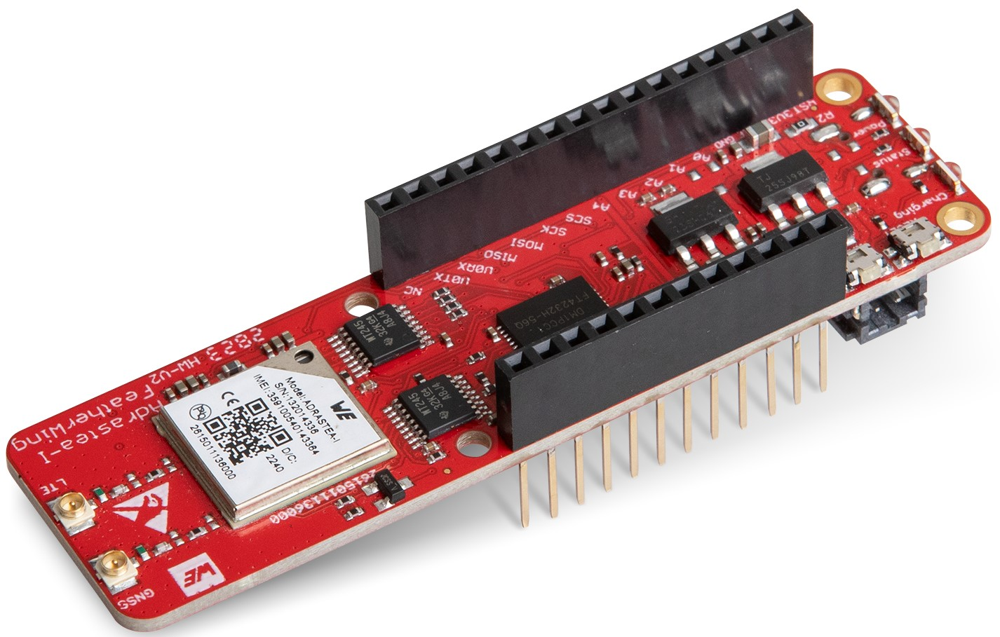
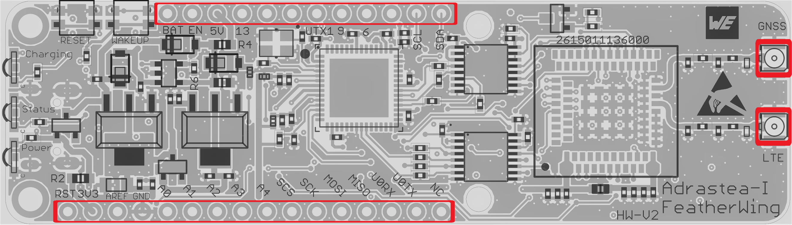
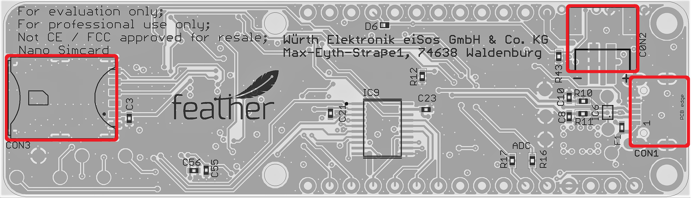
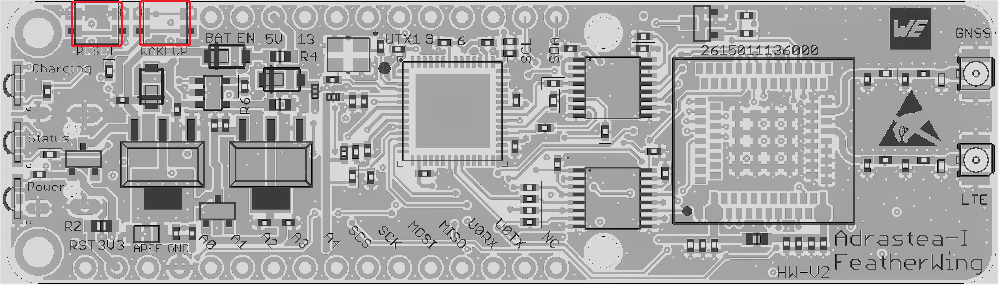

# Adrastea-I FeatherWing

## Introduction

The Würth Elektronik eiSos [Adreastea-I FeatherWing](https://www.we-online.com/en/components/products/ADRASTEA-I) is a development board for the  Adrastea-I radio module. [**Adrastea-I**](https://www.we-online.com/en/components/products/ADRASTEA-I) (2615011136000) module is a compact LTE-M/NB-IoT cellular module with integrated GNSS, integrated ARM Cortex-M4 and 1MB flash memory for customer developed applications. It is fully compatible to the popular [Adafruit](https://www.adafruit.com/) [Feather line](https://www.adafruit.com/feather) of development boards and extends the feathers with Cellular IoT connectivity. 

It has an AT-style command interface on the standard UART and hence can be connected to any of the Feather microcontroller boards. The [Arduino](https://www.arduino.cc/) (C/C++) drivers and examples made available makes it easy to build a prototype to kick-start the application development.

This repository contains the [Eagle](https://www.autodesk.com/products/eagle/overview) design files for the Adreastea-I FeatherWing [PCB](hardware) as well as the [software](software) with quick start example. 

 Feel free to check our [YouTube channel](https://www.youtube.com/user/WuerthElektronik/videos) for video tutorials, hands-ons and webinars relating to our products.

## Hardware

### Description

Adrastea-I module is a compact LTE-M/NB-IoT cellular module with integrated GNSS, integrated ARM Cortex-M4 and 1MB flash memory for customer developed applications.
Based on the Sony Altair ALT1250 chipset, the Adrastea-I module provides AT-Command based multi-band configurability, enabling international multi-regional coverage in LTE Cat M1/NB1 radio access technologies.
Adrastea-I includes a fully integrated global navigation satellite system solution that supports GPS and GLONASS positioning systems.
The ARM Cortex-M4 processor is exclusively for user application software and it offers 1 MB of flash and 256 kB of RAM dedicated to this use.

Compact 13.4 mm x14.6 mm x 1.85 mm design allows the module to fit in small-size applications.
The module can be operated through one of two available cellular communication technologies:
* LTE-Cat.M or
* LTE-Cat.NB-IoT.

The module comes with the declaration of conformity (CE), is compliant to RoHS, REACh. The Adrastea-I FeatherWing module is GCF and Deutsche Telekom certified.

### Key features

| Feature | Description |
| ------- | ----------- |
|Physical Dimensions| 13.4mm x 14.6mm x 1.85mm |
|Supported Networks|  LTE-Cat.M/LTE-Cat.NB-IoT|
|LTE Supported Bands | LTE-Cat.M: B2/B3/B4/B5/B8/B12/B20/B25/B26/B28
||LTE-Cat.NB-IoT: B3/B5/B8/B20/B28|
|Module Interfaces | USIM, UART, I2C Master, SPI Master, GPIO, ADC, JTAG|
|Integrated GNSS | GPS and GLONASS| 
|Integrated User MCU |ARM Cortex-M4, 1 MB Flash Memory,256 kB RAM|
| Maximum Data Rate | LTE-Cat.M: Downlink: 300 Kbps, Uplink: 375 Kbps|
||LTE-Cat.NB-IoT: Downlink: 27.2 Kbps, Uplink: 62.5 Kbps
|3GPP Standard Compliance | 3GPP Release 13 compliant, Upgradable to Release 14|
|Output Power class| Power Class 3 (23 dBm)|
| Firmware Upgrade | Firmware upgrade over the air and USB interface|
|Supported Protocols|IPv4, IPv6, TPC/UDP SOCKET, HTTP/HTTPS, TLS/DTLS, LWM2M Client, MQTT|
|AT Commands| 3GPP TS 27.007 and 3GPP TS 27.005 AT commands, as well as Würth Elektronik eiSos enhanced AT commands|
|Operating Voltage| VDD: From 2.3 V to 4.3 V, VDD_FEM: From 3.1 V to 4.3 V|
|Temperature Range | Operation temperature: -40°C to +85°C|

Further details about the Adrastea-I radio module can be found under [we-online.de/katalog/en/Adrastea-I](https://www.we-online.com/en/components/products/ADRASTEA-I).

### Pinouts
The Adrastea FeatherWing has the following connectors,
| Connector| Description |
|----------|-------------|
|Feather Connector | Connection to other FeatherWings|
|CON1 | Micro-USB connector |
|CON2 | Li-Po Battery connector|
|CON3| Sim card connector|
|CON4| LTE RF UMRF connector|
|CON5| GNSS RF UMRF connector| 

#### Feather Connector
This is the standard set of connectors that is used across the Feather ecosystem. The table below describes the functions of each of the 28 pins as applicable to this FeatherWing.

| Pin number | Pin name | Function |
| ------- | ------- |----------------|
|   1          | RST | Not connected|
|    2          | 3V3| 3.3 V power supply|
|    3          | AREF| Not connected|
|    4          | GND| Ground|
|    5          | A0| Adrastea ADC0/GPIO1 via R16|
|    6          | A1| Adrastea ADC1/GPIO2 via R17|
|    7          | A2| Not connected|
|    8          | A3| Not connected|
|    9          | A4| Not connected|
|    10         | A5| Adrastea SPIM1_CS/GPIO40|
|    11         | SCK| Adrastea SPIM1_CLK/GPIO41|
|    12         | MOSI| Adrastea SPIM1_MOSI/GPIO38|
|    13         | MISO| Adrastea SPIM1_MISO/GPIO39|
|    14         | U0RX| Adrastea UART0 TX pin|
|    15         | U0TX| Adrastea UART0 RX pin|
|    16         | NC| Not connected|

| Pin number | Pin name | Function |
| ------- | ------- |----------------|
|    17         | SDA|I2C SDA|
|    18         | SCL|I2C SCL|
|    19         | 5| Not connected|
|    20         | 6| Adrastea WAKEUP pin|
|    21         | 9|  Not connected|
|    22         | U1TX| Not connected|
|    23         | U1RX| Not connected|
|    24         | 12| Not connected|
|    25         | 13| Not connected|
|    26         | 5V| 5 V Power supply|
|    27         | EN| Not connected|
|    28         | VBAT| Battery| 

#### CON1

Micro-USB connector that enables connection to PC via Standard USB cable. This interface can be used to power-up the device as well as access all the UART ports of the Adrastea Module.

| UART| Function|
|-------|--------|
|UART0 |Miniconsole (AT command). Only UTX and URX|
|UART1|Console Logs. Only UTX and URX|
|UART2|FW update. Full UART (inc. /CTS and /RTS)|

#### CON2
Connector CON2 is a Li-Po battery connector that allows to power board via 3.7 V Lithium-Polymer battery. VBAT is given by a charging IC with ICharge = 200 mA. ICharge can be modifed by changing R6 wich is a 5.1 k by default. A 2 k resistor for example allows a current of 500 mA. In charging mode (D9 lights up) VBAT is 4.2 V

| Pin connection | Function  |
| ------- | -------|
|    1	| VBAT |
| 2| GND |

#### CON3

Connector CON3 is a push/pull nano SIMcard holder.
| Pin connection | Function  |
| ------- | -------|
|    C1	| Voltage supply for SIMcardBAT |
| C2| SIMcard reset signal |
| C2| SIMcard clock signal |
| C2| SIMcard GND |
| C2| Not connected |
| C2| SIMcard data signal |

#### CON4
Connector CON4 (UMRF receptacle) is used to connect the LTE antenna.
| Pin connection | Function  |
| ------- | -------|
|    Inner	| RF Signal |
| Outer | GND |

#### CON5
Connector CON5 (UMRF receptacle) is used to connect the GNSS antenna.

| Pin connection | Function  |
| ------- | -------|
|    Inner	| RF Signal |
| Outer | GND |

### Push buttons

#### Push button S1
This push button is connected to the /RESET pin of the Adrastea module. Pressing this button resets the module.

#### Push button S2
This push button is connected to the WAKEUP pin of the Adrastea module. Pressing this
button allows the module to get out from sleep mode.

### LEDs
The following table shows the function of the leds included in the board.

| Name | Designator | Function  |
| ------- | -------| ----------|
| Power LED | LED1| Lights on when the board is powered up|
| Status LED | LED2 | Turns off when the module is in DH0 state|
| Charging LED | LED3 | Indicates when a battery is being charged|

### Schematics
The hardware design files including the schematics can be found in the [hardware folder](hardware).

### DISCLAIMER:
THE USE OF THE WÜRTH ELEKTRONIK EISOS DESIGN EXAMPLE / REFERENCE DESIGN IS ENTIRELY AT YOUR OWN RISK. IT IS YOUR SOLE RESPONSIBILITY TO IMPLEMENT THE DESIGN EXAMPLE / REFERENCE DESIGN WITH ALL TECHNICAL AND REGULATORY REQUIREMENTS IN YOUR APPLICATION. IT IS ALSO YOUR RESPONSIBILITY TO VERIFY THE FUNCTION AND PERFORMANCE OF YOUR DESIGN IN YOUR OWN PARTICULAR ENGINEERING AND PRODUCT ENVIRONMENT AND YOU ASSUME THE ENTIRE RISK OF DOING SO OR FAILING TO DO SO. THE WÜRTH ELEKTRONIK EISOS DESIGN EXAMPLE / REFERENCE DESIGN IS PROVIDED ON AN "AS IS" OR "AS AVAILABLE" BASIS, WITHOUT ANY WARRANTIES OF ANY KIND AND WÜRTH ELEKTRONIK EISOS DISCLAIMS ANY WARRANTIES EXPRESS OR IMPLIED, INCLUDING WITHOUT LIMITATION THE MERCHANTABILITY OR FITNESS FOR A PARTICULAR PURPOSE, USAGE OR THE NON-INFRINGEMENT OF THIRD PARTIES’ INTELLECTUAL PROPERTY RIGHTS. NO LICENSE IS GRANTED TO ANY INTELLECTUAL PROPERTY RIGHT BY WÜRTH ELEKTRONIK EISOS OR ANY THIRD PARY. UNDER NO CIRCUMSTANCES SHALL WÜRTH ELEKTRONIK EISOS BE LIABLE FOR DAMAGES INCURRED BY REASON OF OTHER SERVICES OR PRODUCTS RECEIVED THROUGH OR ADVERTISED IN CONNECTION WITH THE WÜRTH ELEKTRONIK EISOS SITE OR THE WÜRTH ELEKTRONIK EISOS DESIGN EXAMPLE / REFERENCE DESIGN. THE WÜRTH ELEKTRONIK EISOS DESIGN EXAMPLE / REFERENCE DESIGN IS SUBJECT TO CHANGE WITHOUT NOTICE.

## Software

Adreastea-I FeatherWing **software examples** can be found in the [software folder](software).
