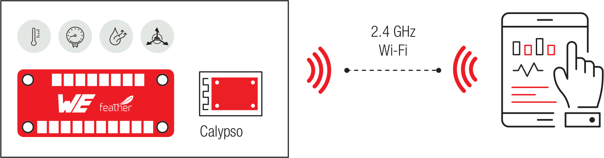

# Calypso FeatherWing

## Introduction

<!--Goals-->
WE WiFi connectivity evaluation board provides an easy to use platform for learning, experimenting and prototyping cloud connectibity applications.

The Calypso FeatherWing offers easy access to the multiple cloud platforms which then provide the data storage, visualization and other advanced data analyses available in your chosen cloud.

In combination with other WE boards and chosen micro controller, it simplifies the creation of secure data pipelines from connected devices and their sensors to online data storage and processing.
A user can use this FeatherWing to collect sensor data, store it in a database and then visualize the data in graphs.

## Schematics

## Code Examples

* Take a Adafruit Feather Microcontroller you like to use. Perhaps out of the typically used family in your company.
* Use the Sensor FeatherWing for measuring condition parameter like temperature, air pressure, humidity and acceleration
* Send data with Calypso FeatherWing on 2.4 GHz WiFi out
* Receive data even on smart devices or on server structures

