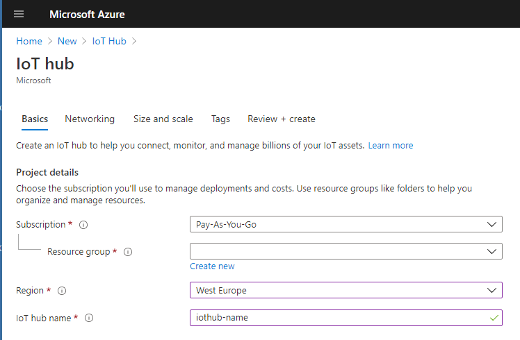

# Calypso FeatherWing Microsoft Azure example

## Introduction

This article describes how to create and manage IoT hubs using the [Azure portal](https://portal.azure.com), hot to connect with the Stream Analytics and visualize your data in PowerBI or Excel.

To use the steps in this tutorial, you need an [Azure subscription](https://azure.microsoft.com/en-us/free/). If you don't have an Azure subscription, create a free account before you begin.

## IoTHub

1. Sign in to the Azure portal.
2. From the Azure homepage, select the **+ Create a resource** button, and then enter IoT Hub in the **Search the Marketplace** field.
3. Select **IoT Hub** from the search results, and then select **Create**.

{width=50%}

4. On the Basics tab, complete the fields as follows:

* **Subscription**: Select the subscription to use for your hub.

* **Resource Group**: Select a resource group or create a new one. To create a new one, select Create new and fill in the name you want to use. To use an existing resource group, select that resource group. For more information, see Manage Azure Resource Manager resource groups.

* **Region**: Select the region in which you want your hub to be located. Select the location closest to you. Some features, such as IoT Hub device streams, are only available in specific regions. For these limited features, you must select one of the supported regions.

* **IoT Hub Name**: Enter a name for your hub. This name must be globally unique. If the name you enter is available, a green check mark appears. Please take care which name you chose. The IoT hub will be publicly discoverable as a DNS endpoint, be sure to avoid entering any sensitive or personally identifiable information when you name it.

5. Select Next: Size and scale to continue creating your hub. You can accept the default settings here. If desired, you can modify any of the following fields

* **Pricing and scale tier**: Your selected tier. You can choose from several tiers, depending on how many features you want and how many messages you send through your solution per day. The free tier is intended for testing and evaluation. It allows 500 devices to be connected to the hub and up to 8,000 messages per day. Each Azure subscription can create one IoT hub in the free tier.

If you are working through a Quickstart for IoT Hub device streams, select the free tier.

* **IoT Hub units**: The number of messages allowed per unit per day depends on your hub's pricing tier. For example, if you want the hub to support ingress of 700,000 messages, you choose two S1 tier units. For details about the other tier options, see Choosing the right IoT Hub tier.

* **Azure Security Center**: Turn this on to add an extra layer of threat protection to IoT and your devices. This option is not available for hubs in the free tier. For more information about this feature, see Azure Security Center for IoT.

* **Advanced Settings** > Device-to-cloud partitions: This property relates the device-to-cloud messages to the number of simultaneous readers of the messages. Most hubs need only four partitions.

6. Select **Next: Tags** to continue to the next screen.

Tags are name/value pairs. You can assign the same tag to multiple resources and resource groups to categorize resources and consolidate billing. For more information, see Use tags to organize your Azure resources.

7. Select **Next: Review + create** to review your choices. You see something similar to this screen, but with the values you selected when creating the hub.

8. Select **Create** to create your new hub. Creating the hub takes a few minutes.

## Register a new device in the IoT hub

In this section, you create a device identity in the identity registry in your IoT hub. A device cannot connect to a hub unless it has an entry in the identity registry. For more information, see the IoT Hub developer guide.

1. In your IoT hub navigation menu, open IoT Devices, then select New to add a device in your IoT hub.

2. In Create a device, provide a name for your new device, such as **myWEDeviceId**, and select **Save**. This action creates a device identity for your IoT hub. The device ID may be visible in the logs collected for customer support and troubleshooting, so make sure to avoid any sensitive information while naming it.

## Send data to the IoTHub

To send data to the IoTHub, the easiest way is to use our examaple code together with Calypso FeatherWing, if you have M0 and WE Sensor FeatherWing. Simulator for the raspberry pi can be found in Azure samples [Raspberry Pi Simulator](https://azure-samples.github.io/raspberry-pi-web-simulator/#Getstarted). In order to make it work properly iot IP address or DNS must be added to the source code.

## Visualize real-time sensor data from Azure IoT Hub using Power BI

### Necessary steps

* Get your IoT hub ready for data access by adding a consumer group.
* Create, configure, and run a Stream Analytics job for data transfer from your IoT hub to your Power BI account.
* Create and publish a Power BI report to visualize the data.

Note: If you prefer using **Excel** for the data visualization, please skip to the next section.

### What you need

* Complete the Calypso FeatherWing Evaluation board tutorial for the Adafruit M0 Express Feather. These articles cover the following requirements:
    * An active Azure subscription.
    * An Azure IoT hub under your subscription.
    * A client application that sends messages to your Azure IoT hub.
* A Power BI account. (Try Power BI for free)

### Add a consumer group to your IoT hub

[Consumer groups](https://docs.microsoft.com/en-us/azure/event-hubs/event-hubs-features#event-consumers) provide independent views into the event stream that enable apps and Azure services to independently consume data from the same Event Hub endpoint. In this section, you add a consumer group to your IoT hub's built-in endpoint that is used later in this tutorial to pull data from the endpoint.

To add a consumer group to your IoT hub, follow these steps:

1. In the Azure portal, open your IoT hub.
2. On the left pane, select Built-in endpoints, select Events on the right pane, and enter a name under Consumer groups. Select Save.
3. Create a consumer group in your IoT hub

### Create, configure, and run a Stream Analytics job

Let's start by creating a Stream Analytics job. After you create the job, you define the inputs, outputs, and the query used to retrieve the data.

#### Create a Stream Analytics job

1. In the Azure portal, select Create a resource > Internet of Things > Stream Analytics job.
2. Enter the following information for the job.

    **Job name**: The name of the job. The name must be globally unique.

    **Resource group**: Use the same resource group that your IoT hub uses.

    **Location**: Use the same location as your resource group.

3. Select **Create**.

### Add an input to the Stream Analytics job

1. Open the Stream Analytics job.
2. Under Job topology, select Inputs.
3. In the Inputs pane, select Add stream input, then select IoT Hub from the drop-down list. On the new input pane, enter the following information:

    **Input alias**: Enter a unique alias for the input.

    **Select IoT Hub from your subscription**: Select this radio button.

    **Subscription**: Select the Azure subscription you're using for this tutorial.

    **IoT Hub**: Select the IoT Hub you're using for this tutorial.
    
    **Endpoint**: Select Messaging.

    **Shared access policy name**: Select the name of the shared access policy you want the Stream Analytics job to use for your IoT hub. For this tutorial, you can select service. The service policy is created by default on new IoT hubs and grants permission to send and receive on cloud-side endpoints exposed by the IoT hub. To learn more, see Access control and permissions.

    **Shared access policy key**: This field is auto-filled based on your selection for the shared access policy name.

    **Consumer group**: Select the consumer group you created previously.

    Leave all other fields at their defaults.

                                    

4. Select **Save**

### Add an output to the Stream Analytics job

1. Under Job topology, select Outputs.
2. In the Outputs pane, select Add and Power BI.
3. On the Power BI - New output pane, select Authorize and follow the prompts to sign in to your Power BI account.
4. After you've signed in to Power BI, enter the following information:

    **Output alias**: A unique alias for the output.

    **Group workspace**: Select your target group workspace.

    **Dataset name**: Enter a dataset name.

    **Table name**: Enter a table name.

    **Authentication mode**: Leave at the default.

5. Select **Save**

### Configure the query of the Stream Analytics job

1. Under Job topology, select Query.
2. Replace [YourInputAlias] with the input alias of the job.
3. Replace [YourOutputAlias] with the output alias of the job.

4. Select **Save query**.

### Run the Stream Analytics job

In the Stream Analytics job, select Overview, then select Start > Now > Start. Once the job successfully starts, the job status changes from Stopped to Running.

## Visualize real-time sensor data from Azure IoT Hub using Excel

### Necessary steps

* Get your IoT hub ready for data access by adding a consumer group. Note: You can use the same one you used for the PowerBI, if you created previous step
* Create SQL database to Stream data from the IoTHub
* Create, configure, and run a Stream Analytics job for data transfer from your IoT hub to your SQL Database.
* Connect Excel data source with Azure SQL datanase to visualize the data.

