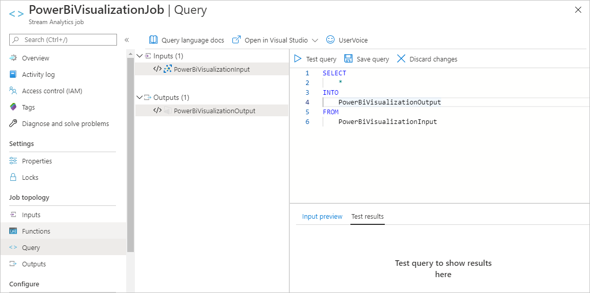

# Calypso FeatherWing Microsoft Azure example

## Introduction

<!--Goals-->
WE WiFi connectivity evaluation board provides an easy to use platform for learning, experimenting and prototyping cloud connectibity applications.

The Calypso FeatherWing offers easy access to the multiple cloud platforms which then provide the data storage, visualization and other advanced data analyses available in your chosen cloud.

In combination with other WE boards and chosen micro controller, it simplifies the creation of secure data pipelines from connected devices and their sensors to online data storage and processing.
A user can use this FeatherWing to collect sensor data, store it in a database and then visualize the data in graphs.

## Login

First open your Azure portal: [Azure portal](https://portal.azure.com) and login to your account. If you no not have azure account please create one.

## IoTHub

Easiest way to create IoTHub resource is to sear for it in the filter filed.

{width=25%}

and then create IoTHub resource

{width=50%}

To create IoTHub resource chose parameters, IoTHub name and resource group.

Add all necessary parameters and create IoTHub.

### Send data to the IoTHub

To send data to the IoTHub, the easiest way is to use simulator or our code, if you have M0 and WE Sensor FeatherWing. Simulator for the raspberry pi can be found in Azure samples [Raspberry Pi Simulator](https://azure-samples.github.io/raspberry-pi-web-simulator/#Getstarted). In order to make it work properly 

## Visualize real-time sensor data from Azure IoT Hub using Power BI

### Necessary steps

* Get your IoT hub ready for data access by adding a consumer group.
* Create, configure, and run a Stream Analytics job for data transfer from your IoT hub to your Power BI account.
* Create and publish a Power BI report to visualize the data.

### What you need

* Complete the Calypso FeatherWing Evaluation board tutorial for the Adafruit M0 Express Feather. These articles cover the following requirements:
    * An active Azure subscription.
    * An Azure IoT hub under your subscription.
    * A client application that sends messages to your Azure IoT hub.
* A Power BI account. (Try Power BI for free)

### Add a consumer group to your IoT hub

[Consumer groups](https://docs.microsoft.com/en-us/azure/event-hubs/event-hubs-features#event-consumers) provide independent views into the event stream that enable apps and Azure services to independently consume data from the same Event Hub endpoint. In this section, you add a consumer group to your IoT hub's built-in endpoint that is used later in this tutorial to pull data from the endpoint.

To add a consumer group to your IoT hub, follow these steps:

1. In the Azure portal, open your IoT hub.
2. On the left pane, select Built-in endpoints, select Events on the right pane, and enter a name under Consumer groups. Select Save.
3. Create a consumer group in your IoT hub

### Create, configure, and run a Stream Analytics job

Let's start by creating a Stream Analytics job. After you create the job, you define the inputs, outputs, and the query used to retrieve the data.

#### Create a Stream Analytics job

1. In the Azure portal, select Create a resource > Internet of Things > Stream Analytics job.
2. Enter the following information for the job.

    **Job name**: The name of the job. The name must be globally unique.

    **Resource group**: Use the same resource group that your IoT hub uses.

    **Location**: Use the same location as your resource group.

3. Select **Create**.

### Add an input to the Stream Analytics job

1. Open the Stream Analytics job.
2. Under Job topology, select Inputs.
3. In the Inputs pane, select Add stream input, then select IoT Hub from the drop-down list. On the new input pane, enter the following information:

    **Input alias**: Enter a unique alias for the input.

    **Select IoT Hub from your subscription**: Select this radio button.

    **Subscription**: Select the Azure subscription you're using for this tutorial.

    **IoT Hub**: Select the IoT Hub you're using for this tutorial.
    
    **Endpoint**: Select Messaging.

    **Shared access policy name**: Select the name of the shared access policy you want the Stream Analytics job to use for your IoT hub. For this tutorial, you can select service. The service policy is created by default on new IoT hubs and grants permission to send and receive on cloud-side endpoints exposed by the IoT hub. To learn more, see Access control and permissions.

    **Shared access policy key**: This field is auto-filled based on your selection for the shared access policy name.

    **Consumer group**: Select the consumer group you created previously.

    Leave all other fields at their defaults.

                                    

4. Select **Save**

### Add an output to the Stream Analytics job

1. Under Job topology, select Outputs.
2. In the Outputs pane, select Add and Power BI.
3. On the Power BI - New output pane, select Authorize and follow the prompts to sign in to your Power BI account.
4. After you've signed in to Power BI, enter the following information:

    **Output alias**: A unique alias for the output.

    **Group workspace**: Select your target group workspace.

    **Dataset name**: Enter a dataset name.

    **Table name**: Enter a table name.

    **Authentication mode**: Leave at the default.

5. Select **Save**

### Configure the query of the Stream Analytics job

1. Under Job topology, select Query.
2. Replace [YourInputAlias] with the input alias of the job.
3. Replace [YourOutputAlias] with the output alias of the job.

4. Select **Save query**.

### Run the Stream Analytics job

In the Stream Analytics job, select Overview, then select Start > Now > Start. Once the job successfully starts, the job status changes from Stopped to Running.

