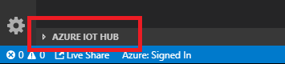
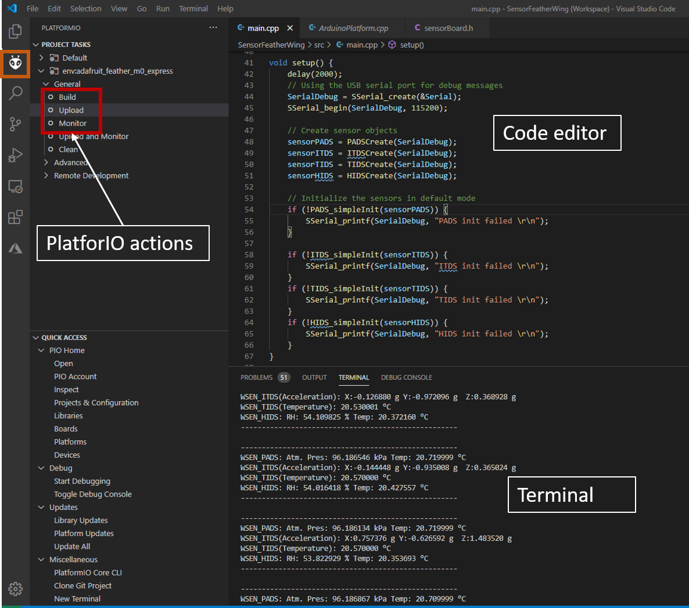
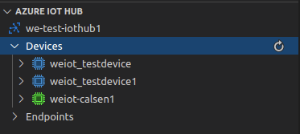

# Calypso WiFi FeatherWing

## Introduction

<!--Goals-->

The Würth Elektronik eiSos Calypso Wi-Fi FeatherWing is a development board that offers a secure 2.4 GHz Wi-Fi connectivity solution. It is fully compatible to the [Adafruit’s](https://www.adafruit.com/) popular [Feather line](https://www.adafruit.com/feather) of development boards and extends the Feathers with Wi-Fi connectivity..

The Calypso Wi-Fi FeatherWing consists of the [Calypso radio module](https://www.we-online.com/catalog/en/CALYPSO) that offers Wi-Fi connectivity based on IEEE 802.11 b/g/n with a fully featured TCP/IP (IPv4 and IPv6) stack.


With out-of-the-box support to commonly used network applications like SNTP, HTTP(S), MQTT(S) Calypso offers an easy and secure solution to any IoT application.

It has an AT-style command interface on the standard UART and hence can be connected to any of the Feather microcontroller boards. The [Arduino](https://www.arduino.cc/) (C/C++) drivers and examples made available makes it easy to build a prototype to kick-start the application development.


The Calypso WiFi FeatherWing board provides an easy to use platform for learning, experimenting and prototyping [cloud connectibity](lib/examples/../WE_CalypsoWiFiFeatherWing/examples/) applications. It offers easy access to the multiple cloud platforms which then provide the data storage, visualization and other advanced data analyses available in your chosen cloud. For more examples, please see [CalypsoSensorCombo](../CalypsoSensorCombo) 

The [**SDK**](we-online.com/wcs-software) can be accessed on Github at [eiSmart FeatherWing GitHub](/../../).

For more information about the Hardware, please go to the Hardware repository or download [Calypso WiFi FeatherWing user manual](link.to.com\document).
Feel free to check our [YouTube channel](https://www.youtube.com/user/WuerthElektronik/videos) for video tutorials, hands-ons and webinars relating to our products.

### Necessary Steps

* **Install IDE**: your favourite development IDE (we recommend [Visual Studio Code](https://code.visualstudio.com/) with [Platform IO](https://platformio.org/) extension.
* **PlatformIO**: is a cross-platform, cross-architecture, multiple framework professional tool for embedded software development. It provides the tool chain necessary for the software development including building, debugging, code-upload and many more. PlatformIO works well on all the modern operating systems and supports a host of development boards including the Feathers from Adafruit. Further details about PlatformIO can be found under [platformio.org](https://platformio.org/)
* **WE SDK**: This is a layer of platform-independent pure C drivers for sensors and wireless connectivity modules from Würth Elektronik eiSos. These drivers implement all the necessary functions to utilize full feature set of the sensors and wireless connectivity modules. More details on the SDK and dowloads under [WCS Software](we-online.com/wcs-software)
* **Board files**: This layer provides abstraction at a board level and provides functions to configure and control individual FeatherWings from WE.
* **User application**: The SDK currently implements a quick start example for each of the FeatherWings.

### Optional steps

* **MQTT Broker**: It is recomended to install Mosquito MQTT broker if you: do not have a cloud access, do not want to create cloud account, or do not want to use cloud.

> Note: For more information about usage with the cloud check [Calypso cloud examples](lib/WE_CalypsoWiFiFeatherWing/examples).

* **Cloud**: If you want to use cloud, please find detailed instructions in the [cloud example section](lib/WE_CalypsoWiFiFeatherWing/examples) and detailed instruction for [Microsoft Azure usage](lib/WE_CalypsoWiFiFeatherWing/examples).


### Installing the tools

* Install Visual Studio Code on the platform of your choice following the [instructions](code.visualstudio.com/docs)
* Follow the instructions to install [PlatformIO IDE](platformio.org/install/ide?install=vscode) extension.
  
**First option**

* Download and install [Mosquito MQTT broker](https://mosquitto.org/download/). Follow the instrucitons for the installation and configuration on the [Mosquito MQTT broker man page](https://mosquitto.org/man/mosquitto-8.html). This step is optional and can be replaced with the [cloud approach](/lib/WE_CalypsoWiFiFeatherWing/examples) (see above).

**Second option**

* **Azure IoT Hub Extension** is part of Azure IoT Tools extension. You can [download the Azure IoT Toolkit extension](https://marketplace.visualstudio.com/items?itemName=vsciot-vscode.azure-iot-toolkit) from the marketplace, or install it directly from the extension gallery in Visual Studio Code.
After installing and connecting to the cloud, the results IoTHub messages can be tracked in the Visual Studio Code directly in the Lower left corner of the IDE in Azure IoT Hub extension:



## Example

The quick start examples in the SDK are written to be run on Adafruit’s Feather M0 express. The hardware setup is as simple as stacking up the FeatherWing on top of the M0 Feather and powering up the board.

1. Clone or download the [WE FeatherWing SDK](/)
2. Open the workspace of interest with the filename `<FeatherWing>.code-workspace` in Visual Studio code.
3. Build and upload the code from the PlatformIO tab as shown in the Figure below
4. After successful upload, click on **Monitor** in PlatformIO extension tab to view the debug logs in the serial terminal.
   
5. In order to be able to connect wo the cloud device, SAS is needed as password. It can be generated using the **Azure IoT Hub Extension**  
6. Cloud results can be seen in the **Azure IoT Hub Extension**


For more information about the cloud connectivity and explanation of the steps 5 and 6 please refer to [Calypso WiFi FeatherWing cloud example](/lib/WE_CalypsoFeatherWing/examples)


### Source Code

Depending on the approach: Mosquito MQTT Broker or Azure IoT Hub, following code has two parameters which need to be set to make one or the other example work

```
#define MOSQUITTO_CONNECTION 1
#define AZURE_CONNECTION 0
```
* **MOSQUITTO_CONNECTION**: Set to 1 - local Mosquito MQTT broker, set to 0 - not used
* **AZURE_CONNECTION**: Set to 1 - Azure IoTHub, set to 0 - not used


```

/**
 * \file
 * \brief Main file for the WE-CalypsoWiFiFeatherWing.
 *
 * \copyright (c) 2020 Würth Elektronik eiSos GmbH & Co. KG
 *
 * \page License
 *
 * THE SOFTWARE INCLUDING THE SOURCE CODE IS PROVIDED “AS IS”. YOU ACKNOWLEDGE
 * THAT WÜRTH ELEKTRONIK EISOS MAKES NO REPRESENTATIONS AND WARRANTIES OF ANY
 * KIND RELATED TO, BUT NOT LIMITED TO THE NON-INFRINGEMENT OF THIRD PARTIES’
 * INTELLECTUAL PROPERTY RIGHTS OR THE MERCHANTABILITY OR FITNESS FOR YOUR
 * INTENDED PURPOSE OR USAGE. WÜRTH ELEKTRONIK EISOS DOES NOT WARRANT OR
 * REPRESENT THAT ANY LICENSE, EITHER EXPRESS OR IMPLIED, IS GRANTED UNDER ANY
 * PATENT RIGHT, COPYRIGHT, MASK WORK RIGHT, OR OTHER INTELLECTUAL PROPERTY
 * RIGHT RELATING TO ANY COMBINATION, MACHINE, OR PROCESS IN WHICH THE PRODUCT
 * IS USED. INFORMATION PUBLISHED BY WÜRTH ELEKTRONIK EISOS REGARDING
 * THIRD-PARTY PRODUCTS OR SERVICES DOES NOT CONSTITUTE A LICENSE FROM WÜRTH
 * ELEKTRONIK EISOS TO USE SUCH PRODUCTS OR SERVICES OR A WARRANTY OR
 * ENDORSEMENT THEREOF
 *
 * THIS SOURCE CODE IS PROTECTED BY A LICENSE.
 * FOR MORE INFORMATION PLEASE CAREFULLY READ THE LICENSE AGREEMENT FILE LOCATED
 * IN THE ROOT DIRECTORY OF THIS PACKAGE
 */
#include "calypsoBoard.h"
#include "json-builder.h"

#define MOSQUITTO_CONNECTION 1
#define AZURE_CONNECTION 0

// WiFi access point parameters
#define WI_FI_SSID "AP"
#define WI_FI_PASSWORD "pw"

#if MOSQUITTO_CONNECTION
/*MQTT settings - Mosquitto server*/
#define MQTT_CLIENT_ID "calypso"
#define MQTT_SERVER_ADDRESS "127.0.0.1"
#define MQTT_PORT 1883
#define MQTT_TOPIC "timeStamp"
#endif

#if AZURE_CONNECTION
/*MQTT settings - Azure server*/
#define MQTT_CLIENT_ID "we-iot-device"
#define MQTT_SERVER_ADDRESS "we-iothub.azure-devices.net"
#define MQTT_PORT 8883
#define MQTT_TOPIC "devices/we-iot-device/messages/events/"
#define MQTT_USER_NAME "we-iothub.azure-devices.net/we-iot-device"
#define MQTT_PASSWORD                                                         \
    "SharedAccessSignature "                                                  \
    "sr=we-iothub.azure-devices.net%2Fdevices%2Fwe-iot-device&sig=" \
    "DcBBSucFMS15NAN6wLCfMiZtpBb8fgYrUJeq%2BBvbnw%3D&se=1640500745"

#endif
// SNTP settings
#define SNTP_TIMEZONE "+60"
#define SNTP_SERVER "0.de.pool.ntp.org"

// USB-Serial debug Interface
TypeSerial *SerialDebug;

// Calypso settings
CalypsoSettings calSettings;

// Calypso object
CALYPSO *calypso;

// Serial communication port for Calypso
TypeHardwareSerial *SerialCalypso;

int msgID;

void setup() {
    delay(5000);
    // Using the USB serial port for debug messages
    SerialDebug = SSerial_create(&Serial);
    SSerial_begin(SerialDebug, 115200);

    SerialCalypso = HSerial_create(&Serial1);

    // Create serial port for Calypso WiFi FeatherWing baud 921600, 8E1
    HSerial_beginP(SerialCalypso, 921600, (uint8_t)SERIAL_8E1);
    // Wi-Fi settings
    strcpy(calSettings.wifiSettings.SSID, WI_FI_SSID);
    strcpy(calSettings.wifiSettings.securityParams.securityKey, WI_FI_PASSWORD);
    calSettings.wifiSettings.securityParams.securityType =
        ATWLAN_SECURITY_TYPE_WPA_WPA2;

#if MOSQUITTO_CONNECTION
    // MQTT Settings - Mosquitto broker(non-secure for demo purposes only)
    strcpy(calSettings.mqttSettings.clientID, MQTT_CLIENT_ID);
    calSettings.mqttSettings.flags = ATMQTT_CREATE_FLAGS_IP4;
    strcpy(calSettings.mqttSettings.serverInfo.address, MQTT_SERVER_ADDRESS);
    calSettings.mqttSettings.serverInfo.port = MQTT_PORT;
    calSettings.mqttSettings.connParams.protocolVersion = ATMQTT_PROTOCOL_v3_1;
    calSettings.mqttSettings.connParams.blockingSend = 0;
    calSettings.mqttSettings.connParams.format = Calypso_DataFormat_Base64;
    strcpy(calSettings.mqttSettings.userOptions.userName, MQTT_CLIENT_ID);
    strcpy(calSettings.mqttSettings.userOptions.password, MQTT_CLIENT_ID);
#endif

#if AZURE_CONNECTION
    // MQTT Settings - Mosquitto broker(non-secure for demo purposes only)
    strcpy(calSettings.mqttSettings.clientID, MQTT_CLIENT_ID);
    calSettings.mqttSettings.flags =
        ATMQTT_CREATE_FLAGS_URL | ATMQTT_CREATE_FLAGS_SEC;
    strcpy(calSettings.mqttSettings.serverInfo.address, MQTT_SERVER_ADDRESS);
    calSettings.mqttSettings.serverInfo.port = MQTT_PORT;

    calSettings.mqttSettings.secParams.securityMethod =
        ATMQTT_SECURITY_METHOD_TLSV1_2;
    calSettings.mqttSettings.secParams.cipher =
        ATMQTT_CIPHER_TLS_RSA_WITH_AES_256_CBC_SHA;

    calSettings.mqttSettings.connParams.protocolVersion =
        ATMQTT_PROTOCOL_v3_1_1;
    calSettings.mqttSettings.connParams.blockingSend = 0;
    calSettings.mqttSettings.connParams.format = Calypso_DataFormat_Base64;
    strcpy(calSettings.mqttSettings.userOptions.userName, MQTT_USER_NAME);

    strcpy(calSettings.mqttSettings.userOptions.passWord, MQTT_PASSWORD);

#endif

    // SNTP settings
    strcpy(calSettings.sntpSettings.timezone, SNTP_TIMEZONE);
    strcpy(calSettings.sntpSettings.server, SNTP_SERVER);

    calypso = Calypso_Create(SerialDebug, SerialCalypso, &calSettings);

    // Initialize Calypso
    if (!Calypso_simpleInit(calypso)) {
        SSerial_printf(SerialDebug, "Calypso init failed \r\n");
    }

    // Connect Calypso WiFi FeatherWing to the Wi-Fi access point
    if (!Calypso_WLANconnect(calypso)) {
        SSerial_printf(SerialDebug, "WiFi connect fail\r\n");
        return;
    }

    delay(3000);

    // Set up SNTP client on Calypso
    if (!Calypso_setUpSNTP(calypso)) {
        SSerial_printf(SerialDebug, "SNTP config fail\r\n");
    }

    // Connect to MQTT server
    if (!Calypso_MQTTconnect(calypso)) {
        SSerial_printf(SerialDebug, "MQTT connect fail\r\n");
    }
    msgID = 0;
}

void loop() {
    Timestamp timestamp;
    Timer_initTime(&timestamp);

    msgID++;
    if (msgID == INT_MAX) {
        msgID = 0;
    }

    // Get the current time from calypso
    if (!Calypso_getTimestamp(calypso, &timestamp)) {
        SSerial_printf(SerialDebug, "Get time fail\r\n");
    }

    /* convert to unix timestamp */
    unsigned long long unixTime_ms = Time_ConvertToUnix(&timestamp);

    /*Create a JSON object with the device ID, message ID, and time stamp*/
    json_value *payload = json_object_new(1);
    json_object_push(payload, "deviceId", json_string_new(calypso->MAC_ADDR));
    json_object_push(payload, "messageId", json_integer_new(msgID));
    json_object_push(payload, "ts", json_integer_new(unixTime_ms));

    char *buf = (char *)malloc(json_measure(payload));
    json_serialize(buf, payload);

    /*Publish to MQTT topic*/
    if (!Calypso_MQTTPublishData(calypso, MQTT_TOPIC, 0, buf, strlen(buf),
                                 true)) {
        SSerial_printf(SerialDebug, "Publish failed\n\r");
    }

    /*Clean-up*/
    json_builder_free(payload);
    free(buf);

    delay(5000);
}


```