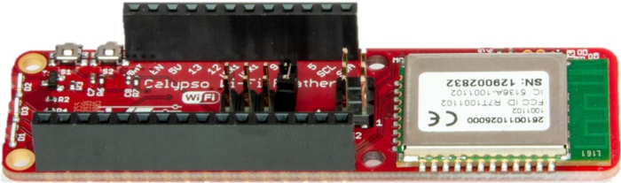
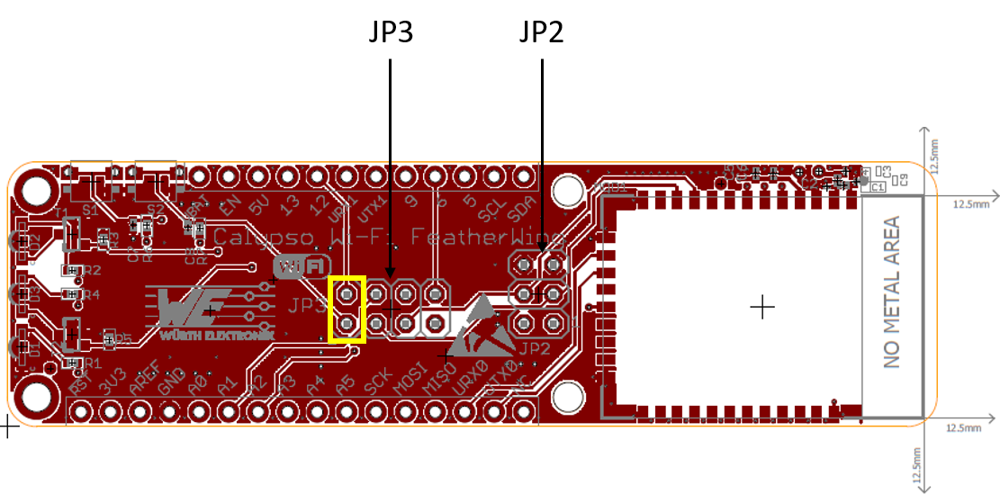
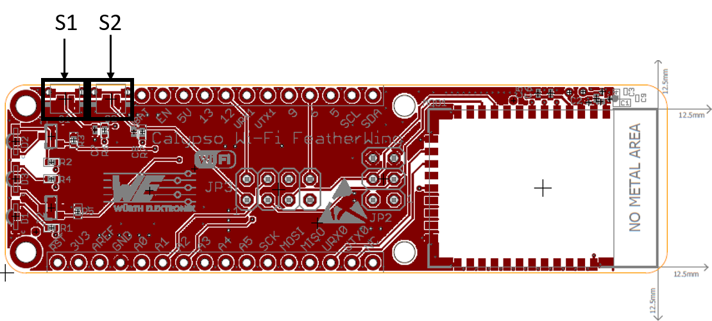
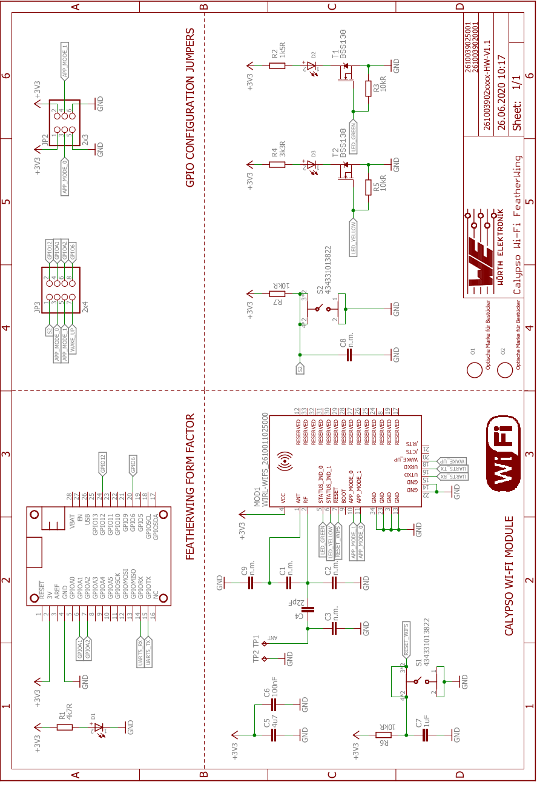

# Calypso Wi-Fi FeatherWing

## Introduction

The Würth Elektronik eiSos [Calypso Wi-Fi FeatherWing](https://www.we-online.de/katalog/en/CALYPSO_FeatherWing) is a development board that offers a secure 2.4 GHz Wi-Fi connectivity solution. It is fully compatible to the popular [Adafruit](https://www.adafruit.com/) [Feather line](https://www.adafruit.com/feather) of development boards and extends the Feathers with Wi-Fi connectivity.

The Calypso Wi-Fi FeatherWing consists of the [Calypso radio module](https://www.we-online.com/catalog/en/CALYPSO) that offers Wi-Fi connectivity based on **IEEE 802.11 b/g/n** with a fully featured TCP/IP stack. With out-of-the-box support to commonly used network applications like **SNTP**, **HTTP(S)**, **MQTT(S)**, Calypso offers easy and secure solutions to any **IoT application**.

It has an AT-style command interface on the standard UART and hence can be connected to any of the Feather microcontroller boards. The [Arduino](https://www.arduino.cc/) (C/C++) drivers and examples made available makes it easy to build a prototype to kick-start the application development.

This repository contains the [Eagle](https://www.autodesk.com/products/eagle/overview) design files for the Calypso Wi-Fi FeatherWing [PCB](hardware) as well as the [software](software) with quick start example.

For more information, please download the [Calypso Wi-Fi FeatherWing user manual](docs/CalypsoFeatherWing.pdf). Feel free to check our [YouTube channel](https://www.youtube.com/user/WuerthElektronik/videos) for video tutorials, hands-ons and webinars relating to our products.

## Hardware

### Description

The Calypso Wi-Fi FeatherWing was designed with rapid prototyping in mind. Being fully compatible with the Adafruit ecosystem, this FeatherWing gives the user the flexibility to choose the preferred host microcontroller. The inherent modularity of the ecosystem allows the FeatherWing to be easily integrated into any project.

### [Calypso Wi-Fi module](https://www.we-online.com/catalog/en/CALYPSO) [(2610011025000)](https://www.we-online.de/katalog/datasheet/2610011025000.pdf)

The Calypso Wi-Fi module is a compact Wi-Fi radio module based on IEEE 802.11 b/g/n with a fully featured TCP/IP stack. The edge castellated connections, smart antenna configuration and an easy-to-use AT-style command interface enable easy integration of the Calypso into any embedded application.

The module supports IPv4 as well as IPv6 and implements several commonly used network applications like SNTP, DHPv4, DHCPv6, mDNS, HTTP(S), MQTT(Secure) out-of the box. Advanced security features like up to 6 simultaneous secure sockets, secure boot, secure storage and secure OTA update provide a good basis for a secure end product.

Whether a serial cable replacement or low power IoT application with cloud connectivity, the Calypso Wi-Fi modules offers a robust and standard compliant wireless connectivity solution for low-power and low-medium throughput applications.

### Key features

Calypso offers the user to configure and exploit its rich features through an easy-to-use command interface over UART.

| Feature | Description |
| ------- | ----------- |
| Radio standards | IEEE 802.11 b/g/n station  IEEE 802.11 b/g Access point (for provisioning only)  Wi-Fi Direct client and group owner |
| Channels | 1-13 |
| Security | WEP, WPA/WPA2PSK, WPA2 Enterprise (802.1x) |
| Provisioning | In AP mode using the on-board HTTPS server |
| Network layer | IPv4, IPv6 |
| IP addresssing | Static, LLA, DHCPv4, DHCPv6 with DAD 
| Transport layer | TCP, UDP SSLv3.0/TLSv1.0/TLSv1.1/TLSv1.2 Up to 15 simultaneous sockets of which 6 can be secure |
| Network applications | MQTT(Secure) client HTTP(S) client SNTP client HTTP(S) server mDNS, DNS-SD DHCP server  Ping |
| Update | Secure OTA update with fall back mechanism |
| Security | Secure key storage Trusted root-certificate catalog Encrypted file system Secure OTA Software tamper detection Cloning protection |
| Power management | 802.11 power save power modes  Lower power sleep mode with timed or pin wake-up |

### Pinouts 

#### Feather Connector
This is the standard set of connectors that is used across the Feather ecosystem. The table below describes the functions of each of the 28 pins as applicable to this FeatherWing.

| Pin number | Pin name | Function |
| ------- | ------- |----------------|
|    1          | RST | Not connected|
|    2          | 3V3| 3.3V power supply|
|    3          | AREF| Not connected|
|   4          | GND| Ground|
|    5          | A0| Not connected|
|    6          | A1| (Optional) Calypso APP_MODE_0 pin via JP3|
|    7          | A2| (Optional) Calypso APP_MODE_1 pin via JP3|
|    8          | A3| Not connected|
|    9          | A4| Not connected|
|    10         | A5| Not connected|
|    11         | SCK| Not connected|
|    12         | MOSI| Not connected|
|    13         | MISO| Not connected|
|    14         | U0RX| Calypso UTXD pin|
|    15         | U0TX| Calypso URXD Pin|
|    16         | NC| Not connected|

| Pin number | Pin name | Function |
| ------- | ------- |----------------|
|    17         | SDA| Not connected|
|    18         | SCL| Not connected|
|    19         | 5| Not connected|
|    20         | 6| (Optional) Calypso WAKE_UP pin via JP3|
|    21         | 9| Not connected|
|    22         | U1TX| Not connected|
|    23         | U1RX| Not connected|
|    24         | 12| (Optional) Switch S2 via JP3|
|    25         | 13| Not connected|
|    26         | 5V| Not connected|
|    27         | EN| Not connected|
|    28         | VBAT| Not connected|   

    
#### Jumper JP2
This jumper enables the user to start Calypso Wi-Fi module in different modes through the APP_MODE_0 and APP_MODE_1 pins. 

| Pin connection | Function  | Jumper set (Default) |
| ------- | ------- |----------------|
|    1,3	| APP_MODE_0 to HIGH |	No |
|    3,5	|APP_MODE_0 to LOW |	No |
|    2,4	| APP_MODE_1 to HIGH |	No |
|    4,6	|APP_MODE_1 to LOW |	No |

The table below briefly describes the different application modes of Calypso. Please refer to Section 5.2 of the Calypso [user manual](https://www.we-online.com/catalog/manual/2610011025000_Calypso%20261001102500x%20Manual_rev1.pdf) for further details. For normal operation in the standard AT-command mode, these jumpers do not need to be mounted as the lines are pulled down internally.

| APP_MODE_0 | APP_MODE_1  | Mode |
| ------- | ------- |----------------|
|    0	| 0  |	AT command normal mode |
|    0	|1 |	FOTA update mode |
|    1	| 0 |	Provisioning mode |
|    1	|1 |	AT command terminal mode |

#### Jumper JP3
This jumper allows the connection of Calypso pins APP_MODE_0, APP_MODE_1, WAKE_UP to the host microcontroller. Additionally, it allows the general purpose switch S2 to be connected to GPIO 12.

| Pin connection | Function  | Jumper set (Default) |
| ------- | ------- |----------------|
|    1,2|	S2 to GPIO12|	Yes|
|    3,4|	APP_MODE_0 to GPIOA1|	No|
|    5,6|	APP_MODE_1 to GPIOA2|	No|
|    7,8|	WAKE_UP to GPIO6|	No|

#### Push button S1
This push button is connected to the /RESET pin of the Calypso Wi-Fi module. Pressing this button resets the module.

#### Push button S2
S2 is a general purpose push button which is connected to GPIO 12 when a jumper is set between pins 1 and 2 of JP3. This switch can be used to trigger a specific action like switching the Calypso into provisioning mode.

### Schematics

## Software

A Calypso Wi-Fi FeatherWing quick start example can be found in the [software folder](software). Please check the [cloud connectivity folder](../Sensor2CloudConnectivity) for more examples for sensor to cloud solutions.
