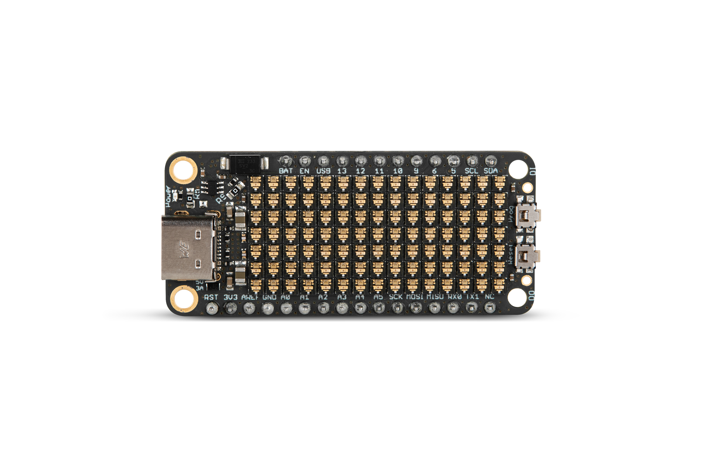
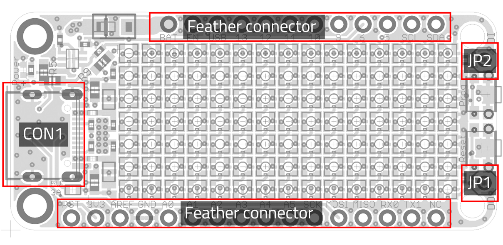
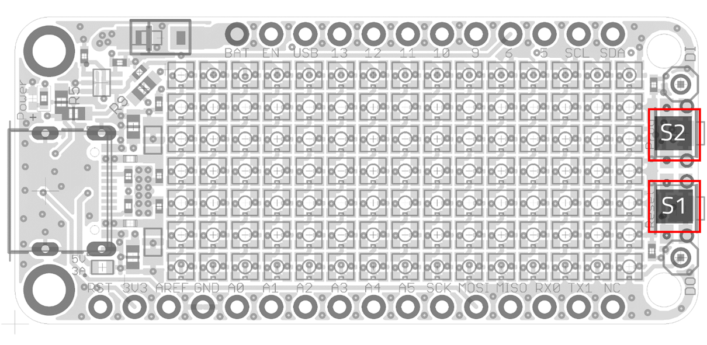

# ICLED

## Introduction

The [ICLED](https://www.we-online.com/en/components/products/WL-ICLED) was designed with rapid prototyping in mind. Being fully compatible with the Adafruit ecosystem, this FeatherWing gives the user the flexibility to choose the preferred host microcontroller. The inherent modularity of the ecosystem allows the FeatherWing to be easily integrated into any project.

The ICLEDFeatherWing contains 105 IC LEDs ([**1312020030000**](https://www.we-online.com/en/components/products/WL-ICLED?sq=1312020030000#1312020030000)) in a 7x15 display shape with a pitch of 2.38 mm. It can be controlled by any adafruit feather micro-controller board and
is powered by USB-C (5 V@3 A) or LiPoly battery. The display is controlled by only 1 pin while a second GPIO-pin is used to trigger an interrupt by pushing the ”Prog”-button on featherwing. Internal Level-shifter makes logic-levels lower than 3.3 V possible and with that usage of other micro-controllers than adafruit feathers.

## Hardware description

This sections contains a detailed description of the hardware features of the ICLEDFeatherWing.

### Connectors

This section explains all connectors of the ICLEDFeatherWing.

| Pin header | Function | WE-article Number |
| ------- | ------- |----------------|
| Feather connector| Connection to Feather M0 or other FeatherWings | [**61301211121**](https://www.we-online.com/en/components/products/PHD_2_54_THT_PIN_HEADER_6130XX11121?sq=61301211121#6130121112) / [**61301611121**](https://www.we-online.com/en/components/products/PHD_2_54_THT_PIN_HEADER_6130XX11121?sq=61301611121#61301611121) |
| CON1 | USB-C connector for VDD bus supply | [**629722000214**](https://www.we-online.com/de/components/products/WR-COM_USB_20_TYPE_C_RECEPTACLE_HORIZONTAL_SMT?sq=629722000214#629722000214) |

### Feather connector
This is the standard set of connectors that is used across the Feather ecosystem. The table below describes the functions of each of the 28 pins as applicable to this FeatherWing.
| Pin number | Pin name | Function |
| ------- | ------- |----------------|
|   1          | RST | RST|
|    2          | 3V3| 3.3 V power supply|
|    3          | AREF| Not connected|
|    4          | GND| Ground|
|    5          | A0| Not connected|
|    6          | A1| Not connected|
|    7          | A2| Not connected|
|    8          | A3| Not connected|
|    9          | A4| Not connected|
|    10         | A5| (Optional) SPI_CE via JP1|
|    11         | SCK| Not Connected|
|    12         | MOSI| (Optional) DI via R10|
|    13         | MISO| Not Connected|
|    14         | U0RX| Not connected|
|    15         | U0TX| Not connected|
|    16         | NC| Not connected|
|    17         | SDA| Not Connected|
|    18         | SCL|  Not Connected|
|    19         | 5| S2|
|    20         | 6| DI via R9|
|    21         | 9| Not connected|
|    22         | U1TX| Not connected|
|    23         | U1RX| Not connected|
|    24         | 12|(Optional) DI via R4 |
|    25         | 13| Not connected|
|    26         | 5V| Optional) USB power via R8|
|    27         | EN| Not connected|
|    28         | VBA| Battery Power via D2|

### CON1

Connector CON1 is a USB-C connector designed for connecting to a power source (e.g. PC) using a standard USB-C cable. It is strongly advised against using a USB-Type-A to USBType-C adapter. The 5.1 kΩ resistors placed on the CC-lines will handle out up to 3 A from
power source. However, the actual maximum current delivered will depend on what the power source can safely provide.

| CON1  | Function |
| ------- | ------- |
| - |USB-C connector for VDD bus supply |

### JPI
Connector JP1 is an optional standard 2.54 mm pinheader, which is not mounted by default.It can be used to combine multiple ICLEDFeatherWings or with other ICLEDscreens. JP1 is
directly connected to the DOUT Pin of ICLED105.

| JP1  | Function |
| ------- | ------- |
| 1 |Data Out of last IC LED|

### JP2
Connector JP2 is an optional standard 2.54 mm pinheader, which is not mounted by default.It can be used to combine multiple ICLEDFeatherWings or with other ICLEDscreens. JP2 is
connected to DIN Pin of ICLED1 via U1 and R5 or optional directly to DIN of ICLED1 via R3.

| JP2  | Function |
| ------- | ------- |
| 1 |Data In of Level-Shifter (U1)|

### DIN pin
The Data In (DIN) Pin is Pin 20 (GPIO 6) by default. It can be changed by removing R9 from
board. If a 0 Ω resistor is placed for R4, pin 24 (GPIO 12) is the new DIN pin. By soldering a
0 Ω resistor for R10 it is also possible to use pin 12 (MOSI) for data input. Instead of soldering
a 0 Ω resistor, it is also an option to short-circuit pads with solder. If needed, JP2 can be used
as data input pin.
DIN is connected to level-shifter (U1) via R5 by default. If R5 is removed and a 0Ω resistor is
placed for R3, DIN is directly connected to DIN pin of LED1. This is highly recommended, if
input logic level is higher than 3.6 V, to avoid damaging U1. Please remind, that the maximum
input voltage level is 5.5 V for ICLEDFeatherWing.
Input reference level for U1 is 3V3. By supplying 3V3 pin with input logic voltage, any logic level
between 1.65 V and 3.6 V can be shifted to 5 V.

## Push buttons

### S1
This push button is connected to the /RESET pin of the Feather connector. Pressing this button
resets m0.
### S2
This push button is connected to Pin 5 of the Feather connector. Pressing this button pulls pin
5 to signal low. It is recommended to set this pin as an input with internal pull-up by software.
It is recommended to use this pin for interrupt functions for example to change displayed data.

# DISCLAIMER

THE USE OF THE WÜRTH ELEKTRONIK EISOS DESIGN EXAMPLE / REFERENCE DESIGN IS ENTIRELY AT YOUR OWN RISK. IT IS YOUR SOLE RESPONSIBILITY TO IMPLEMENT THE DESIGN EXAMPLE / REFERENCE DESIGN WITH ALL TECHNICAL AND REGULATORY REQUIREMENTS IN YOUR APPLICATION. IT IS ALSO YOUR RESPONSIBILITY TO VERIFY THE FUNCTION AND PERFORMANCE OF YOUR DESIGN IN YOUR OWN PARTICULAR ENGINEERING AND PRODUCT ENVIRONMENT AND YOU ASSUME THE ENTIRE RISK OF DOING SO OR FAILING TO DO SO. THE WÜRTH ELEKTRONIK EISOS DESIGN EXAMPLE / REFERENCE DESIGN IS PROVIDED ON AN "AS IS" OR "AS AVAILABLE" BASIS, WITHOUT ANY WARRANTIES OF ANY KIND AND WÜRTH ELEKTRONIK EISOS DISCLAIMS ANY WARRANTIES EXPRESS OR IMPLIED, INCLUDING WITHOUT LIMITATION THE MERCHANTABILITY OR FITNESS FOR A PARTICULAR PURPOSE, USAGE OR THE NON-INFRINGEMENT OF THIRD PARTIES’ INTELLECTUAL PROPERTY RIGHTS. NO LICENSE IS GRANTED TO ANY INTELLECTUAL PROPERTY RIGHT BY WÜRTH ELEKTRONIK EISOS OR ANY THIRD PARY. UNDER NO CIRCUMSTANCES SHALL WÜRTH ELEKTRONIK EISOS BE LIABLE FOR DAMAGES INCURRED BY REASON OF OTHER SERVICES OR PRODUCTS RECEIVED THROUGH OR ADVERTISED IN CONNECTION WITH THE WÜRTH ELEKTRONIK EISOS SITE OR THE WÜRTH ELEKTRONIK EISOS DESIGN EXAMPLE / REFERENCE DESIGN. THE WÜRTH ELEKTRONIK EISOS DESIGN EXAMPLE / REFERENCE DESIGN IS SUBJECT TO CHANGE WITHOUT NOTICE.

## Software

IC LED FeatherWing software examples can be found in the [software folder](software).
