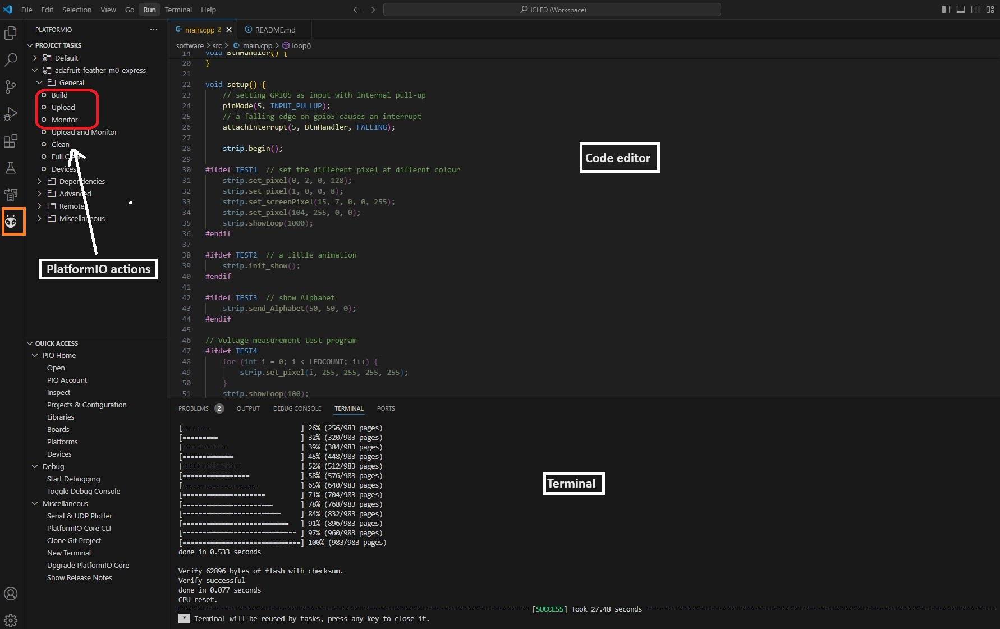

# ICLED

## Introduction

The [ICLED](https://www.we-online.com/en/components/products/WL-ICLED) was designed with rapid prototyping in mind. Being fully compatible with the Adafruit ecosystem, this FeatherWing gives the user the flexibility to choose the preferred host microcontroller. The inherent modularity of the ecosystem allows the FeatherWing to be easily integrated into any project.

Würth Elektronik eiSos provides a Software Development Kit (SDK) with examples to support all WE FeatherWings. Here are the salient features of the WE FeatherWing SDK. 
* The SDK is **open-source** and well documented.
* It uses popular open-source tool chain including an IDE.
* The examples are written in Arduino styled C/C++ for easy understanding.
* The core components of the SDK are written in pure C to enable easy porting to any microcontroller platform.
* Modular structure of the software stack makes it easy to integrate into any project.

### Software components

* **Install IDE**: Use your favourite development IDE (we recommend [Visual Studio Code](https://code.visualstudio.com/) with [PlatformIO](https://platformio.org/) extension).
* **PlatformIO**: This is a cross-platform, cross-architecture, multiple framework professional tool for embedded software development. It provides the tool chain necessary for software development including building, debugging, code-upload and many more. PlatformIO works well on all modern operating systems and supports a host of development boards including the Feathers from Adafruit. Further details about PlatformIO can be found under [platformio.org](https://platformio.org/).
* **WE SDK**: This is a layer of platform-independent pure C drivers for sensors and wireless connectivity modules from Würth Elektronik eiSos. These drivers implement all necessary functions to utilize a full feature set of the sensors and wireless connectivity modules. More details on the SDK and dowloads under [WCS Software](https://we-online.com/wcs-software).
* **Board files**: This layer provides abstraction at a board level and provides functions to configure and control individual FeatherWings from Würth Elektronik eiSos.
* **User application**: The SDK currently implements a quick start example for each of the FeatherWings.

### Installing the tools

* Install Visual Studio Code on the platform of your choice following the [instructions](https://code.visualstudio.com/docs).
* Follow the instructions under [platformio.org](https://platformio.org/install/ide?install=vscode) to install the IDE extension.


### Quick start example

The quick start example for the ICLED FeatherWing demonstrates configuring the ICLED and showing different animations.

1. In the quick start application, the ICLED is configured to show different test based examples. Pressing the S2 button will switch to the next test example. 

2. Configuration : The following parameters need to be set-up before building the code.
```C
#define PROTEUSIIIFEATHERWING false // Set to true if the ProteusIIIFeatherWing is connected to enable a test example that will show data sent over BLE on the ICLED board.

#define SENSORFEATHERWING false // Set to true if the SensorFeatherWing is connected to enable test examples that will show readings from the sensors as well as automatically detecting and adjusting the orientation of the ICLED board.

static volatile TestMode current_mode = TEST1; // To change starting test example.
```
3. Setup - The ICLED is initialized after setting up the S<sup>P</sup>I interface. 
```C
void setup() {
    
    if (!ICLED_Init(RGB, Landscape))
    {
        WE_DEBUG_PRINT("ICLED init failed \r\n");
    }

    pinMode(ICLED_PROG_PIN, INPUT_PULLUP);

    attachInterrupt(digitalPinToInterrupt(ICLED_PROG_PIN), PROG_ISR_handler, FALLING);

}
```
3. In the main application, different test examples are shown 
```C
void loop() {

    ICLED_set_color_system(RGB);

    switch (current_mode)
    {
    case TEST1:
    {
        running_loop = true;
        ICLED_demo_start_show((bool *)&initial_test_run, &running_loop, (uint8_t *)&current_mode);
        break;
    }
    case TEST2:
    {
        if (!initial_test_run && !orientation_changed)
        {
            break;
        }
        ICLED_clear(false);
        initial_test_run = false;
        ICLED_set_pixel(0, 0, 0, 50, 128);
        ICLED_set_screen_pixel(3, 6, 0, 50, 0, 128);
        ICLED_set_pixel(104, 50, 0, 0, 255);
        break;
    }
    case TEST3:
    {
        ICLED_clear(false);
        running_loop = true;
        ICLED_demo_send_alphabet(128, 128, 128, 10, 80, &running_loop);
        break;
    }
    case TEST4:
    {
        ICLED_clear(false);
        running_loop = true;
        uint16_t place = 12;
        char string[] = "Hello World!";
        ICLED_set_string(string, &place, 128, 128, 128, 10, false);
        static uint16_t hello_world_current_column = place;
        ICLED_start_conditional_loop(0, place, 100, &hello_world_current_column, &running_loop);
        break;
    }
    case TEST5:
    {
        ICLED_clear(false);
        running_loop = true;
        ICLED_demo_show_rainbow(8, 35, &running_loop);
        break;
    }
    case TEST6:
    {
        char price[] = "42,69";
        ICLED_clear(false);
        running_loop = true;
        ICLED_demo_show_price(price, 0, 128, 0, 10, 80, &running_loop);
        break;
    }
    case TEST7:
    {
        uint16_t place = 0;
        ICLED_clear(false);
        running_loop = true;
        ICLED_set_emoji(Emoji_Smile_Face, &place, 128, 128, 128, 10, false);
        ICLED_set_emoji(Emoji_Neutral_Face, &place, 128, 128, 128, 10, false);
        ICLED_set_emoji(Emoji_Frown_Face, &place, 128, 128, 128, 10, false);
        ICLED_set_emoji(Emoji_Heart, &place, 128, 0, 0, 15, false);
        static uint16_t emojis_current_column = 0;
        ICLED_start_conditional_loop(0, place, 100, &emojis_current_column, &running_loop);
        break;
    }
    case TEST8:
    {
        if (!initial_test_run && !orientation_changed)
        {
            break;
        }
        ICLED_clear(false);
        initial_test_run = false;
        ICLED_set_color_system(RGB);
        for (uint8_t i = 0; i < ICLED_ROWS; i++)
        {
            ICLED_set_screen_pixel(i, 0, 227, 0, 11, 50);
        }
        ICLED_set_color_system(HSV);
        for (uint8_t i = 0; i < ICLED_ROWS; i++)
        {
            ICLED_set_screen_pixel(i, ICLED_COLUMNS - 1, 357, 100, 50, 50);
        }
        break;
    }
    }
}
```
### Running the example

1. Clone or download the code.
2. Open the workspace of interest with the filename `<ICLED>.code-workspace` in Visual Studio code.
3. **Build** and **Upload** the code from the PlatformIO tab as shown in the Figure below.
4. After successful upload, click on **Monitor** in the PlatformIO extension tab to view the debug logs in the serial terminal.



