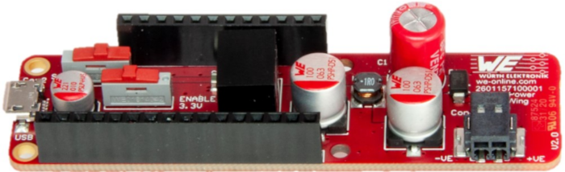

# MagI³C Power FeatherWing

## Introduction

The Würth Elektronik eiSos MagI³C Power FeatherWing is a development board that offers **5 V** and **3.3 V** power supply. It is fully compatible to the popular [Adafruit](https://www.adafruit.com/) [Feather line](https://www.adafruit.com/feather) of development boards and can be used as plug-and-play solution for a range of industrial input voltages (**5 V, 9 V, 12 V, 15 V, 18 V and 24 V**).

The MagI³C Power FeatherWing consists of two important components,
* [**MagI³C FDSM**](https://www.we-online.de/katalog/de/MAGIC_FDSM_FIXED_OUTPUT_VOLTAGE) [(173010535)](https://www.we-online.de/katalog/datasheet/173010335.pdf) - A power module with 6 V - 36 V input, 1 A current and a 5 V output.
* [**MagI³C VDMM**](https://www.we-online.de/katalog/de/MAGIC-VDMM) [(171010550)](https://www.we-online.de/katalog/datasheet/171010550.pdf) - A power module with 2.5 V - 5.5 V input, 1.2 A current and a variable output range set to 3.3 V.

The FeatherWing offers a **stable output voltage** for a **wide range of input voltages** making it an ideal power supply add-on to any Feather project.

This repository contains the [Altium](https://www.altium.com/) design files for the MagI³C Power FeatherWing [PCB](hardware).
For more information download the [MagI³C Power FeatherWing user manual](docs/MagI3CPowerFeatherWing.pdf). Feel free to check our [YouTube channel](https://www.youtube.com/user/WuerthElektronik/videos) for video tutorials, hands-ons and webinars relating to our products.

## Hardware

### Description

The MagI³C Power FeatherWing was designed with rapid prototyping in mind. Being fully compatible with the [Adafruit ecosystem](https://www.adafruit.com/), this [FeatherWing](https://www.adafruit.com/feather) offers the user the flexibility to choose from a range of input voltages to power the system. The inherent modularity of the ecosystem allows the FeatherWing to be easily integrated into any project.

### [**MagI³C FDSM**](https://www.we-online.de/katalog/de/MAGIC_FDSM_FIXED_OUTPUT_VOLTAGE) [(173010535)](https://www.we-online.de/katalog/datasheet/173010335.pdf)

The FDSM series of the MagI³C Power Module family is a fixed output voltage, **fully integrated DC-DC power supply** including the **switching regulator**, **inductor** and **capacitors** all in one package.

The module requires only an input capacitor and no other external components for operation, reducing design effort and complexity to a minimum.

The FDSM ensures fast time to market and low development costs. It is pin compatible with the common 78xx linear regulator series. The high efficiency reduces the power dissipation and in many cases a heat sink and assembly parts are unnecessary.

#### Key features

* Peak efficiency up to 94 %
* Current capability up to 1 A
* Output voltage: 3.3 V or 5 V
* Output voltage accuracy: ±4 % max
* No minimum load required
* Partially integrated input and output capacitors
* Integrated inductor
* Low output voltage ripple (< 20 mVpp)
* Fixed 520 kHz switching frequency
* Current mode control
* Pulse skipping for high efficiency at light loads
* Internal soft-start
* Thermal shutdown
* Short circuit protection
* Cycle by cycle current limit
* Pin compatible with the FDSM power modules series
* Operating ambient temperature range: 40 °C to 85 °C
* [RoHS](https://www.rohsguide.com/) and [REACh](https://ec.europa.eu/environment/chemicals/reach/reach_en.htm) compliant
* Case and potting material UL 94 Class V0 (flammability testing) certified
* Complies with **EN55032 class B** conducted and radiated emissions standard

Further details about MagI³C FDSM can be found [here](https://www.we-online.de/katalog/en/MAGIC_FDSM_FIXED_OUTPUT_VOLTAGE).

### [**MagI³C VDMM**](https://www.we-online.de/katalog/de/MAGIC-VDMM) [(171010550)](https://www.we-online.de/katalog/datasheet/171010550.pdf)

This VDMM MagI³C MicroModule provides a **fully integrated DC-DC power supply** including the **switching regulator** with **integrated MOSFETs**, **compensation**, and **shielded inductor** in one package.

The 171010550 offers high efficiency and delivers up to **1.2 A** of output current. It operates with an input voltage from **2.5 V to 5.5 V** and is designed for a small solution size. The selectable forced PWM or PFM/PWM mode allows for the choice between high efficiency and low output voltage ripple at light load. 

It is available in an **LGA-6EP** package (2.5 x 2.5 x 1.2 mm). This module has integrated protection circuitry that guards against thermal overstress with thermal shut-down and protects against electrical damage using over-current, short-circuit and under-voltage protections.

#### Key features

* Peak efficiency up to 96 %
* Output current up to 1.2 A
* Input voltage range: 2.5 V to 5.5 V
* Output voltage range: 0.8 V to 5.5 V
* 25 μA typical quiescent current
* Integrated shielded inductor
* Low output voltage ripple: ±6 mV typ.
* Output voltage accuracy over temperature: 2 % max.
* Fixed switching frequency: 4 MHz
* Constant On-Time control
* Synchronous operation
* Selectable forced PWM or PFM/PWM mode
* Undervoltage lockout protection (UVLO)
* Embedded soft-start
* Thermal shutdown
* Short-circuit protection
* Cycle-by-cycle current limit
* [RoHS](https://www.rohsguide.com/) and [REACh](https://ec.europa.eu/environment/chemicals/reach/reach_en.htm) compliant
* Operating ambient temperature up to 85 °C
* Operating junction temp. range: -40 °C to 125 °C
* Complies with EN55032 class B radiated emissions standard

Further details about the MagI³C VDMM can be found [here](https://www.we-online.de/katalog/en/MAGIC-VDMM).

### Pinouts

#### Feather Connector
This is the standard set of connectors that is used across the Feather ecosystem. The table below describes the functions of each of the 28 pins as applicable to this FeatherWing.

| Pin number | Pin name | Function |
| ------- | ------- |----------------|
|   1          |RST | Not connected|
|    2          | 3V3| 3.3 V power supply|
|    3          | AREF| Not connected|
|    4          | GND| Ground|
|    5          | A0| Not connected|
|    6          | A1| Not connected|
|    7          | A2| Not connected|
|    8          | A3| Not connected|
|    9          | A4| Not connected|
|    10         | A5| Not connected|
|    11         | SCK| Not connected|
|    12         | MOSI| Not connected|
|    13         | MISO| Not connected|
|    14         | U0RX| Not connected|
|    15         | U0TX| Not connected|
|    16         | NC| Not connected|

| Pin number | Pin name | Function |
| ------- | ------- |----------------|
|    17         | SDA| Not connected|
|    18         | SCL| Not connected|
|    19         | 5| Not connected|
|    20         | 6| Not connected|
|    21         | 9| Not connected|
|    22         | U1TX| Not connected|
|    23         | U1RX| Not connected|
|    24         | 12| Not connected|
|    25         | 13| Not connected|
|    26         | 5V| 5 V Power supply|
|    27         | EN| Not connected|
|    28         | VBAT| Not connected| 

#### Connector CON1
This is a 2-pole WR-TBL series horizontal entry screwless connector to connect input DC voltage from 6 V to 36 V.

| Pin number | Pin name | Description |
| ------- | ------- |----------------|
|   1 | -VE| Connect to GND |
|    2|  +VE| Connect to positive supply voltage (6 V - 36 V)|

#### Connector CON2
This is a standard micro-USB connector to connect 5V input.

:warning: Exceeding the absolute maximum values given in the data sheets of the MagI³C Power modules may affect the devices negatively and may cause permanent damage.

:warning: Please make sure that the USB power source is able to deliver enough current necessary for the application.

#### Switch S1
This sliding switch can be used to select between the two input power sources.

| Position | Source | 
| ------- | ------- |
| Left (towards CON2) | CON1 (6 V - 36 V) as input source |
| Right (towards CON1)| CON2 (5 V USB) as input |

#### Switch S2
This sliding switch can be used to enable/disable the 3.3 V output.

| Position | Source | 
| ------- | ------- |
|    Left (towards CON2) | Power supply ON |
|    Right (towards CON1)|  Power supply OFF|

### Schematics

