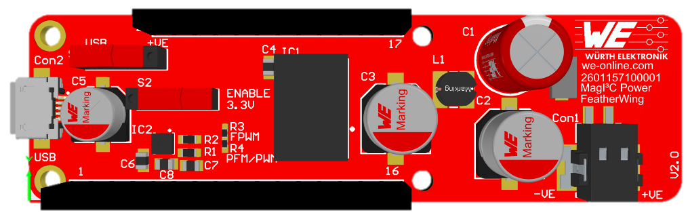
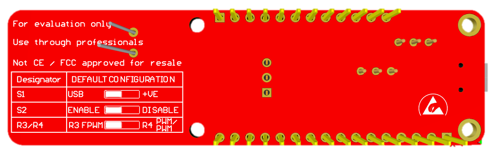

# MagI³C Power FeatherWing

## Introduction

The MagI³C Power Featherwing board functions as a plug compatible 5V and 3.3V power supply for the whole Würth Elektronik eiSos FeatherWing ecosystem. It operates at industrial input voltage rails of 9V, 12V, 15V, 18V and 24V with a maximum nominal input voltage of 36V[*](#myfootnote1). 

Additionally, the board can be powered with 5V USB connection, which can be selected by switch. The including MagI³C Power Modules transform the given industrial input voltage rail into 5V which is further transformed into 3.3V. These two voltage rails can be used to power other Feather-compatible boards. To control and also tune the performance of the MagI³C MicroModule the Enable functionality as well as the Mode selection can be used.

For further information of the MagI³C Power Modules please visit the linked datasheets [173010335](https://www.we-online.de/katalog/datasheet/173010335.pdf) and [171010550](https://www.we-online.de/katalog/datasheet/171010550.pdf) or directly contact our power module support hotline at [powermodules@we-online.com](mailto:%22Power%20Modules%22%3cpowermodules@we-online.com?subject=MagI³C%20FeatherWing%20board).

## Structure

<!-- 

 -->

| No | Designator| Component Description     | Purpose             |
|----|-----------|---------------------------|---------------------|
| 1  | Con1      | WR-TBL Serie 8050 Horizontal Entry SMT, Screwless, pitch 2.50mm, 2-pin | DC bus connection up to 36V
| 2  | Con2      | WR-COM Micro USB SMT Type B connector |	USB connection 5V
| 3  | S1        | WS-SLTV THT Mini Slide Switch | Switch between USB and bus supply 
| 4  | S2        | WS-SLTV THT Mini Slide Switch | Switch to enable / disable MagI³C MicroModule (IC2)
| 5	 | R3 / R4   | SMD resistor / 0R / 0402 | 0R resistance bridge for MODE selection
| 6	 | J1 / J2	 | Feather Headers, THT Vertical Female Header, pitch 2.54mm, single row, 12/16-pin | Pin headers for pluggable Feather board extensions
| 7	 | -	     | Configuration table | Configuration table for default settings

<a name="myfootnote1">* Exceeding the absolute maximum values given in the datasheets of the MagI³C FDSM 173010335 as well as MagI³C MicroModule 171010550 may affect the devices negatively and may cause permanent damage. 
