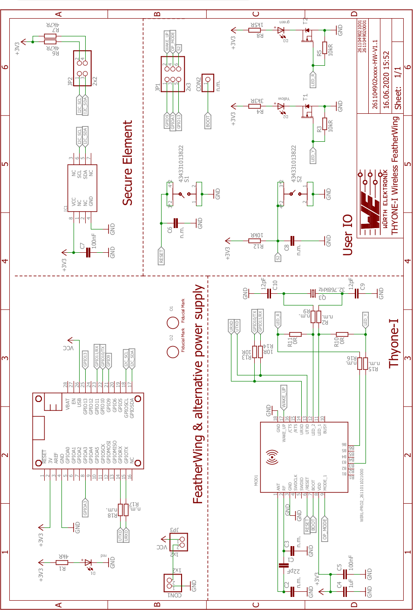

# Proteus-III BLE FeatherWing

## Introduction

The Würth Elektronik eiSos [Proteus-III BLE FeatherWing](https://www.we-online.com/katalog/de/proteus-III) is a development board that offers a **Bluetooth® Low Energy 5.1** wireless connectivity solution. It is fully compatible to the popular [Adafruit](https://www.adafruit.com/) [Feather line](https://www.adafruit.com/feather) of development boards. The FeatherWing consists of two important components:

* [**Proteus-III**](https://www.we-online.com/katalog/de/proteus-III) [(2611011024000)](https://www.we-online.com/katalog/datasheet/2611011024000.pdf) - 2.4 GHz proprietary radio module
* [**ATECC608A-TNGTLS**](http://ww1.microchip.com/downloads/en/DeviceDoc/ATECC608A-TNGTLS-CryptoAuthentication-Data-Sheet-DS40002112B.pdf) - Secure element from Microchip Technologies

The Proteus-III module has an UART interface and the secure element an I2C interface and hence can be connected to any of the Feather microcontroller boards. The available [Arduino](https://www.arduino.cc/) (C/C++) drivers and examples (see [software folder](software)) make it easy to build a prototype to kick-start the application development.

The Proteus-III BLE FeatherWing was designed with rapid prototyping in mind. Being fully compatible with the [Adafruit ecosystem](https://www.adafruit.com/), this [FeatherWing](https://www.adafruit.com/feather) gives the user the flexibility to choose the preferred host microcontroller. The inherent modularity of the ecosystem allows the FeatherWing to be easily integrated into any project.

This repository contains the [Eagle](https://www.autodesk.com/products/eagle/overview) design files for the Proteus-III BLE FeatherWing [PCB](hardware) as well as the [software](software) with quick start example. 

 Feel free to check our [YouTube channel](https://www.youtube.com/user/WuerthElektronik/videos) for video tutorials, hands-ons and webinars relating to our products.

### Secure Element

The Proteus-III BLE FeatherWing contains a [ATECC608A-TNGTLS](https://www.microchip.com/wwwproducts/en/ATECC608A) Microchip secure element. The ATECC608A-TNGTLS is a pre-provisioned variant of the ATECC608A secure element from Microchip Technologies. The device is configured to make the secure element suitable to some of the most common use cases for IoT applications. It offers a rich set of cryptographic features like key agreement using **ECDH**, **sign-verify mechanism**, and **encryption/decryption** over easily accessible I2C interface. Its tiny form factor and low power consumption makes it suitable for a wide variety of battery-driven applications.

## Hardware

### Description

The Proteus-III module is a radio sub module/device for wireless communication between devices such as control systems, remote controls, sensors et cetera. On the basis of Bluetooth® LE 5.1 it offers a fast and secure data transmission of data packages between two or more parties (point to point topology). A serial interface (UART) is available for communication with the host system.

The Proteus-III uses the Bluetooth® LE standard to provide general data transmission between several devices. The standard itself offers a wide range of configurations and possibilities to suit and optimize sophisticated customer applications. To fulfill the needs and specifications of such applications a tailored firmware can be developed on the basis of the Proteus-III hardware. This includes the connection and communication to custom sensors, custom Bluetooth® LE profiles, timing configurations, security configuration as well as power consumption optimizations.

Even with it’s small dimensions of 8 x 12 mm the Proteus-III provides a strongly miniaturized integrated PCB antenna. Beside it is possible to connect an external antenna if high radio ranges are of interest.

The main functionality is accessible through pads with edge castellation. This offers easy prototype building as it is suitable for hand soldering. More optional GPIOs without enlarging the size are accessible through land grid pads that can only be connected through reflow process.

### Key features

The Proteus-III BLE module offers a wide range of configurable features to suit even the most sophisticated application design.
* **SPP-like connection-based secured data transmission**: The Proteus-III firmware implements an SPP-like Bluetooth® LE profile that allows the bidirectional data transmission between several Proteus-III and/or to other Bluetooth® LE devices implementing the AMBER SPP profile. Any module in the network can initiate a connection setup. Secured connections allow the transmission of encrypted data
* **Remote GPIOs**: The Proteus-III firmware allows to switch free module GPIOs via remote control.
* **Advanced customization capabilities**:The configurable Device Information Service (DIS), the UUID and the appearance of the Bluetooth® LE profile, enable to personalize the Proteus-III to fuse with the user’s end product.
* **Low power position sensing solutions**: The current TX power of any Proteus-III is always transmitted with each advertising packet when the module is in command mode. With this, distance estimation and position sensing solutions can be realized conveniently by performing a passive scan.
* **Fast serial interface**:The Proteus-III offers a UART-interface to communicate with a host using a user-defined baud rate and a simple command interface.
* **Bluetooth® 5 stack**: The Bluetooth® 5 stack enables fast and energy efficient data transmission using state-of-the-art technology of Nordic Semiconductors.
* **High throughput mode**: The Proteus-III contains the so called "High throughput mode" that allows to send up to 4 data packets per connection interval. This increases the throughput significantly.
* **All Bluetooth® LE roles supported**: The integrated Bluetooth® LE stack supports all Bluetooth® LE roles. Depending on the current state of operation the Proteus-III firmware automatically switches its role to execute the user’s instructions.
* **Flexible wired interfacing**: The Proteus-III is equipped with extra pins suited for custom device/sensor connection. With help of these, a tailored firmware can be developed which is optimized to the customer’s needs. The pins can be configured to various functions such as UART, SPI, I2C, ADC, PWM, NFC and GPIO.
* **OTA firmware update**: The Proteus-III firmware provides over the air firmware update capabilities. Firmware updates can be applied using the Nordic Apps for cell phones.
* **Peripheral only mode**: The Proteus-III firmware provides the "peripheral only" operation mode, that allows the easy adaption of already existing custom hardware with the Bluetooth® LE interface. By default, this mode offers the static passkey pairing method with bonding and a transparent UART interface. With this, custom hardware can be accessed by mobile Bluetooth® LE devices (like smart phones including a custom App) using an authenticated and encrypted Bluetooth® LE link without the need of configuring the module.
* **Long range connect**:  For backward compatibility reasons, a Bluetooth® LE connection is setup using the legacy 1MBit radio mode and can then be updated to long range mode. The Proteus-III allows in addition to setup the connection immediately using the long range mode, such that even connections can be initiated on high distances.
* **Fast sensor data transmission via Beacons**:  The Proteus-III supports the transmission and reception of Beacons. Beacons are fast broadcast messages that allow the energy efficient unidirectional transmission of data. Especially in sensor networks, this feature is suitable for the frequent transmission of measurement data as it avoids the need for a connection-based communication and therefore is more energy efficient.

Further details about the Proteus-III radio module can be found under [we-online.de/katalog/en/Proteus-III](https://www.we-online.de/katalog/en/Proteus-III).

### Pinouts

#### Feather Connector
This is the standard set of connectors that is used across the Feather ecosystem. The table below describes the functions of each of the 28 pins as applicable to this FeatherWing.

| Pin number | Pin name | Function |
| ------- | ------- |----------------|
|   1          | RST | Not connected|
|    2          | 3V3| 3.3 V power supply|
|    3          | AREF| Not connected|
|    4          | GND| Ground|
|    5          | A0| Not connected|
|    6          | A1| Not connected|
|    7          | A2| Not connected|
|    8          | A3| (Optional) Proteus-III MODE pin via Jumper JP1|
|    9          | A4| Not connected|
|    10         | A5| Not connected|
|    11         | SCK| Not connected|
|    12         | MOSI| Not connected|
|    13         | MISO| Not connected|
|    14         | U0RX|  (Optional) Proteus-III UTXD pin via R18|
|    15         | U0TX| (Optional) Proteus-III URXD pin via R17|
|    16         | NC| Not connected|

| Pin number | Pin name | Function |
| ------- | ------- |----------------|
|    17         | SDA|I2C SDA to secure element|
|    18         | SCL|I2C SCL to secure element|
|    19         | 5| Not connected|
|    20         | 6| Not connected|
|    21         | 9|  (Optional) Proteus-III WAKE_UP pin via Jumper JP1|
|    22         | U1TX| Proteus-III URXD pin via R13|
|    23         | U1RX| Proteus-III UTXD pin via R14|
|    24         | 12| Not connected|
|    25         | 13| (Optinal) Push button S2 via JP1|
|    26         | 5V| 5 V Power supply|
|    27         | EN| Not connected|
|    28         | VBAT| Not connected| 

#### Jumper JP1
This jumper enables the use of WAKE_UP and MODE pins of the Proteus-III module as well as the Switch S2 from the host microcontroller. 

| Pin connection | Function  | Jumper set (Default) |
| ------- | ------- |----------------|
|    1,2	| WAKE_UP to GPIO9 |	No |
|    3,4	| MODE to GPIOA3 |	No |
|    5,6	| Switch S2 to GPIO13 |	Yes |

#### Jumper JP2
The standard I2C interface requires the SCL and SDA lines to be pulled up with resistors. These jumpers can be removed in cases where the pull-ups already exist on the I2C bus. 

| Pin connection | Function  | Jumper set (Default) |
| ------- | ------- |----------------|
|    1,2|	Connect  I2C SCL line to a 4.7 k&#8486; Pull up resistor|	Yes|
|    3,4|	Connect  I2C SDA line to a 4.7 k&#8486; Pull up resistor|	Yes|

#### Jumper JP3
This jumper, when set, connects the external power supply coming from CON1 to V_USB.

| Pin connection | Function  | Jumper set (Default) |
| ------- | ------- |----------------|
|    1,2|	Connect  external supply connected to CON1 to V_USB|	No|

#### Push button S1
This push button is connected to the /RESET pin of the Proteus-III module. Pressing this button resets the module.

#### Push button S2
S2 is a general purpose push button which is connected to GPIO 13 when a jumper is set between pins 5 and 6 of JP1.

### Schematics

## Software

Proteus-III BLE FeatherWing **software examples** can be found in the [software folder](software).
