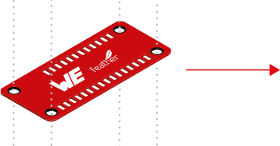

# WE Adafruit FeatherWings

[Würth Elektronik eiSos](https://www.we-online.de/web/en/wuerth_elektronik/start.php) presents, a range of FeatherWing development boards that are **open source** and **fully compatible** with the **Feather form factor**. Through these development boards WE brings a range of wireless connectivity modules, sensors and power modules to the Feather ecosystem.

[Adafruit Feather](https://www.adafruit.com/feather) is a complete line of development boards from [Adafruit](https://www.adafruit.com/) and other developers that are both standalone and stackable. They're able to be powered by [LiPo batteries](https://en.wikipedia.org/wiki/Lithium_polymer_battery) for on-the-go use or by their [micro-USB](https://www.we-online.de/katalog/de/em/connectors/input_output_connectors/wr-com) plugs for stationary projects. Feathers are flexible, portable, and as light as their namesake.

[FeatherWings](https://learn.adafruit.com/adafruit-feather/featherwings) are stacking boards and add functionality and room for prototyping. At its core, the Adafruit Feather is a complete ecosystem of products - and the best way to get your project flying.

Hypercharge your prototyping for easy and fast solution testing. 
Start by checking our [quick start section](#Quick-start-guide).

| Image    | Description |
| -------- | ----------- |
| | [**Sensor FeatherWing** (2501000201291)](/SensorFeatherWing) <ul> <li>Acceleration (WSEN-ITDS)<li>Absolute Pressure (WSEN-PADS)<li>Temperature (WSEN-TIDS)<li>Humidity (WSEN-HIDS)<li>[Sparkfun QWIIC® Connect System](https://www.sparkfun.com/qwiic) to connect additional peripherals </ul> |
| | [**Thyone-I Wireless FeatherWing** (2611059021001)](/ThyoneWirelessFeatherWing)<ul><li>2.4 GHz Proprietary radio Module<li>Robust wireless link up to 500 m<li>Easy build up networks<li>Connect to Thyone modules or USB-Stick</ul> |
| | [**Calypso WiFi FeatherWing** (2610039025001)](/CalypsoWiFiFeatherWing)<ul><li>2.4 GHz WiFi-Connectivity <li>Easy and secure connection to Smart Devices<li>Out-of-the-box support to applications like HTTP(S), MQTT(S) <li>AT-style command interface </ul> |
| | [**MagI³C Power FeatherWing** (2601157100001)](/MagI3CPowerFeatherWing)<ul><li>5 V and 3.3 V power supply<li>Using a range of input voltages (5 V, 9 V, 12 V, 15 V, 18 V and 24 V industrial rails)</ul> |
| | Connect any **Adafruit Feather Microcontroller**  (e.g. [Adafruit Feather M0 Express](https://www.adafruit.com/product/3403) or [Adafruit Feather M4 Express](https://www.adafruit.com/product/3857))<ul><li>Request sensor data<li>Transfer data to RF-Module<li>Examples available on Github<li>Source code available on Github</ul> |

## Quick start guide

**Read this documentation!**

This step-by-step description will guide you through the setup process and help avoid the most common mistakes. These steps are relevant for all the WE FeatherWings.

### Hardware requirements

1. Adafruit feather M0 - Featherwings are stackable, add-on boards that bring additional functionality to any Feather board. The current repository contains software developed on the [Adafruit Feather M0 express](https://www.adafruit.com/product/3403).

>Note: The WE featherwings can be operated only in combination with a Feather. Please use the Feather M0 express for the quick start examples.

2. Stable power supply - Please ensure that the boards are powered using a clean and stable power supply. The following input options are available,
- **USB** interface on the M0 feather. 
>Note: Please use this option for the quick start examples. The USB interface will also be used to upload the example code to the microcontroller.

- **LiPo** - For low power applications, it is also possible to connect a LiPo battery. Please ensure that the battery can deliver sufficient current at the desired voltage for the combination of boards used.

- [**MagI³C Power FeatherWing** (2601157100001)](/MagI3CPowerFeatherWing) - Stack on this WE featherwing to use a range of input voltages (5 V, 9 V, 12 V, 15 V, 18 V and 24 V industrial rails).

3. Computing device with sufficient memory and an internet connection. 
>Note: The software tools used in the quick start example require up to 2 GB of storage.

### Software installation
In order to enable ease of prototyping, we use the popular cross platform integrated development environment, [Visual Studio Code](https://code.visualstudio.com/) along with some extensions. The following steps will guide you through the installation process.

1. Download and install **[Visual Studio Code](https://code.visualstudio.com/download)** by following the steps described [here](https://code.visualstudio.com/docs/setup).

2. **Install** the [PlatformIO](https://platformio.org/install/ide?install=vscode) extension for Visual Studio Code
  - Select **Extensions** in the lower left
  - **Type** platformio in the *Search window* and 
  - when PlatformIO IDE extension appears, **press the blue Install button**

> **Note**: Do not close the VS code window until PlatformIO is completely installed.
> Installation process can be slow, depending on speed and network connection of your computer. 

3. After the PlatformIO extension has been installed follow the on screen instructions to **restart** Visual Studio Code.                                                                                               

The PlatformIO extension will then be loaded in Visual Studio Code and its icon will appear in the Visual Studio Code menu bar on the left side.

### Running the sample applications

1. **Download documentation and example code** from https://github.com/WurthElektronik/FeatherWings using git clone or a simple zip file.     

   
2. There are **4 different** example applications
   - Sensor FeatherWing example showing the functionality of the Sensor FeatherWing
   - Thyone-I Wireless FeatherWing example showing the transmit and receive functionality over a 2.4 GHz proprietary wireless link. 
   - Calypso Wi-Fi FeatherWing example showing the Wi-Fi capabilities
   - Sensor2Cloud connectivity example that sends data measured using the sensors via Wi-Fi to wither Microsoft Azure or Amazon AWS cloud.

> **Note**: For more details on each board and workspace, please see above table and check the board you are interested in.

3. **Open workspace file** for the case you want to test.                  

Chose the workspace you would like to work with based on your preferences.

                                                                                                  
After selecting the workspace, the workspace will appear in your visual studio code and PlatformIO will recognize it as the PlatformIO project. In this quick start guide we will use the simple SensorFeatherWing workspace.   

4. After loading the workspace, connect the set of boards you want to test to the USB port for programming.
For that you will need a combination of at least one WE FeatherWing and one Microcontroller Feather board (for more details see table below).                                                             
 

4. Go into the PlatformIO extension and select the **PROJECT TASKS** dropdown list.

5. **Build** the code using the PlatformIO extension and then **Upload** it to the micro controller. The Upload command will also execute Build before it uploads, but doing it in two steps, first Build then Upload, you will be able to check if the code is correctly built and it prevents uploading erroneous code to the micro controller. 

> **Note**: Wait until PlatformIO rebuilds its indices.
> Index rebuild process can be slow, depending on speed and network connection of you computer.

6. Press **Monitor** and check the Visual Studio Code **TERMINAL** window for results.

