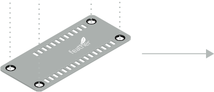

# WE Adafruit FeatherWings

[Würth Elektronik eiSos](https://www.we-online.de/web/en/wuerth_elektronik/start.php) presents, a range of FeatherWing development boards that are **open source** and **fully compatible** with the **Feather form factor**. Through these development boards WE brings a range of wireless connectivity modules, sensors and power modules to the Feather ecosystem.

[Adafruit Feather](https://www.adafruit.com/feather) is a complete line of development boards from [Adafruit](https://www.adafruit.com/) and other developers that are both standalone and stackable. They're able to be powered by [LiPo batteries](https://en.wikipedia.org/wiki/Lithium_polymer_battery) for on-the-go use or by their [micro-USB](https://www.we-online.de/katalog/de/em/connectors/input_output_connectors/wr-com) plugs for stationary projects. Feathers are flexible, portable, and as light as their namesake.

[FeatherWings](https://learn.adafruit.com/adafruit-feather/featherwings) are stacking boards and add functionality and room for prototyping. At its core, the Adafruit Feather is a complete ecosystem of products - and the best way to get your project flying.

Supercharge your prototyping for easy and fast solution testing.
Start by checking our [quick start section](#Quick-start-guide).

| Image    | Description |
| -------- | ----------- |
| | [**Sensor FeatherWing** (2501000201291)](/SensorFeatherWing) <ul> <li>Acceleration (WSEN-ITDS)<li>Absolute Pressure (WSEN-PADS)<li>Temperature (WSEN-TIDS)<li>Humidity (WSEN-HIDS)<li>[Sparkfun QWIIC® Connect System](https://www.sparkfun.com/qwiic) to connect additional peripherals     Note: this Feather will be updated with new sensors in the future.</ul> |
| | [**Thyone-I Wireless FeatherWing** (2611059021001)](/ThyoneWirelessFeatherWing)<ul><li>2.4 GHz Proprietary radio Module<li><li>Easy build up networks<li>Connect to Thyone modules or USB-Stick.     Note: this Feather will be replaced by Setebos-I Feather with selectable radio protocol (either Proteus-III Bluetooth LE or Thyone-I) in the future.</ul> |
| | [**Calypso WiFi FeatherWing** (2610039025001)](/CalypsoWiFiFeatherWing)<ul><li>2.4 GHz WiFi-Connectivity <li>Easy and secure connection to Smart Devices<li>Out-of-the-box support to applications like HTTP(S), MQTT(S) <li>AT-style command interface </ul> |
| | [**Proteus-III BLE FeatherWing** (not available as a standalone product)](/ProteusFeatherWing)<ul><li>Bluetooth® Low Energy 5.1 module<li>Nano SIM size<li>2 MBit PHY and Coded PHY (long range)<li>Connect to any smart device with and app.     Note: this Feather will be replaced by Setebos-I Feather with selectable radio protocol (either Proteus-III Bluetooth LE or Thyone-I) in the future.</ul> |
| | [**MagI³C Power FeatherWing** (2601157100001)](/MagI3CPowerFeatherWing)<ul><li>5 V and 3.3 V power supply<li>Using a range of input voltages (5 V, 9 V, 12 V, 15 V, 18 V and 24 V industrial rails)</ul> |
| | Connect any **Adafruit Feather Microcontroller**  (e.g. [Adafruit Feather M0 Express](https://www.adafruit.com/product/3403) or [Adafruit Feather M4 Express](https://www.adafruit.com/product/3857))<ul><li>Request sensor data<li>Transfer data to RF-Module<li>Examples available on Github<li>Source code available on Github</ul> |

## Quick start guide

**Read this documentation!**

This step-by-step description will guide you through the setup process for taking WE FeatherWings into operation  and help avoid the most common mistakes.

### Hardware requirements

1. Adafruit Feather M0 - FeatherWings are stackable, add-on boards that bring additional functionality to any Feather board. The current repository contains software developed on the [Adafruit Feather M0 express](https://www.adafruit.com/product/3403).

>**Note**: The WE FeatherWings can be operated only in combination with a Feather. Please use the Feather M0 express for the quick start examples.

2. WE FeatherWing - Please choose the FeatherWing of interest or a combination of FeatherWings and stack it on to the Feather.

3. Stable power supply - Please ensure that the boards are powered using a clean and stable power supply. The following input options are available,
- **USB** interface on the M0 Feather.
>**Note**: Please use this option for the quick start examples. The USB interface will also be used to upload the example code to the microcontroller.

- **LiPo** - For low power applications, it is also possible to connect a LiPo battery. Please ensure that the battery can deliver sufficient current at the desired voltage for the combination of boards used.

- [**MagI³C Power FeatherWing** (2601157100001)](/MagI3CPowerFeatherWing) - Stack on this WE FeatherWing to use a range of input voltages (5 V, 9 V, 12 V, 15 V, 18 V and 24 V industrial rails).

4. Computing device with sufficient memory and an internet connection.
>**Note**: The software tools used in the quick start example require up to 2 GB of data storage.

### Software installation
In order to enable ease of prototyping, we use the popular cross platform integrated development environment, [Visual Studio Code](https://code.visualstudio.com/) along with some extensions. The following steps will guide you through the installation process.

1. Download and install **[Visual Studio Code](https://code.visualstudio.com/download)** by following the steps described [here](https://code.visualstudio.com/docs/setup).
>**Note**: If you are in a corporate environment, check with your IT department if you are required to enter proxy settings and credentials inside Visual Studio Code.

2. **Install** the [PlatformIO](https://platformio.org/install/ide?install=vscode) extension for Visual Studio Code.
  - Select **Extensions** in the lower left
  - **Type** platformio in the *Search window* and
  - when PlatformIO IDE extension appears, **press the blue Install button**

> **Note**: Do not close the Visual Studio Code window until PlatformIO is completely installed.
> Installation process can be slow, depending on speed and network connection of your computer. 

3. After the PlatformIO extension has been installed follow the on screen instructions to **restart** Visual Studio Code.

The PlatformIO extension will then be loaded in Visual Studio Code and its icon will appear in the Visual Studio Code menu bar on the left side.

### Running the sample applications

1. **Download documentation and example code** from https://github.com/WurthElektronik/FeatherWings using [git](https://git-scm.com/) ``clone`` https://github.com/WurthElektronik/FeatherWings.git or a simple [zip file](https://github.com/WurthElektronik/FeatherWings/archive/main.zip).

1. This repository contains **four different**, **ready-to-run** applications:
   - [Sensor FeatherWing example](/SensorFeatherWing/software) showing the functionality of the Sensor FeatherWing.
   - [Thyone-I Wireless FeatherWing example](/ThyoneWirelessFeatherWing/software) showing the transmit and receive functionality over a 2.4 GHz proprietary wireless link. 
   - [Calypso Wi-Fi FeatherWing example](/CalypsoWiFiFeatherWing/software) showing the Wi-Fi capabilities.
   - [Sensor2Cloud connectivity example](/Sensor2CloudConnectivity) sends data measured using the sensors via Wi-Fi to the Microsoft Azure or Amazon AWS cloud.
   - [Sensor2BLE connectivity example](/Sensor2BLE) uses Bluetooth Low Energy in Role Peripheral to share the Sensor measurement values with a Smart Device. The WE-SensorBLE App is required on the smart device. Requires to a Proteus-III compatible radio module, such as available with Setebos-I Feather.
   

> **Note**: For more details on each board and workspace, please click on the links above.

3. **Open workspace file** for the case you want to test.

Chose the workspace you would like to work with based on your preferences.

After selecting the workspace, the workspace will appear in your Visual Studio Code and PlatformIO will recognize it as its project. In this quick start guide we will use the simple SensorFeatherWing workspace.

1. After loading the workspace, connect the set of boards you want to test to the USB port for programming.
For that you will need a combination of at least one WE FeatherWing and one microcontroller Feather board (for more details see table below).

5. Go into the PlatformIO extension and select the **PROJECT TASKS** dropdown list.

6. **Build** the code using the PlatformIO extension and then **Upload** it to the microcontroller. The Upload command will also execute Build before it uploads, but doing it in two steps, first Build then Upload, you will be able to check if the code is correctly built and it prevents uploading erroneous code to the microcontroller.

> **Note**: Wait until PlatformIO rebuilds its indices.
> Index rebuild processes can be slow, depending on speed and network connection of you computer.

7. Press **Monitor** and check the Visual Studio Code **TERMINAL** window for results.

