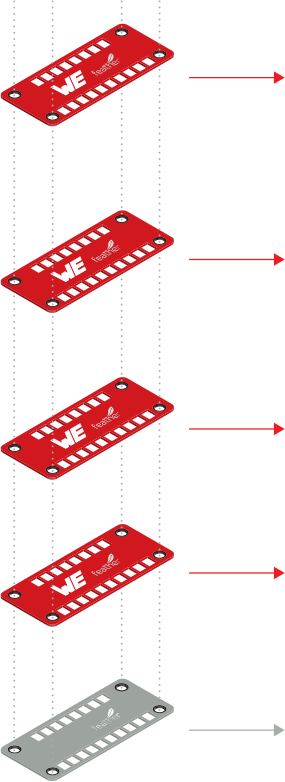

 | 

# WE Adafruit FeatherWings

[Adafruit Feather](https://www.adafruit.com/category/943) is a complete line of development boards from [Adafruit](https://www.adafruit.com/) and other developers that are both standalone and stackable. They're able to be powered by [LiPo batteries](https://en.wikipedia.org/wiki/Lithium_polymer_battery) for on-the-go use or by their [micro-USB](https://en.wikipedia.org/wiki/USB_hardware) plugs for stationary projects. Feathers are flexible, portable, and as light as their namesake.

FeatherWings are stacking boards and add functionality and room for prototyping. At its core, the Adafruit Feather is a complete ecosystem of products - and the best way to get your project flying.

Würth Elektronik eiSos FeatherWings are open source and use this form factor to maximize compatibility with dozens of pre-existing boards.
Hypercharge your prototyping for easy and fast solution testing.

| Image    | Description |
| -------- | ----------- |
| | Sensor FeatherWing (2501000201291) * Acceleration (WSEN-ITDS) * Absolute Pressure (WSEN-PADS) * Temperature (WSEN-TIDS) * Humidity (WSEN-HIDS) * Using additionaly Sparkfun QWIIC Connect System |