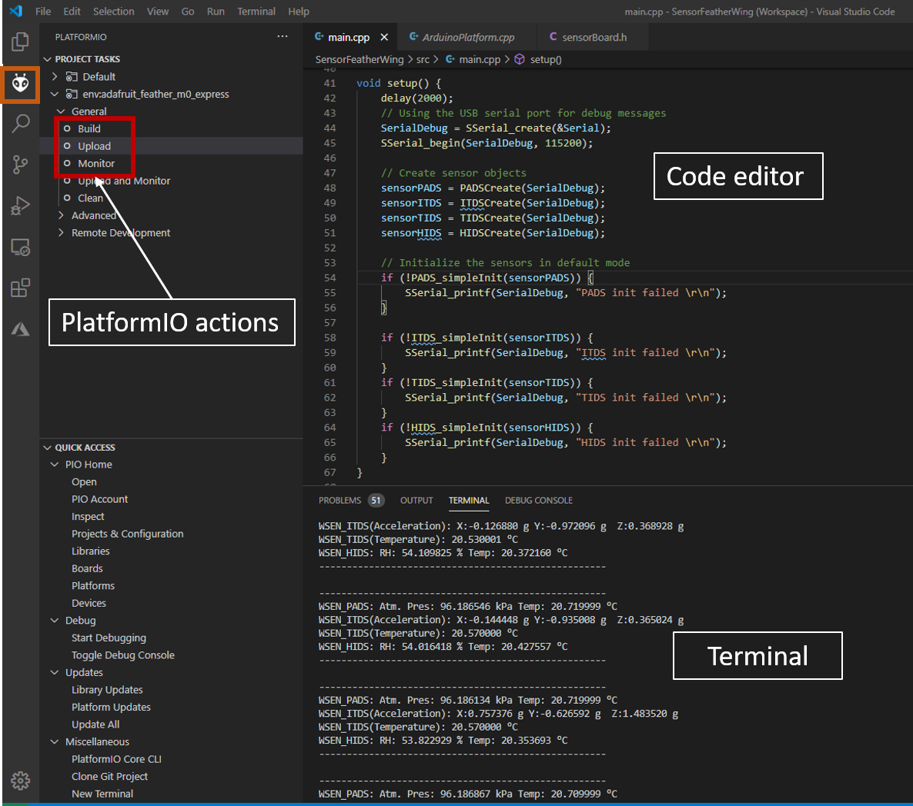

# Sensor to smart device example using WE Featherwings

## Introduction

Würth Elektronik eiSos offers different product development boards in the FeatherWing form factor. Access to the Feather eco-system offers unlimited possibilities. One such example is described here with the combination of an [Adafruit Feather M0 Express](https://www.adafruit.com/product/3403) with our [Sensor FeatherWing](../SensorFeatherWing)  and [Setebos-I FeatherWing](../Setebos-I_FeatherWing).

A typical IoT application involves sensing the environment through sensors, collecting the sensor data and passing it on to the smart device. The smart device then offers possibilities to further process and visualize data. In this example, the data from the sensors on the Sensor FeatherWing is read and forwarded via Setebos-I BLE FeatherWing. This data is visualized on the **WE-SensorBLE** smart device application available for [Android](https://play.google.com/store/apps/details?id=com.eisos.wesensorble) and [iOS](https://apps.apple.com/de/app/we-sensorble/id1642507035)  

This Evaluation Kit is not yet in series production, radio hardware is currently using Protues-III instead of later Setebos-I. Changes may apply till product release.
A Setebos-I Feather will not be available as a product, since Bluetooth LE function can be supported by the Setebos-I Feather.

### Installing the tools

* Install Visual Studio Code on the platform of your choice following the [instructions](https://code.visualstudio.com/docs).
* Follow the instructions to install [PlatformIO IDE](https://platformio.org/platformio-ide) extension.
* Please download the **WE-SensorBLE** app on the smart device of your choice.
*  [Android](https://play.google.com/store/apps/details?id=com.eisos.wesensorble) app from Google Play store or
* [iOS](https://apps.apple.com/de/app/we-sensorble/id1642507035) app from the Apple App store.  

## Running this example

This example is written to be run on Adafruit Feather M0 express. The hardware setup is as simple as stacking up the Sensor FeatherWing and Thyone-I (Nordic nRF52840) FeatherWing on top of the M0 Feather and powering up the board. The radio board is setup with Bluetoth LE capable firwmare. When released the Product will use Setebos-I as module on the FeatherWing.

1. Clone or download the code.
2. Open the workspace of interest with the filename `Sensor2BLE.code-workspace` in Visual Studio Code.
3. Build and upload the code from the PlatformIO tab as shown in the figure below
4. After successful upload, click on **Monitor** in the PlatformIO extension tab to view the debug logs in the serial terminal.
5. Open the **WE-SensorBLE** app on your smart device.
6. Select the correct device from the list of available devices.
7. The sensor data is now available on the app.

   

