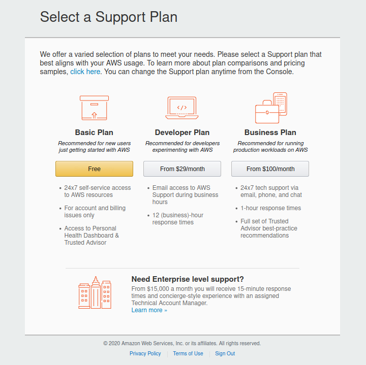

# Example: Amazon AWS with Calypso WiFi FeatherWing

## Introduction

This article describes how to create and manage IoT device using the [AWS Management Console](https://aws.amazon.com), how to connect to the cloud and visualize your data.

To use the steps in this tutorial, you need an [AWS subscription](https://azure.microsoft.com/en-us/free/). If you don't have an Azure subscription, please [create a free account](https://docs.aws.amazon.com/iot/latest/developerguide/setting-up.html) before you begin. Feel free to use free support plan



> **Note**: 
> If you have [Visual Studio Code](https://code.visualstudio.com/) you can use [AWS Toolkit Extension](https://aws.amazon.com/visualstudiocode/) to work with your AWS account. To make this possible, you will need to create AWS user and get its [access keys](https://docs.aws.amazon.com/toolkit-for-vscode/latest/userguide/obtain-credentials.html). More details in [Setting up your AWS credentials](https://docs.aws.amazon.com/toolkit-for-vscode/latest/userguide/setup-credentials.html).


## IoT-Core

In this tutorial, you'll install the software and create the AWS IoT resources necessary to connect a device to AWS IoT so that it can send and receive MQTT messages with AWS IoT Core. You'll see the messages in the MQTT client in the AWS IoT console. 

### Necessary steps

* Sign up for an AWS account
* Create a user and grant permissions
* Open the AWS IoT console

If you already have an AWS account and an IAM user for yourself, you can use them and skip ahead to the next steps. For more information about AWS user account setup, please read [Set up your AWS account](https://docs.aws.amazon.com/iot/latest/developerguide/setting-up.html)


### Sign up to IoT-Core

1. Sign in to the [AWS Management Console](https://aws.amazon.com).
2. Select **IoT Core** from the Menu.


3. Create new **Thing** (device) from the AWS IoT **Manage** menu and click **Register a thing** to start the process


4. In **Add your device to the thing registry**  give a **Name** to your thing and chose **Thing Type** if any exists.


If you do not have type, please create one with the **Create a type** button. Fill the form and press **Create thing type** button.


5. When offered to use certificates please use **One-click certificate creation (recommended)** option and press the **Create certificate** button.


6. If the certificates are created correctly, the success page will appear with the links to the certificates.

**Download**: 
* **A certificate for this thing** and 
* **A private key**.
Neither Public Key nor Root CA Certificate for AWS are needed, since the root certificate is already integrated in Calypso module.
7. **Activate**


### Certificate and Policy

1. Press button **Activate** and then **Attach a policy**
2. If policy does not exist click on **Create new policy** to create new one.


3. On the **Create a policy** page enter policy **Name** and **Add statement**.  In the **Action list** chose appropriate statements:
   * *iot:Connect*, 
   * *iot:Publish* 
   * *iot:Receive* 
  from the drop down menu. Chose **Effect** **Allow** and press **Create** or use **Advanced** modus and copy the following code.


```json

{
  "Version": "2012-10-17",
  "Statement": [
    {
      "Effect": "Allow",
      "Action": "iot:Connect",
      "Resource": "arn:aws:iot:eu-central-1:123456789012:client/we-iot-device-t1"
    },
    {
      "Effect": "Allow",
      "Action": "iot:Publish",
      "Resource": "arn:aws:iot:eu-central-1:123456789012:topic/test"
    },
    {
      "Effect": "Allow",
      "Action": "iot:Receive",
      "Resource": "arn:aws:iot:eu-central-1:123456789012:topic/test"
    }
  ]
}
```
4.  Now that the policy has been created, navigate to the **Certificates** page using the link on the left. You'll see a certificate entry for the certificate we created earlier.Chose **Attach policy** from the **Actions** drop down menu and chose policy
  

5. Chose policy and press **Add**.                                                                                   
  

This way, a thing with the policy and private key is created, to connect with the [Calypso WiFi FeatherWing](https://github.com/WE-eiSmart/FeatherWings-Hardware/tree/main/CalypsoWiFiFeatherWing) directly.


## Visualizing Sensor Data in Amazon QuickSight

Using AWS Serverless Application Model (AWS SAM), you can reduce the cost and time to market of an IoT solution. This chapter demonstrates how to collect and visualize data from a [Calypso WiFi FeatherWing](../../../../../CalypsoWiFiFeatherWing) using a variety of AWS services. Much of this can be accomplished within the AWS Free Usage Tier, which is necessary for the following instructions.

### Services used

The following services are used in this example:

* AWS Lambda
* Amazon Kinesis Data Firehose
* Amazon QuickSight
* Amazon S3

### Necessary Steps

* Forwarding messages from an AWS IoT Core topic stream to a Lambda function.
* Using a Kinesis Data Firehose delivery stream to store data in S3.
* Analyzing and visualizing data stored in S3 using Amazon QuickSight.

### Create a Kinesis Firehose delivery stream

[Amazon Kinesis Data Firehose](https://aws.amazon.com/kinesis/data-firehose/) is a service that reliably loads streaming data into data stores, data lakes, and analytics tools. Amazon QuickSight requires a data store to create visualizations of the sensor data. This simple Kinesis Data Firehose delivery stream continuously uploads data to an S3 storage bucket. The next sections cover how to add records to this stream using a Lambda function.

1. In the [Kinesis Data Firehose console](https://console.aws.amazon.com/firehose/), create a new delivery stream, called ***CalypsoDataStream***.
   

2. Leave the default source as a **Direct PUT or other sources** and choose **Next**.
3. On the next screen, leave all the default values and choose **Next**.
4. Select **Amazon S3** as the destination and create a new bucket with a unique name. This is where records are continuously uploaded so that they can be used by Amazon QuickSight.
  

5. On the next screen, in the **Permission** section, choose **Create or update IAM Role**. This gives the Firehose delivery stream permission to upload to S3.                                                                                              
  

6. Review and then choose **Create Delivery Stream**.

It can take some time to fully create the stream. In the meantime, continue on to the next section.

### Invoking Lambda using AWS IoT Core rules

Using [AWS IoT Core rules](https://docs.aws.amazon.com/iot/latest/developerguide/iot-rules.html), you can forward messages from devices to a [Lambda function](https://aws.amazon.com/lambda/), which can perform actions such as uploading to an [Amazon DynamoDB](https://aws.amazon.com/dynamodb/) table or an [S3 bucket](https://aws.amazon.com/s3/), or running data against various [Amazon Machine Learning services](https://aws.amazon.com/machine-learning/?nc2=h_m1). In this case, the function transforms and adds a message to the Kinesis Data Firehose delivery stream, which then adds that data to S3.

AWS IoT Core rules use the MQTT topic stream to trigger interactions with other AWS services. An AWS IoT Core rule is created by using an SQL statement, a topic filter, and a [rule action](https://docs.aws.amazon.com/iot/latest/developerguide/iot-rule-actions.html). The Calypso example publishes messages every five seconds on the topic test. The following instructions show how to consume those messages with a Lambda function.

### Create a Lambda function

Before creating an AWS IoT Core rule, you need a Lambda function to consume forwarded messages.


1. In the [AWS Lambda console](https://console.aws.amazon.com/lambda/home), choose Create function.
   

2. Name the function ``CalypsoConsumeMessage``.
3. For **Runtime**, choose 
   * **Author From Scratch, Node.js12.x**. 
   * For **Execution role**, choose **Create a new role with basic Lambda permissions**.
   * Choose **Create**.
4. On the **Execution role** card, choose **View the CalypsoConsumeMessage-role**-xxxx on the **IAM console**.
5. Choose **Attach Policies**. Then, search for and select **AmazonKinesisFirehoseFullAccess**.
6. Choose **Attach Policy**. This applies the necessary permissions to add records to the Firehose delivery stream.
7. In the **Lambda console**, in the **Designer** card, select the function name.
8. Paste the following in the code editor, replacing *CalypsoDataStream* with the name of your own Firehose delivery stream. Choose **Save**.

```JavaScript

const AWS = require('aws-sdk');

const firehose = new AWS.Firehose();
const StreamName = "CalypsoDataStream";

exports.handler = async (event, context, callback) => {
    
    console.log('Received IoT event:', JSON.stringify(event, null, 2));

    let payload = {
        deviceId: event.deviceId,
        messageId: event.messageId,
        time: new Date(event.ts*1000),
        TIDS_T_C: event['TIDS_T[°C]'],
        HIDS_T_C: event['HIDS_T[°C]'],
        HIDS_H_percent: event['HIDS_RH[]'],
        PADS_T_C: event["PADS_T[°C]"],
        PADS_P_kPa: event["PADS_P[kPa]"],
        ITDS_X_mg: event["ITDS_X[mg]"],
        ITDS_Y_mg: event["ITDS_Y[mg]"],
        ITDS_Z_mg: event["ITDS_Z[mg]"]
    };
    
    console.log('payload', payload);

    let params = {
            DeliveryStreamName: StreamName,
            Record: {
                Data: JSON.stringify(payload)
            }
        };
        
    return await firehose.putRecord(params).promise();

};
```

### Create an AWS IoT Core rule

To create an AWS IoT Core rule, follow these steps.

1. In the [AWS IoT console](https://console.aws.amazon.com/iot/home), choose **Act**.
2. Choose **Rules**, and in the configuration action select *CalypsoDataStream* and **Add action**
4. Give a **Name** to the query and for **Rule query statement**, copy and paste ``SELECT * FROM 'test’``. This subscribes to the outgoing message topic used in the Calypso AWS example.
5. Choose **Add action, Send a message to a Lambda function, Configure action** and add **Create rule**.
6. Select the function created in the last set of instructions.
7. Choose **Create rule**.

At this stage, any message published to the ``test`` topic forwards to the ``CalypsoConsumeMessage`` Lambda function, which transforms and puts the payload on the Kinesis Data Firehose stream and also logs the message to [Amazon CloudWatch](https://aws.amazon.com/cloudwatch/). If you’ve connected an Calypso device to AWS IoT Core, it publishes to that topic every five seconds.

The following steps show how to test functionality using the AWS IoT console.

1. In the [AWS IoT console](https://console.aws.amazon.com/iot/home), choose **Test**.
2. For **Publish**, enter the topic *test*.
3. Enter the following test payload:

```json
{
  “time”: 1567023375013,  
  “TIDS_T_C”: 25.0
}
```

4. Choose **Publish to topic**.
5. Navigate back to your Lambda function.
6. Choose **Monitoring, View logs in CloudWatch**.
7. Select a log item to view the message contents, as shown in the following screenshot.

### Visualizing data with Amazon QuickSight

To visualize data with Amazon QuickSight, follow these steps.

1. In the Amazon QuickSight console, [sign up](https://quicksight.aws.amazon.com/sn/console/signup).
2. Choose **Manage Data, New Data Set**. Select **S3** as the data source.
3. A manifest file is necessary for Amazon QuickSight to be able to fetch data from your S3 bucket. Copy the following into a file named ``manifest.json``. Replace *YOUR-BUCKET-NAME* with the name of the bucket created for the Firehose delivery stream.
```json
{
    "fileLocations":[
      {
          "URIPrefixes":[
            "s3://YOUR-BUCKET-NAME/"
          ]
      }
    ],
    "globalUploadSettings":{
      "format":"JSON"
    }
}
```

5. Upload the ``manifest.json`` file.
6. Choose **Connect**, then **Visualize**. You may have to [give Amazon QuickSight explicit permissions](https://docs.aws.amazon.com/quicksight/latest/user/managing-permissions.html) to your S3 bucket.
7. Finally, design the Amazon QuickSight visualizations in the drag and drop editor. Drag the two available fields into the center card to generate a Sum of Sensor_value by Time visual.


## Conclusion

This post demonstrated visualizing data from a securely connected remote IoT device. This was achieved by connecting an [Calypso Wi-Fi FeatherWing](../../CalypsoWiFiFeatherWing) to AWS IoT Core using MQTT, forwarding messages from the topic stream to Lambda using IoT Core rules, putting records on an Amazon Kinesis Data Firehose delivery stream, and using Amazon QuickSight to visualize the data stored within an S3 bucket.

With these building blocks, it is possible to implement highly scalable and customizable IoT data collection, analysis, and visualization. With the use of other AWS services, you can build a full end-to-end platform for an IoT product that can reliably handle volume. To further explore how hardware and AWS Serverless can work together, visit the Amazon Web Services page on [Hackster](https://www.hackster.io/AmazonWebServices).