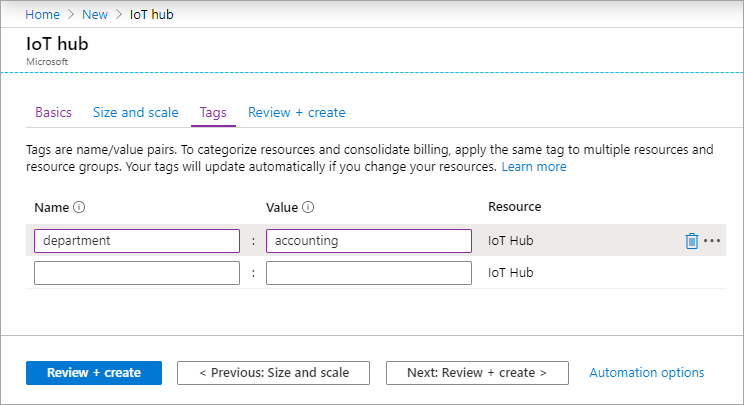
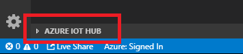
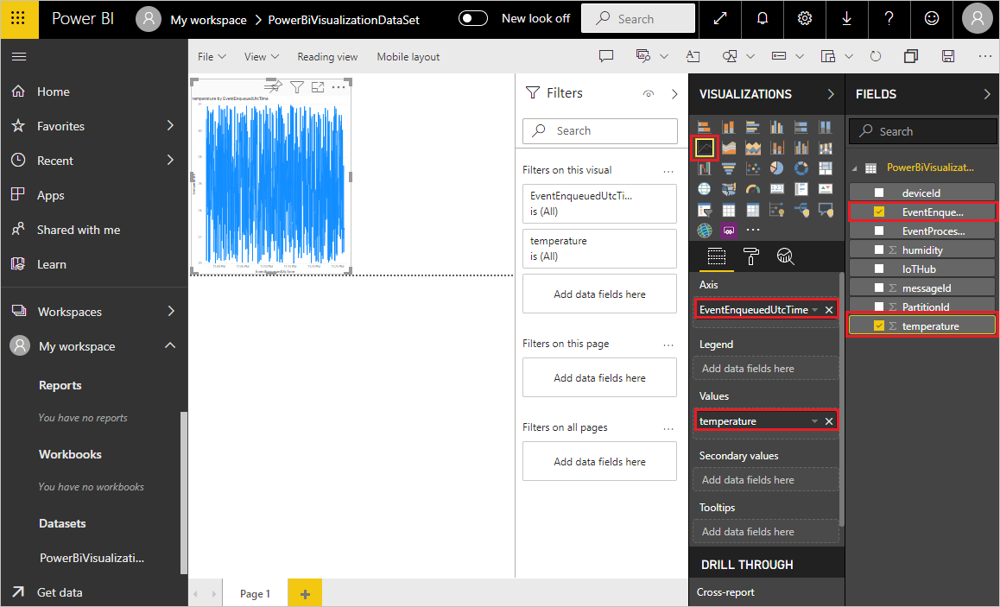
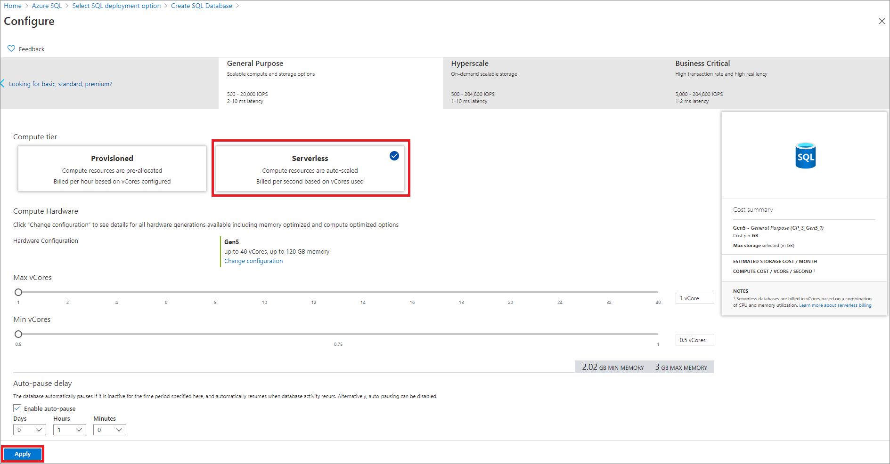

# Example: Microsoft Azure with Calypso WiFi FeatherWing

## Introduction

This article describes how to create and manage IoT hubs using the [Azure portal](https://portal.azure.com), how to connect with the Stream Analytics and visualize your data in PowerBI or Excel.

To use the steps in this tutorial, you need an [Azure subscription](https://azure.microsoft.com/en-us/free/). If you don't have an Azure subscription, please create a free account before you begin.


## IoTHub

1. Sign in to the [Azure portal](https://portal.azure.com).
2. From the Azure homepage, select the **+ Create a resource** button, and then enter IoT Hub in the **Search the Marketplace** field.
3. Select **IoT Hub** from the search results, and then select **Create**.


4. On the Basics tab, complete the fields as follows:

* **Subscription**: Select the subscription to use for your hub.

* **Resource Group**: Select a resource group or create a new one. To create a new one, select Create new and fill in the name you want to use. To use an existing resource group, select that resource group. For more information, see Manage Azure Resource Manager resource groups.

* **Region**: Select the region in which you want your hub to be located. Select the location closest to you. Some features, such as IoT Hub device streams, are only available in specific regions. For these limited features, you must select one of the supported regions.

* **IoT Hub Name**: Enter a name for your hub. This name must be globally unique. If the name you enter is available, a green check mark appears. Please take care which name you chose. The IoT hub will be publicly discoverable as a DNS endpoint, be sure to avoid entering any sensitive or personally identifiable information when you name it.


5. Select Next: Size and scale to continue creating your hub. You can accept the default settings here. If desired, you can modify any of the following fields

* **Pricing and scale tier**: Your selected tier. You can choose from several tiers, depending on how many features you want and how many messages you send through your solution per day. The free tier is intended for testing and evaluation. It allows 500 devices to be connected to the hub and up to 8,000 messages per day. Each Azure subscription can create one IoT hub in the free tier.

If you are working through a Quick start for IoT Hub device streams, select the free tier.

* **IoT Hub units**: The number of messages allowed per unit per day depends on your hub's pricing tier. For example, if you want the hub to support ingress of 700,000 messages, you choose two S1 tier units. For details about the other tier options, see [Choosing the right IoT Hub tier](https://docs.microsoft.com/en-us/azure/iot-hub/iot-hub-scaling).

* **Azure Security Center**: Turn this on to add an extra layer of threat protection to IoT and your devices. This option is not available for hubs in the free tier. For more information about this feature, see [Azure Security Center for IoT](https://docs.microsoft.com/en-us/azure/asc-for-iot/).

* **Advanced Settings > Device-to-cloud partitions**: This property relates the device-to-cloud messages to the number of simultaneous readers of the messages. Most hubs need only four partitions.

6. Select **Next: Tags** to continue to the next screen.

Tags are name/value pairs. You can assign the same tag to multiple resources and resource groups to categorize resources and consolidate billing. For more information, see [Use tags to organize your Azure resources](https://docs.microsoft.com/en-us/azure/azure-resource-manager/management/tag-resources).



7. Select **Next: Review + create** to review your choices. You see something similar to this screen, but with the values you selected when creating the hub.


8. Select **Create** to create your new hub. Creating the hub takes a few minutes.


## Register a new device in the IoT hub

In this section, you create a device identity in the identity registry in your IoT hub. A device cannot connect to a hub unless it has an entry in the identity registry. For more information, see the [IoT Hub developer guide](https://docs.microsoft.com/en-us/azure/iot-hub/iot-hub-devguide-identity-registry#identity-registry-operations).

1. In your IoT hub navigation menu, open IoT Devices, then select New to add a device in your IoT hub.


2. In **Create a device**, provide a name for your new device, such as **myWEDeviceId**, and select **Save**. This action creates a device identity for your IoT hub. The device ID may be visible in the logs collected for customer support and troubleshooting, so make sure to avoid any sensitive information while naming it.


## Send data to the IoTHub

To send data to the IoTHub, the easiest way is to use our example code together with the Calypso WiFi FeatherWing, if you have a M0 microprocessor Feather and WE Sensor FeatherWing.


## Create device SAS token
1. Visual studio code can connect to the Azure IoT Hub directly using [Azure IoT Hub Extension](https://marketplace.visualstudio.com/items?itemName=vsciot-vscode.azure-iot-toolkit)
Azure IoTHub Extension is part of Azure IoT Tools extension. You can [download the Azure IoT Toolkit extension](https://marketplace.visualstudio.com/items?itemName=vsciot-vscode.azure-iot-toolkit) from the marketplace, or install it directly from the extension gallery in Visual Studio Code.                                                        


2. In Explorer of VS Code, click "Azure IoT Hub" in the bottom left corner.                                                


Sign in to Azure to select IoT Hub from your Azure Subscription.

3. Click "Select IoT Hub" in context menu.                                                                          


4. If you have not signed in to Azure, a pop-up will show to let you sign in to Azure.
5. After you sign in, your Azure Subscription list will be shown, then select an Azure Subscription.
6. Your IoT Hub list will be shown, then select an IoT Hub.
7. The devices and endpoints list will be shown.                                                                 


8. Right click on the device and select **Generate SAS Token for Device**                                                    


9. Copy generated SAS token to Sensor2Cloud Workspace ``main.c`` file.


## Visualize real-time sensor data from Azure IoT Hub using Power BI or Excel

### Necessary steps

* Get your IoT hub ready for data access by adding a consumer group.
* Create, configure, and run a Stream Analytics job for data transfer from your IoT hub to your Power BI account.
* Create and publish a Power BI report to visualize the data.

>**Note**: If you prefer using **Excel** for data visualization, you will have one extra step. Excel cannot connect directly to the stream analytics, therefore a SQL database will be necessary.


### What you need

* Complete the Calypso WiFi FeatherWing Evaluation board tutorial for the Adafruit M0 Express Feather. These articles cover the following requirements:
    * An active Azure subscription.
    * An Azure IoT hub under your subscription.
    * A client application that sends messages to your Azure IoT hub.
* A Power BI account. (Try Power BI for free)

### Add a consumer group to your IoT hub

[Consumer groups](https://docs.microsoft.com/en-us/azure/event-hubs/event-hubs-features#event-consumers) provide independent views into the event stream that enable apps and Azure services to independently consume data from the same Event Hub endpoint. In this section, you add a consumer group to your IoT hub's built-in endpoint that is used later in this tutorial to pull data from the endpoint.

To add a consumer group to your IoT hub, follow these steps:

1. In the Azure portal, open your IoT hub.
2. On the left pane, select Built-in endpoints, select Events on the right pane, and enter a name under Consumer groups. Select Save.
3. Create a consumer group in your IoT hub


### Create, configure, and run a Stream Analytics job

Let's start by creating a Stream Analytics job. After you create the job, you define the inputs, outputs, and the query used to retrieve the data.

#### Create a Stream Analytics job

1. In the Azure portal, select Create a resource > Internet of Things > Stream Analytics job.
2. Enter the following information for the job.

    **Job name**: The name of the job. The name must be globally unique.

    **Resource group**: Use the same resource group that your IoT hub uses.

    **Location**: Use the same location as your resource group.


3. Select **Create**.


### Add an input to the Stream Analytics job

1. Open the Stream Analytics job.
2. Under Job topology, select Inputs.
3. In the Inputs pane, select Add stream input, then select IoT Hub from the drop-down list. On the new input pane, enter the following information:

    **Input alias**: Enter a unique alias for the input.

    **Select IoT Hub from your subscription**: Select this radio button.

    **Subscription**: Select the Azure subscription you're using for this tutorial.

    **IoT Hub**: Select the IoT Hub you're using for this tutorial.
    
    **Endpoint**: Select Messaging.

    **Shared access policy name**: Select the name of the shared access policy you want the Stream Analytics job to use for your IoT hub. For this tutorial, you can select service. The service policy is created by default on new IoT hubs and grants permission to send and receive on cloud-side endpoints exposed by the IoT hub. To learn more, see [Access control and permissions](https://docs.microsoft.com/en-us/azure/iot-hub/iot-hub-devguide-security#access-control-and-permissions).

    **Shared access policy key**: This field is auto-filled based on your selection for the shared access policy name.

    **Consumer group**: Select the consumer group you created previously.

    Leave all other fields at their defaults.


                                    

4. Select **Save**

### Add an output to the Stream Analytics job

1. Under Job topology, select Outputs.
2. In the Outputs pane, select Add and Power BI.
3. On the Power BI - New output pane, select Authorize and follow the prompts to sign in to your Power BI account.
4. After you've signed in to Power BI, enter the following information:

    **Output alias**: A unique alias for the output.

    **Group workspace**: Select your target group workspace.

    **Dataset name**: Enter a dataset name.

    **Table name**: Enter a table name.

    **Authentication mode**: Leave at the default.


5. Select **Save**

### Configure the query of the Stream Analytics job

1. Under Job topology, select Query.
2. Replace [YourInputAlias] with the input alias of the job.
3. Replace [YourOutputAlias] with the output alias of the job.


4. Select **Save query**.

### Run the Stream Analytics job

In the Stream Analytics job, select Overview, then select Start > Now > Start. Once the job successfully starts, the job status changes from Stopped to Running.


## Visualize real-time sensor data from Azure IoT Hub in Visual Studio Code

As already mentioned in previous topics, Visual studio code can connect to the Azure IoT Hub directly using [Azure IoT Hub Extension](https://marketplace.visualstudio.com/items?itemName=vsciot-vscode.azure-iot-toolkit)


### Necessary Steps

1. In Explorer of VS Code, click "Azure IoT Hub" in the bottom left corner.


### Sign in to Azure

If not already signed to Azure Cloud, use the extension to sign in to Azure to select IoT Hub from your Azure Subscription.

1. Click "Select IoT Hub" in context menu.


2. If you have not signed in to Azure, a pop-up will show to let you sign in to Azure.
3. After you sign in, your Azure Subscription list will be shown, then select an Azure Subscription.
4. Your IoT Hub list will be shown, then select an IoT Hub.
5. The devices and endpoints list will be shown.                                                           


6. Right click on the device and select **Start Monitoring Built-in Event Endpoint**.                       


## Visualize real-time sensor data from Azure IoT Hub using PowerBI


> **Note**:
> If you prefer using **Excel** for the data visualization, please skip this section. Go to [Create SQL database](#create-a-single-database) and then follow [Excel visualization section](#excel-visualization).

### Necessary steps

* Get your IoT hub ready for data access by adding a consumer group. Note: You can use the same one you used for the PowerBI, if you created previous step.
* Create, configure, and run a Stream Analytics job for data transfer from your IoT hub to your Power BI account.
* Create and publish a Power BI report to visualize the data.

### Create and publish a Power BI report

The following steps show you how to create and publish a report using the Power BI service. You can follow these steps with some modification, if you want to use the "new look" in Power BI. To understand the differences and how to navigate in the "new look", [see The 'new look' of the Power BI service](https://docs.microsoft.com/en-us/power-bi/consumer/service-new-look).

1. Ensure the sample application is running on your device. If not, you can refer to the tutorials under [Setup your device](#register-a-new-device-in-the-iot-hub).
2. Sign in to your Power BI account.
3. Select the workspace you used, **My Workspace**.
4. Select **Datasets**.
5. You should see the dataset that you specified when you created the output for the Stream Analytics job.
6. For the dataset you created, select **Add Report** (the first icon to the right of the dataset name).


7. Create a line chart to show real-time values over time.
    > **Note** 
    ts (time stamp from the WiFi module without Sensors FeatherWing) if you use this example or sensor values if you are using [CalypsoSensorCombo](../../../../../CalypsoSensorCombo/)

     * On the **Visualizations** pane of the report creation page, select the line chart icon to add a line chart. 
     * On the **Fields** pane, expand the table that you specified when you created the output for the Stream Analytics job.
     * Drag **EventEnqueuedUtcTime** to **Axis** on the **Visualizations** pane.
     * Drag **real-time values** to **Values**.
  
    A line chart is created. The x-axis displays date and time in the UTC time zone. The y-axis displays real-time values from the Calypso WiFi FeatherWing.

    

8. Select **Save** to save the report.
9. Select **Reports** on the left pane, and then select the report that you just created.
10. Select **File > Publish** to web.

    

> **Note**
    If you get a notification to contact your administrator to enable embed code creation, you may need to contact them. Embed code creation must be enabled before you can complete this step.

## Visualize real-time sensor data from Azure IoT Hub using Excel

### Necessary steps

* Get your IoT hub ready for data access by adding a consumer group. Note: You can use the same one you used for the PowerBI, if you created previous step
* Create SQL database to Stream data from the IoTHub
* Create, configure, and run a Stream Analytics job for data transfer from your IoT hub to your SQL Database.
* Connect the Excel data source with Azure SQL database to visualize the data.


### Create a single database

To create a single database in the Azure portal this quick start begins at the Azure SQL page.

1. Browse to the [Select SQL Deployment option page](https://portal.azure.com/#create/Microsoft.AzureSQL).
2. Under **SQL databases**, leave **Resource type** set to **Single database**, and select **Create**.


3. On the **Basics** tab of the **Create SQL Database** form, under **Project details**, select the desired Azure Subscription.
4. For **Resource group**, select **Create new** or use exiting one from your IoTHub, and select OK.
5. For **Database name** enter *someDatabaseName*.

6. For **Server**, select **Create new**, and fill out the **New server** form with the following values:
* **Server name**: Enter mysqlserver, and add some characters for uniqueness. We can't provide an exact server name to use because server names must be globally unique for all.

* **Servers in Azure**, not just unique within a subscription. So enter something like mysqlserver12345, and the portal lets you know if it is available or not.

* **Server admin login**: Enter azure user.
* **Password**: Enter a password that meets requirements, and enter it again in the Confirm password field.
* **Location**: Select a location from the dropdown list.

**Select OK**.

7. Leave **Want to use SQL elastic pool** set to **No**.
8. Under **Compute + storage**, select **Configure database**.
9. If asked use a serverless database, so select **Serverless**, and then select **Apply**.



10. Select **Next: Networking** at the bottom of the page.


11. On the **Networking** tab, for **Connectivity method**, select **Public endpoint**.This is necessary for the excel connection from the local computer.

12. For **Firewall rules**, set **Add current client IP address** to **Yes**. Leave **Allow Azure services and resources to access this server** set to **No**.

13. Select **Next: Additional settings** at the bottom of the page.


14. On the **Additional settings tab**, in the **Data source** section, for **Use existing data**, select **Sample**. This creates an AdventureWorksLT sample database so there's some tables and data to query and experiment with, as opposed to an empty blank database.

15. Select **Review + create** at the bottom of the page:


16. On the **Review + create** page, after reviewing, select **Create**.


### Create data table and query the database

Once your database is created, you can use the **Query editor (preview)** in the Azure portal to connect to the database and query data.

1. In the portal, search for and select **SQL databases**, and then select your database from the list.
2. On the page for your database, select **Query editor (preview)** in the left menu.
3. Enter your **server admin** login information, and select **OK**.


4. Enter the following query in the Query editor pane to create default database structure visualization Sensor FeatherWing.

```SQL

CREATE TABLE <tablename> (
	EventID bigint IDENTITY(1,1) NOT NULL PRIMARY KEY,
	deviceId varchar(18) NULL,
	messageId int NULL,
	EventProcessedUtcTime datetime2(7) NULL,
	PartitionId int NOT NULL,
	EventEnqueuedUtcTime datetime2(7) NULL,
	IoTHub nvarchar(4000) NULL,
	ts bigint NULL,
) GO;
```

5. Select **Run**, and then review the query results in the **Results** pane.
6. Close the **Query editor** page.

### Excel visualization

You can connect Excel to a database and then import data and create tables and charts based on values in the database. In this tutorial you will set up the connection between Excel and a database table, save the file that stores data and the connection information for Excel, and then create a pivot chart from the database values.

You'll need to create a database before you get started. If you don't have one, see previous chapter Create a database in Azure SQL Database and connect SQL database to IoTHub to get a database with IoTHub data up and running in a few minutes.

In this article, you'll import your own data IoTHub data into Excel by following the steps described here.

#### Connect Excel and load data

1. To connect Excel to a database in SQL Database, open Excel and then create a new workbook or open an existing Excel workbook.
2. In the menu bar at the top of the page, select the **Data** tab, select **Get Data**, select **From Azure**, and then select **From Azure SQL Database**.


3. In the **SQL Server database** dialog box, type the **Server name** you want to connect to in the form **<*server-name*>.database.windows.net**. For example, *weiotsqlserver.database.windows.net*. Optionally, enter in the name of your database. Select **OK** to open the credentials window.


4. In the SQL Server database dialog box, select **Database** on the left side, and then enter in your **User Name** and **Password** for the server you want to connect to. Select **Connect** to open the Navigator.

    Type the server name and login credentials.

---
**Tip**

Depending on your network environment, you may not be able to connect or you may lose the connection if the server doesn't allow traffic from your client IP address. Go to the Azure portal, click SQL servers, click your server, click firewall under settings and add your client IP address. See [How to configure firewall settings](https://docs.microsoft.com/en-us/azure/azure-sql/database/firewall-configure) for details.

---

5. In the **Navigator**, select the database you want to work with from the list, select the tables or views you want to work with (chose the one you created in the Azure SQL), and then select **Load** to move the data from your database to your Excel spreadsheet.

    Select a database and table.

#### Import the data into Excel and create a pivot chart

Now that you've established the connection, you have several different options with how to load the data. For example, the following steps create a pivot chart based on the data found in your database in SQL Database.

1. Follow the steps in the previous section, but this time, instead of selecting Load, select **Load To** from the **Load** drop-down.

2. Next, select how you want to view this data in your workbook. We chose **PivotChart**. You can also choose to 
- create a **New worksheet** or to 
- **Add this data to a Data Model**. 
For more information on Data Models, see [Create a data model in Excel](https://support.office.com/article/Create-a-Data-Model-in-Excel-87E7A54C-87DC-488E-9410-5C75DBCB0F7B).


The worksheet now has an empty pivot table and chart.

3. Under **PivotTable Fields**, select all the check-boxes for the fields you want to view.

#### Create Excel workbook

If you want to connect other Excel workbooks and worksheets to the database, select the **Data** tab, and select **Recent Sources** to launch the **Recent Sources** dialog box. From there, choose the connection you created from the list, and then click **Open**. 


Then simply select the database.


For more information, please check [Connect Excel to a database in Azure SQL Database or Azure SQL Managed Instance, and create a report](https://docs.microsoft.com/en-us/azure/azure-sql/database/connect-excel) article from Microsoft Documentation.
