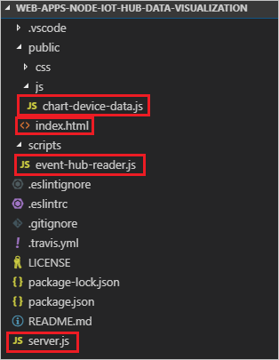
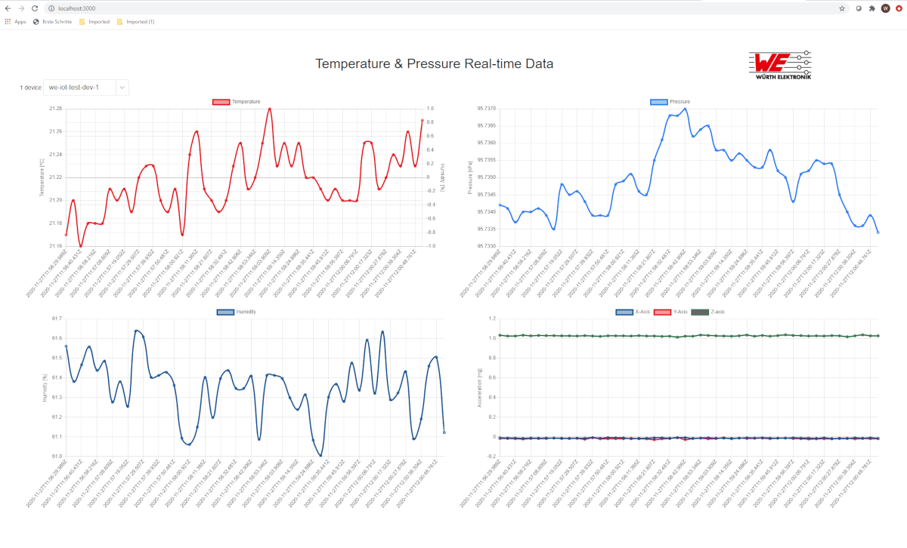
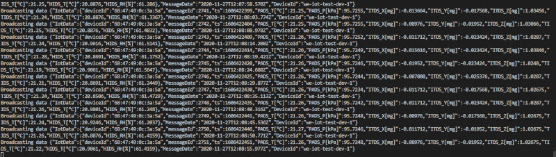

# Example: Microsoft Azure visualization with WebApp

## Introduction

In this example, you learn how to visualize **real-time sensor data** that your IoT hub receives with a node.js web app running on your local computer. After running the web app locally, you can optionally follow steps to host the web app in Azure App Service. If you want to try to visualize the data in your IoT hub by using Power BI or Excel please take a look at [real-time sensor data from Azure IoT Hub using Power BI or Excel](../) chapter.

If you don't have an Azure subscription, create a [free account](https://azure.microsoft.com/free/) before you begin.

## What you need

* Add a consumer group to your IoT hub that the web application will use to read sensor data
* Download the web app code from GitHub
* Examine the web app code
* Configure environment variables to hold the IoT Hub artifacts needed by your web app
* Run the web app on your development machine
* Open a web page to see real-time temperature and humidity data from your IoT hub
* (Optional) Use Azure CLI to host your web app in Azure App Service

## Necessary steps

* Complete the Sensor2Combo or one of the device tutorials. These cover the following requirements:
  * An active Azure subscription
  * An Iot hub under your subscription
  * A client application that sends messages to your Iot hub
* [Download Git](https://www.git-scm.com/downloads)
* The steps in this article assume a Windows development machine; however, you can easily perform these steps on a Linux system in your preferred shell.
* Use [Azure Cloud Shell](https://docs.microsoft.com/en-us/azure/cloud-shell/quickstart) using the bash environment to speed up the process. (see details at the bottom)
[](https://shell.azure.com/)

* If you prefer, install the Azure CLI to run CLI reference commands.
  * If you're using a local install, sign in with Azure CLI by using the az login command. To finish the authentication process, follow the steps displayed in your terminal. See Sign in with Azure CLI for additional sign-in options.
  * When you're prompted, install Azure CLI extensions on first use. For more information about extensions, see Use extensions with Azure CLI.
  * (Optional) Run ``az version`` to find the version and dependent libraries that are installed. To upgrade to the latest version, run ``az upgrade``.

## Create and configure your IoT hub

1. [Create](https://portal.azure.com/#create/Microsoft.IotHub), or [select an existing](https://portal.azure.com/#blade/HubsExtension/BrowseResourceBlade/resourceType/Microsoft.Devices%2FIotHubs), IoT hub.
    - For **Size and Scale**, you may use "F1: Free tier".

1. Select the **Settings | Shared access policies** menu item, open the **service** policy, and copy a connection string to be used in later steps.

1. Select **Settings | Built-in endpoints | Events**, add a new consumer group (e.g. "monitoring"), and then change focus to save it. Note the name to be used in later steps.

1. Select **IoT devices**, create a device, and copy device the connection string.

### Add a consumer group to your IoT hub

[Consumer groups](https://docs.microsoft.com/en-us/azure/event-hubs/event-hubs-features#event-consumers) provide independent views into the event stream that enable apps and Azure services to independently consume data from the same Event Hub endpoint. In this section, you add a consumer group to your IoT hub's built-in endpoint that the web app will use to read data from.

Run the following command to add a consumer group to the built-in endpoint of your IoT hub:

```bash
az iot hub consumer-group create --hub-name YourIoTHubName --name YourConsumerGroupName
```

Note down the name you choose, you'll need it later in this tutorial.

### Get a service connection string for your IoT hub

IoT hubs are created with several default access policies. One such policy is the service policy, which provides sufficient permissions for a service to read and write the IoT hub's endpoints. Run the following command to get a connection string for your IoT hub that adheres to the service policy:

```bash
az iot hub show-connection-string --hub-name YourIotHub --policy-name service
```
The connection string should look similar to the following:

```JavaScript
"HostName={YourIotHubName}.azure-devices.net;SharedAccessKeyName=service;SharedAccessKey={YourSharedAccessKey}"
```

Note down the service connection string, you'll need it later in this tutorial.

### Download the web app from GitHub

Open web application source code in the [Visual Studio Code](code.visualstudio.com) and install **npm** if you do not have it.

### Examine the web app code
Open the web app in your favorite editor (we suggest Visual Studio Code). The following shows the file structure viewed in VS Code:



Take a moment to examine the following files:

* **server.js** is a service-side script that initializes the web socket and the Event Hub wrapper class. It provides a callback to the Event Hub wrapper class that the class uses to broadcast incoming messages to the web socket.

* **event-hub-reader.js** is a service-side script that connects to the IoT hub's built-in endpoint using the specified connection string and consumer group. It extracts the DeviceId and EnqueuedTimeUtc from metadata on incoming messages and then relays the message using the callback method registered by server.js.

* **chart-device-data.js** is a client-side script that listens on the web socket, keeps track of each DeviceId, and stores the last 50 points of incoming data for each device. It then binds the selected device data to the chart object.

* **Index.html** handles the UI layout for the web page and references the necessary scripts for client-side logic.

### Configure environment variables for the web app
To read data from your IoT hub, the web app needs your IoT hub's connection string and the name of the consumer group that it should read through. It gets these strings from the process environment in the following lines in server.js:

```JavaScript

const iotHubConnectionString = process.env.IotHubConnectionString;
const eventHubConsumerGroup = process.env.EventHubConsumerGroup;
```

Set the environment variables in your command window with the following commands. Replace the placeholder values with the service connection string for your IoT hub and the name of the consumer group you created previously. Don't quote the strings.

```bash

set IotHubConnectionString=YourIoTHubConnectionString
set EventHubConsumerGroup=YourConsumerGroupName
```


### Run locally

1. Make sure that your device is running and sending data. For more info about the device, check [device documentation](../../).
1. To pass parameters to the website, you may use environment variables or parameters.
    - Open a command prompt or PowerShell terminal and set the environment variables **IotHubConnectionString** and **EventHubConsumerGroup**.

        > Syntax for Windows command prompt is `set key=value`, PowerShell is `$env:key="value"`, and Linux shell is `export key="value"`.

    - Or, if you are debugging with [VS Code](https://code.visualstudio.com/docs/nodejs/nodejs-debugging), you can edit the launch.json file and add these values in the env property.

        ```json
        "env": {
            "NODE_ENV": "local",
            "IotHubConnectionString": "<your IoT hub's connection string>",
            "EventHubConsumerGroup": "<your consumer group name>"
        }
        ```

1. In the same directory as package.json, run `npm install` to download and install referenced packages.
1. Run the website one of the following ways:
    - From the command-line (with environment variables set), use `npm start`
    - In VS Code, press F5 to start debugging
> **Note**: If you do not have **npm**, download and install [nodejs](https://nodejs.org/en/download/).

5. Watch for console output from the website.
6. If you are debugging, you may set breakpoints in any of the server-side scripts and step through the code to watch the code work.


### Open a web page to see data from your IoT hub
Open a browser to http://localhost:3000.

In the Select a device list, select your device to see a running plot of the last 50 temperature and humidity data points sent by the device to your IoT hub.



You should also see output in the console that shows the messages that your web app is broadcasting to the browser client:



### Host the web app in App Service

The [Web Apps feature of Azure App Service](https://docs.microsoft.com/en-us/azure/app-service/overview) provides a platform as a service (PAAS) for hosting web applications. Web applications hosted in Azure App Service can benefit from powerful Azure features like additional security, load balancing, and scalability as well as Azure and partner DevOps solutions like continuous deployment, package management, and so on. Azure App Service supports web applications developed in many popular languages and deployed on Windows or Linux infrastructure.

In this section, you provision a web app in App Service and deploy your code to it by using Azure CLI commands. You can find details of the commands used in the az webapp documentation. Before starting, make sure you've completed the steps to [add a resource group to your IoT hub](https://docs.microsoft.com/en-us/azure/iot-hub/iot-hub-live-data-visualization-in-web-apps#add-a-consumer-group-to-your-iot-hub), [get a service connection string for your IoT hub](https://docs.microsoft.com/en-us/azure/iot-hub/iot-hub-live-data-visualization-in-web-apps#get-a-service-connection-string-for-your-iot-hub), and [download the web app from GitHub](https://docs.microsoft.com/en-us/azure/iot-hub/iot-hub-live-data-visualization-in-web-apps#download-the-web-app-from-github).

1. An App Service plan defines a set of compute resources for an app hosted in App Service to run. In this tutorial, we use the Developer/Free tier to host the web app. With the Free tier, your web app runs on shared Windows resources with other App Service apps, including apps of other customers. Azure also offers App Service plans to deploy web apps on Linux compute resources. You can skip this step if you already have an App Service plan that you want to use.
To create an App Service plan using the Windows free tier, run the following command. Use the same resource group your IoT hub is in. Your service plan name can contain upper and lower case letters, numbers, and hyphens.

```az cli
az appservice plan create --name <app service plan name> --resource-group <your resource group name> --sku FREE
```

2. Now provision a web app in your App Service plan. The --deployment-local-git parameter enables the web app code to be uploaded and deployed from a Git repository on your local machine. Your web app name must be globally unique and can contain upper and lower case letters, numbers, and hyphens. Be sure to specify Node version 10.6 or later for the --runtime parameter, depending on the version of the Node.js runtime you are using. You can use the az webapp list-runtimes command to get a list of supported runtimes.

```az cli
az webapp create -n <your web app name> -g <your resource group name> -p <your app service plan name> --runtime "node|10.6" --deployment-local-git
```

3. Now add Application Settings for the environment variables that specify the IoT hub connection string and the Event hub consumer group. Individual settings are space delimited in the -settings parameter. Use the service connection string for your IoT hub and the consumer group you created previously in this tutorial. Don't quote the values.

```az cli
az webapp config appsettings set -n <your web app name> -g <your resource group name> --settings EventHubConsumerGroup=<your consumer group> IotHubConnectionString="<your IoT hub connection string>"
```

4. Enable the Web Sockets protocol for the web app and set the web app to receive HTTPS requests only (HTTP requests are redirected to HTTPS).

```az cli
az webapp config set -n <your web app name> -g <your resource group name> --web-sockets-enabled true

az webapp update -n <your web app name> -g <your resource group name> --https-only true
```

5. To deploy the code to App Service, you'll use your user-level deployment credentials. Your user-level deployment credentials are different from your Azure credentials and are used for Git local and FTP deployments to a web app. Once set, they're valid across all of your App Service apps in all subscriptions in your Azure account. If you've previously set user-level deployment credentials, you can use them.

If you haven't previously set user-level deployment credentials or you can't remember your password, run the following command. Your deployment user name must be unique within Azure, and it must not contain the ‘@’ symbol for local Git pushes. When you're prompted, enter and confirm your new password. The password must be at least eight characters long, with two of the following three elements: letters, numbers, and symbols.

```az cli
az webapp deployment user set --user-name <your deployment user name>
```

6. Get the Git URL to use to push your code up to App Service.

```az cli
az webapp deployment source config-local-git -n <your web app name> -g <your resource group name>

```

7. Add a remote to your clone that references the Git repository for the web app in App Service. For <Git clone URL>, use the URL returned in the previous step. Run the following command in your command window.

```bash
git remote add webapp <Git clone URL>
```

8. To deploy the code to App Service, enter the following command in your command window. If you are prompted for credentials, enter the user-level deployment credentials that you created in step 5. Make sure that you push to the master branch of the App Service remote.

```bash
git push webapp master:master
```

9. The progress of the deployment will update in your command window. A successful deployment will end with lines similar to the following output:

```bash
remote:
remote: Finished successfully.
remote: Running post deployment command(s)...
remote: Deployment successful.
To https://contoso-web-app-3.scm.azurewebsites.net/contoso-web-app-3.git
6b132dd..7cbc994  master -> master
```

10. Run the following command to query the state of your web app and make sure it is running:

```az cli
az webapp show -n <your web app name> -g <your resource group name> --query state
```

11. Navigate to ``https://<your web app name>.azurewebsites.net`` in a browser. A web page similar to the one you saw when you ran the web app locally displays. Assuming that your device is running and sending data, you should see a running plot of the 50 most recent temperature and humidity readings sent by the device.

> You may follow the code instructions above or the manual instructions below, or refer to the Azure CLI notes at the bottom to learn how to automate these steps.

### Use an Azure App Service

The approach here is to create a website in Azure, configure it to deploy using git where it hosts a remote repo, and push your local branch to that repo.

> **Note**: Do not forget to delete these resources after you are done, to avoid unnecessary charges.

1. Create a [Web App](https://ms.portal.azure.com/#create/Microsoft.WebSite).
    - OS: Windows
    - Publish: Code
    - App Service Plan: choose the cheapest plan (e.g. Dev / Test | F1)

1. Select **Settings | Configuration**
    1. Select **Application settings** and add key/value pairs for:
        - Add **IotHubConnectionString** and the corresponding value.
        - Add **EventHubConsumerGroup** and the corresponding value.
    1. Select **General settings** and turn **Web sockets** to **On**.

1. Select **Deployment Options**, and configure for a **Local Git** to deploy your web app.

1. Push the repo's code to the git repo URL in last step with:
    - In the **Overview** page, find the **Git clone URL**, using the **App Service build service** build provider. Then run the following commands:

        ```cmd
        git clone https://github.com/Azure-Samples/we-sensor2cloud-visualization.git
        cd we-sensor2cloud-visualization
        git remote add webapp <Git clone URL>
        git push webapp master:master
        ```

    - When prompted for credentials, select **Deployment Center | Deployment Credentials** in the Azure portal and use the auto-generated app credentials, or create your own.

1. After the push and deploy has finished, you can view the page to see the real-time data chart. Find the URL in **Overview** in the Essentials section.

## Troubleshooting

If you encounter any issues with this sample, try the following steps. If you still encounter issues, drop us a note in the Issues tab.

### Client issues

- If a device does not appear in the list, or no graph is being drawn, ensure the sample application is running on your device.

- In the browser, open the developer tools (in many browsers the F12 key will open it), and find the Console. Look for any warnings or errors printed here.
  - Also, you can debug client-side script in /js/chart-device-data.js.

### Local website issues

- Watch the output in the window where node was launched for console output.

- Debug the server code, namely server.js and /scripts/event-hub-reader.js.

### Azure App Service issues

- Open **Monitoring | Diagnostic logs**. Turn Application Logging (File System) to on, Level to Error, and then Save. Then open **Log stream**.

- Open **Development Tools | Console** and validate node and npm versions with `node -v` and `npm -v`.

- If you see an error about not finding a package, you may have run the steps out of order. When the site is deployed (with `git push`) the app service runs `npm install` which runs based on the current version of node it has configured. If that is changed in configuration later, you'll need to make a meaningless change to the code and push again.

## CLI documentation

In order to automate the steps to deploy to Azure, consider reading the following documentation and using the corresponding commands.

- [Azure login](https://docs.microsoft.com/en-us/cli/azure/reference-index?view=azure-cli-latest#az-login)
- [Resource group create](https://docs.microsoft.com/en-us/cli/azure/group?view=azure-cli-latest#az-group-create)
- [IoT Hub](https://docs.microsoft.com/en-us/cli/azure/iot?view=azure-cli-latest)
- [ServicePlan](https://docs.microsoft.com/en-us/cli/azure/appservice/plan?view=azure-cli-latest)
- [WebApp](https://docs.microsoft.com/en-us/cli/azure/webapp?view=azure-cli-latest)

```az cli
# Initialize these variables: $subscriptionId, $resourceGroupName, $location, $iotHubName, $consumerGroupName, $deviceId, $appServicePlanName, $webAppName, $iotHubConnectionString

# Login and set the specified subscription
az login
az account set -s $subscriptionId

# Create the resource group in the specified location
az group create -n $resourceGroupName --location $location

# Create an IoT Hub, create a consumer group, add a device, and get the device connection string
az iot hub create -n $iotHubName -g $resourceGroupName --location $location --sku S1
az iot hub consumer-group create -n $consumerGroupName --hub-name $iotHubName -g $resourceGroupName

az iot hub connection-string show

az iot hub device-identity create -d $deviceId --hub-name $iotHubName -g $resourceGroupName
az iot hub device-identity show-connection-string  -d $deviceId --hub-name $iotHubName -g $resourceGroupName

# Create an app service plan and website, then configure website
az appservice plan create -g $resourceGroupName -n $appServicePlanName --sku F1 --location $location
az webapp create -n $webAppName -g $resourceGroupName --plan $appServicePlanName --runtime "node|10.6"
az webapp update -n $webAppName -g $resourceGroupName --https-only true
az webapp config set -n $webAppName -g $resourceGroupName --web-sockets-enabled true
az webapp config appsettings set -n $webAppName -g $resourceGroupName --settings IotHubConnectionString=$iotHubConnectionString EventHubConsumerGroup=$consumerGroupName

# Configure website for deployment
az webapp deployment list-publishing-credentials -n $webAppName -g $resourceGroupName
az webapp deployment source config-local-git -n $webAppName -g $resourceGroupName

# Push code to website
# Note: the URL is based on the previous two commands of output in the format of https://<web site user>:<password>@$webAppName.scm.azurewebsites.net/$webAppName.git
git remote add azure <web app git URL>
git push azure master:master

# Open browser to web site home page
az webapp browse -g $resourceGroupName -n $webAppName
```

## Conclusion

In this tutorial, you learned how to:

- Create an Azure IoT Hub
- Configure your IoT hub with a device, a consumer group, and use that information for connecting a device and a service application
- On a website, register for device telemetry and broadcast it over a web socket to attached clients
- In a web page, display device data in a chart

> **Note**: remember to delete any Azure resources created during this sample to avoid unnecessary charges.
