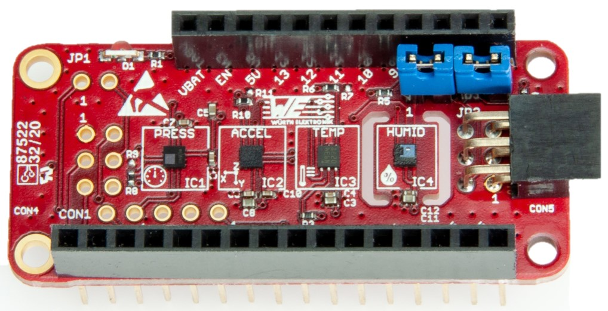

# Sensor FeatherWing

## Introduction

The Würth Elektronik eiSos Sensor FeatherWing is a sensor development board fully compatible to the popular Adafruit’s Feather line of development boards. It consists of the following four sensors,

* **WSEN-PADS** - Absolute pressure sensor (2511020213301)
* **WSEN-ITDS** - 3-axis acceleration sensor (2533020201601)
* **WSEN-TIDS** - Temperature sensor (2521020222501)
* **WSEN-HIDS** - Humidity sensor (2523020210001)

All the four sensors are connected over the shared I<sup>2</sup>C bus and hence can be connected to
any of the Feather microcontroller boards. The Arduino(C/C++) drivers and examples made
available makes it easy to build a prototype to kick-start the application development.



For more information about the Hardware, please go to the Hardware repository or download [Sensor FeatherWing user manual](link.to.com\document).


## Software

The Sensor FeatherWing was designed with rapid prototyping in mind. Being fully compatible with the Adafruit ecosystem, this FeatherWing allows the user the flexibility to choose the
preferred host microcontroller. The inherent modularity of the ecosystem allows the FeatherWing to be easily integrated into any project.

Würth Elektronik eiSos provides a Software Development Kit (SDK) with examples to support all the WE FeatherWings. Here are the salient features of the WE FeatherWing SDK. 
* The SDK is **open-source** and well documented.
* It uses popular open-source tool chain including an IDE.
* The examples are written in Arduino styled C/C++ for easy understanding.
* The core components of the SDK are written in pure C to enable easy porting to any microcontroller platform.
* Modular structure of the software stack makes it easy to integrate into any project.
The SDK can be accessed on Github at [eismart FeatherWing GitHub](/../../).

### Necessary Steps

* **Install IDE**: your favourite development IDE (we recommend [Visual Studio Code](https://code.visualstudio.com/) with [Platform IO](https://platformio.org/) extension.
* **PlatformIO**: is a cross-platform, cross-architecture, multiple framework professional tool for embedded software development. It provides the tool chain necessary for the software development including building, debugging, code-upload and many more. PlatformIO works well on all the modern operating systems and supports a host of development boards including the Feathers from Adafruit. Further details about PlatformIO can be found under [platformio.org](https://platformio.org/)
* **WE SDK**: This is a layer of platform-independent pure C drivers for sensors and wireless connectivity modules from Würth Elektronik eiSos. These drivers implement all the necessary functions to utilize full feature set of the sensors and wireless connectivity modules. More details on the SDK and dowloads under [WCS Software](we-online.com/wcs-software)
* **Board files**: This layer provides abstraction at a board level and provides functions to configure and control individual FeatherWings from WE.
* **User application**: The SDK currently implements a quick start example for each of the FeatherWings.

### Installing the tools

* Install Visual Studio Code on the platform of your choice following the [instructions](code.visualstudio.com/docs)
* Follow the instructions under to install [PlatformIO IDE](platformio.org/install/ide?install=vscode) extension.


## Example

1. Clone or download the [WE FeatherWing SDK](/)
2. Open the workspace of interest with the filename `<FeatherWing>.code-workspace` in Visual Studio code.
3. Build and upload the code from the PlatformIO tab as shown in the Figure below
4. After successful upload, click on **Monitor** in PlatformIO extension tab to view the debug logs in the serial terminal.(See Figure)


### Source Code

```

/**
 * \file
 * \brief Main file for the WE-SensorFeatherWing.
 *
 * \copyright (c) 2020 Würth Elektronik eiSos GmbH & Co. KG
 *
 * \page License
 *
 * THE SOFTWARE INCLUDING THE SOURCE CODE IS PROVIDED “AS IS”. YOU ACKNOWLEDGE
 * THAT WÜRTH ELEKTRONIK EISOS MAKES NO REPRESENTATIONS AND WARRANTIES OF ANY
 * KIND RELATED TO, BUT NOT LIMITED TO THE NON-INFRINGEMENT OF THIRD PARTIES’
 * INTELLECTUAL PROPERTY RIGHTS OR THE MERCHANTABILITY OR FITNESS FOR YOUR
 * INTENDED PURPOSE OR USAGE. WÜRTH ELEKTRONIK EISOS DOES NOT WARRANT OR
 * REPRESENT THAT ANY LICENSE, EITHER EXPRESS OR IMPLIED, IS GRANTED UNDER ANY
 * PATENT RIGHT, COPYRIGHT, MASK WORK RIGHT, OR OTHER INTELLECTUAL PROPERTY
 * RIGHT RELATING TO ANY COMBINATION, MACHINE, OR PROCESS IN WHICH THE PRODUCT
 * IS USED. INFORMATION PUBLISHED BY WÜRTH ELEKTRONIK EISOS REGARDING
 * THIRD-PARTY PRODUCTS OR SERVICES DOES NOT CONSTITUTE A LICENSE FROM WÜRTH
 * ELEKTRONIK EISOS TO USE SUCH PRODUCTS OR SERVICES OR A WARRANTY OR
 * ENDORSEMENT THEREOF
 *
 * THIS SOURCE CODE IS PROTECTED BY A LICENSE.
 * FOR MORE INFORMATION PLEASE CAREFULLY READ THE LICENSE AGREEMENT FILE LOCATED
 * IN THE ROOT DIRECTORY OF THIS PACKAGE
 */
#include "sensorBoard.h"

// USB-Serial debug Interface
TypeSerial *SerialDebug;

// Sensors
// WE absolute pressure sensor object
PADS *sensorPADS;
// WE 3-axis acceleration sensor object
ITDS *sensorITDS;
// WE Temperature sensor object
TIDS *sensorTIDS;
// WE humidity sensor object
HIDS *sensorHIDS;

void setup() {
    delay(2000);
    // Using the USB serial port for debug messages
    SerialDebug = SSerial_create(&Serial);
    SSerial_begin(SerialDebug, 115200);

    // Create sensor objects
    sensorPADS = PADSCreate(SerialDebug);
    sensorITDS = ITDSCreate(SerialDebug);
    sensorTIDS = TIDSCreate(SerialDebug);
    sensorHIDS = HIDSCreate(SerialDebug);

    // Initialize the sensors in default mode
    if (!PADS_simpleInit(sensorPADS)) {
        SSerial_printf(SerialDebug, "PADS init failed \r\n");
    }

    if (!ITDS_simpleInit(sensorITDS)) {
        SSerial_printf(SerialDebug, "ITDS init failed \r\n");
    }
    if (!TIDS_simpleInit(sensorTIDS)) {
        SSerial_printf(SerialDebug, "TIDS init failed \r\n");
    }
    if (!HIDS_simpleInit(sensorHIDS)) {
        SSerial_printf(SerialDebug, "HIDS init failed \r\n");
    }
}

void loop() {
    SSerial_printf(SerialDebug,
                   "----------------------------------------------------\r\n");
    // Read and print sensor values
    if (PADS_readSensorData(sensorPADS)) {
        SSerial_printf(
            SerialDebug, "WSEN_PADS: Atm. Pres: %f kPa Temp: %f °C\r\n",
            sensorPADS->data[padsPressure], sensorPADS->data[padsTemperature]);
    }
    if (ITDS_readSensorData(sensorITDS)) {
        SSerial_printf(SerialDebug,
                       "WSEN_ITDS(Acceleration): X:%f g Y:%f g  Z:%f g\r\n",
                       sensorITDS->data[itdsXAcceleration],
                       sensorITDS->data[itdsYAcceleration],
                       sensorITDS->data[itdsZAcceleration]);
    }
    if (TIDS_readSensorData(sensorTIDS)) {
        SSerial_printf(SerialDebug, "WSEN_TIDS(Temperature): %f °C\r\n",
                       sensorTIDS->data[tidsTemperature]);
    }
    if (HIDS_readSensorData(sensorHIDS)) {
        SSerial_printf(SerialDebug, "WSEN_HIDS: RH: %f %% Temp: %f °C\r\n",
                       sensorHIDS->data[hidsRelHumidity],
                       sensorHIDS->data[hidsTemperature]);
    }
    SSerial_printf(SerialDebug,
                   "----------------------------------------------------\r\n");
    SSerial_printf(SerialDebug, "\r\n");
    delay(1000);
}

```
