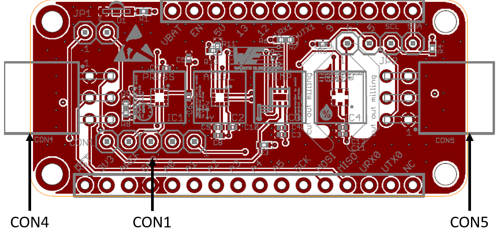
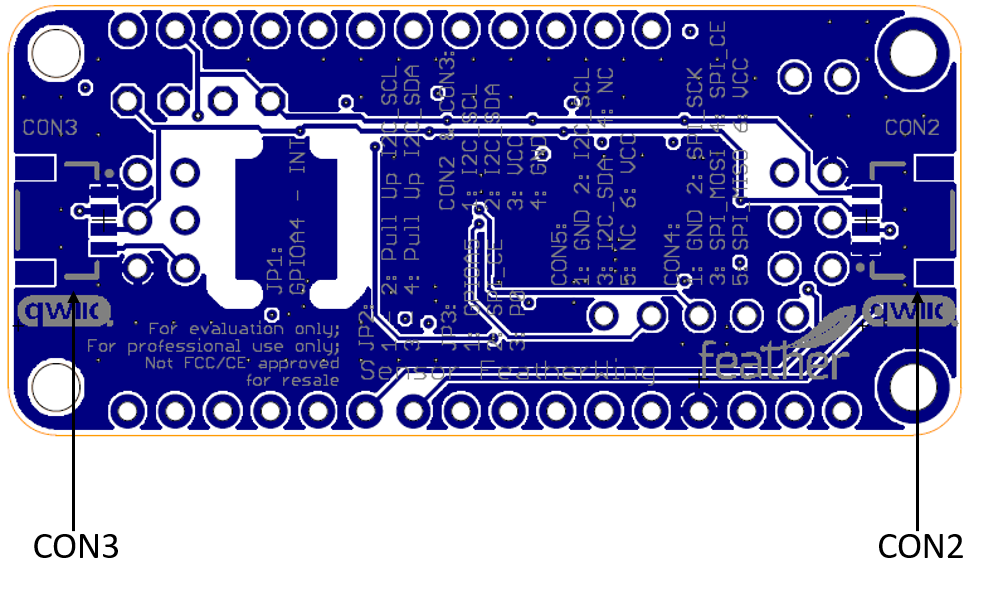
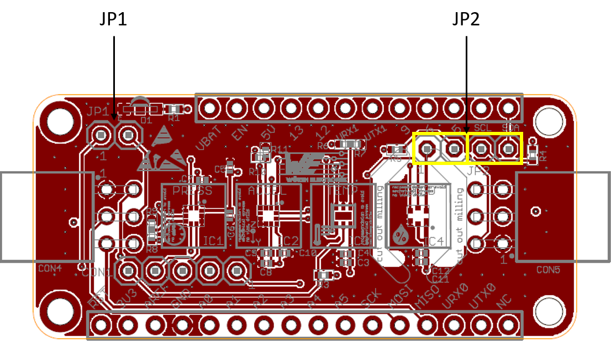
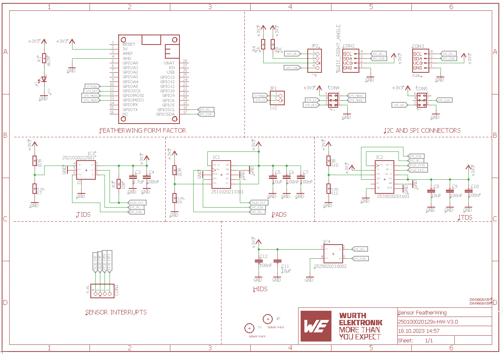

# Sensor FeatherWing

## Introduction

The Würth Elektronik eiSos [Sensor FeatherWing](https://www.we-online.de/katalog/en/SENSOR_FeatherWing) is a sensor development board fully compatible to the popular [Adafruit](https://www.adafruit.com/) [Feather line](https://www.adafruit.com/feather) of development boards. It consists of the following four sensors:

* [**WSEN-PADS**](https://www.we-online.de/katalog/de/WSEN-PADS) - Absolute pressure sensor [(2511020213301)](https://www.we-online.de/katalog/datasheet/2511020213301.pdf)
* [**WSEN-ITDS**](https://www.we-online.de/katalog/de/WSEN-ITDS) - 3-axis acceleration sensor [(2533020201601)](https://www.we-online.de/katalog/datasheet/2533020201601_valid_from_2020-12-14.pdf)
* [**WSEN-TIDS**](https://www.we-online.de/katalog/de/WSEN-TIDS) - Temperature sensor [(2521020222501)](https://www.we-online.de/katalog/datasheet/2521020222501.pdf)
* [**WSEN-HIDS**](https://www.we-online.de/katalog/de/WSEN-HIDS) - Humidity sensor [(2525020210001)](https://www.we-online.de/katalog/datasheet/2525020210001.pdf)

All four sensors are connected over the shared I2C bus and hence can be connected to any of the Feather microcontroller boards. The available [Arduino](https://www.arduino.cc/) (C/C++) drivers and examples (see [software folder](software)) make it easy to build a prototype to kick-start the application development.

The Sensor FeatherWing also has a [4-pin JST QWIIC®](https://www.sparkfun.com/products/16766) connector on-board. This enables easy connection to SparkFun's [QWIIC® ecosystem](https://www.sparkfun.com/qwiic) of development boards. Additionally, a **6 pin connector** enables the extension of the FeatherWing with a host of [**evaluation boards from Würth Elektronik eiSos**](https://www.we-online.de/catalog/de/wco/wireless-connectivity_1/eval_boards).

This repository contains the [Eagle](https://www.autodesk.com/products/eagle/overview) design files for the Sensor FeatherWing [PCB](hardware) as well as the [software](software) with quick start example.

For more information, please download the [Sensor FeatherWing user manual](docs/SensorFeatherWing.pdf). Feel free to check our [YouTube channel](https://www.youtube.com/user/WuerthElektronik/videos) for video tutorials, hands-ons and webinars relating to our products.

## Hardware

### Description

The Sensor FeatherWing consists of four sensors. This section provides details regarding the key features of these sensors.

### [**WSEN-PADS**](https://www.we-online.de/katalog/de/WSEN-PADS) [(2511020213301)](https://www.we-online.de/katalog/datasheet/2511020213301.pdf)

The WSEN-PADS is a MEMS based piezo-resistive absolute pressure sensor with an integrated ASIC and an embedded temperature sensor. The fully molded holed LGA package and low current consumption makes this sensor suitable for a range of applications including weather stations, barometers, altimeters and indoor navigation.

#### Key features

* Absolute pressure range : 26 to 126 kPa
* Output data rate : 1 to 200 Hz
* Pressure data resolution : 24-bits
* Current consumption : 4 μA
* Programmable pressure threshold and data-ready interrupt

Further details about this sensor can be found under [we-online.de/katalog/en/WSEN-PADS](https://www.we-online.de/katalog/en/WSEN-PADS).

### [**WSEN-ITDS**](https://www.we-online.de/katalog/de/WSEN-ITDS) [(2533020201601)](https://www.we-online.de/katalog/datasheet/2533020201601_valid_from_2020-12-14.pdf)

The WSEN-ITDS sensor is a 14-bit digital ultra-low-power and high-performance three-axis accelerometer with a digital output interface. Capability of detecting events like free fall, tap recognition, wake up, stationary/motion, activity/inactivity and 6D orientation make the sensor suitable for applications like vibration monitoring, tilt measurement, impact detection and many more.

#### Key features

* Selectable full scale : ±2g, ±4g, ±8g, ±16g,
* Bandwidth : 400 Hz
* Output data rate : Up to 1600 Hz
* Noise density : 90 μg / 
* Operating modes : High-performance, Low-power, Normal
* Current consumption : 16 μA (Low-power mode)

Further details about this sensor can be found under [we-online.de/katalog/en/WSEN-ITDS](https://www.we-online.de/katalog/en/WSEN-ITDS).

### [**WSEN-TIDS**](https://www.we-online.de/katalog/de/WSEN-TIDS) [(2521020222501)](https://www.we-online.de/katalog/datasheet/2521020222501.pdf)

The WSEN-TIDS is a high precision silicon-based digital temperature sensor with an integrated ASIC and a digital I2C interface. A compact UDFN package and fast thermal response make this sensor ideal for a range of applications like environmental monitoring, HVAC, PCB thermal monitoring, industrial control and many more.

#### Key features

* Temperature range : -40 to 125 °C
* Output data rate : 25 to 200 Hz
* Temperature data resolution : 16-bits
* Current consumption : 1.75 μA
* Programmable temperature threshold interrupt

Further details about this sensor can be found under [we-online.de/katalog/en/WSEN-TIDS](https://www.we-online.de/katalog/en/WSEN-TIDS).

### [**WSEN-HIDS**](https://www.we-online.de/katalog/de/WSEN-HIDS) [(2525020210001)](https://www.we-online.de/katalog/datasheet/2525020210001.pdf)

The WSEN-HIDS is a 16-bit ultra-low power and high-performance humidity sensor with a digital interface. The pre-calibrated sensor in a compact LGA package is suitable for a variety of applications including HVAC systems, white goods, building automation and air conditioning.

#### Key features

* Humidity range : 0 to 100 %rH
* Humidity noise : 0.35 %rH RMS
* Output data rate : 1 Hz, 7 Hz and 12.5 Hz
* Current consumption : 8.9 μA
* Integrated temperature sensor
  
Further details about this sensor can be found under [we-online.de/katalog/en/WSEN-HIDS](https://www.we-online.de/katalog/en/WSEN-HIDS).

### Pinouts

#### Feather Connector
This is the standard set of connectors that is used across the Feather ecosystem. The table below describes the functions of each of the 28 pins as applicable to this FeatherWing.

| Pin number | Pin name | Function |
| ------- | ------- |----------------|
|   1          | RST | Not connected|
|    2          | 3V3| 3.3 V power supply|
|    3          | AREF| Not connected|
|    4          | GND| Ground|
|    5          | A0| Not connected|
|    6          | A1| Not connected|
|    7          | A2| Not connected|
|    8          | A3| Not connected|
|    9          | A4| Not connected|
|    10         | A5| (Optional) SPI_CE via JP1|
|    11         | SCK| SPI clock|
|    12         | MOSI| SPI MOSI|
|    13         | MISO| SPI MOSI|
|    14         | U0RX| Not connected|
|    15         | U0TX| Not connected|
|    16         | NC| Not connected|

| Pin number | Pin name | Function |
| ------- | ------- |----------------|
|    17         | SDA| I2C SDA|
|    18         | SCL|  I2C SCL|
|    19         | 5| Not connected|
|    20         | 6| Not connected|
|    21         | 9| Not connected|
|    22         | U1TX| Not connected|
|    23         | U1RX| Not connected|
|    24         | 12| Not connected|
|    25         | 13| Not connected|
|    26         | 5V| 5 V Power supply|
|    27         | EN| Not connected|
|    28         | VBAT| Not connected|

#### Connector CON1
Connector CON1 is a 1x5 2.54 mm pin header and provides all the interrupt lines that can be optionally connected to the host. This connector is not mounted.

| Pin number  | Function |
| ------- | ------- |
|     1 |  Interrupt of the WSEN-HIDS sensor|
|     2|  Interrupt 1 of the WSEN-ITDS sensor|
|     3 | Interrupt 0 of the WSEN-ITDS sensor |
|     4 | Interrupt of the WSEN-PADS sensor|
|    5 | Interrupt of the WSEN-TIDS sensor| 

#### Connectors CON2 and CON3
CON2 (mounted) and CON3 (not mounted) are 4-pin JST connectors that allow interfacing with [SparkFun's QWIIC®](https://www.sparkfun.com/qwiic) development board ecosystem.
CON3 is not mounted and needs to be soldered on in order to be daisy chain-able. The QWIIC® ecosystem offers a wide range of development boards and accessories for quick prototyping.

| Pin number  | Function |
| ------- | ------- |
|    1 | I2C SCL |
|    2|  I2C SDA|
|    3 | VCC |
|    4 | GND|

#### Connector CON4
The connector 4 (not mounted) is a 2x3 2.54 mm pitch plug that is compatible with the [Sensor EV-boards](https://www.we-online.de/katalog/de/wco/sensors/evaluation_boards_wsen) from Würth Elektronik using the **SPI** interface.

| Pin number  | Function |
| ------- | ------- |
|    1 | GND|
|    2 | SPI_SCK (Clock) |
|    3|  SPI_MOSI (Master Out Slave In) |
|    4 | SPI_CE (Chip Enable) |
|    5|  SPI_MISO (Master In Slave Out)|
|   6|  VCC|

#### Connector CON5
The connector 5 is a 2x3 2.54 mm pitch plug that is compatible with the [Sensor EV-boards](https://www.we-online.de/katalog/de/wco/sensors/evaluation_boards_wsen) from Würth Elektronik using the **I2C** interface.

#### Jumper JP1
This jumper has to be mounted and set when CON4 is used to connect to a sensor using the **SPI** interface.
| Pin connection | Function  | Jumper set (Default) |
| ------- | ------- |----------------|
|    1,2	| SPI_CE(CON4) to GPIOA5 |	No (Not mounted)|

#### Jumper JP2
The standard I2C interface requires the SCL and SDA lines to be pulled up with resistors. These jumpers can be removed in cases where the pull-ups already exist on the I2C bus.
| Pin connection | Function  | Jumper set (Default) |
| ------- | ------- |----------------|
|    1,2|	Connect  I2C SCL line to a 4.7 k&#8486; Pull up resistor|	Yes|
|    3,4|	Connect  I2C SDA line to a 4.7 k&#8486; Pull up resistor|	Yes|
### Schematics

## Software

Sensor FeatherWing **software examples** can be found in the [software folder](software).
