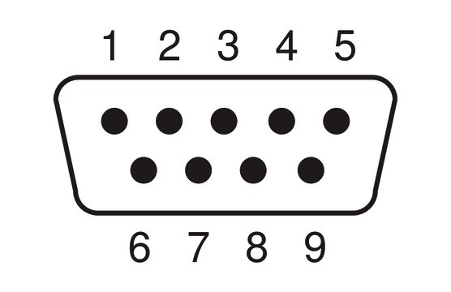

# Serial FeatherWing

## Introduction

The Würth Elektronik eiSos Serial bridge FeatherWing is a development board that acts as an bridge between UART and RS232/RS485/RS422. It is fully compatible to the popular [Adafruit](https://www.adafruit.com/) [Feather line](https://www.adafruit.com/feather) of development boards and can be used as plug-and-play solution to connect any D-SUB9 interfaced device to the Feather ecosystem.

This FeatherWing acts as a bridge between legacy RS232/RS485 devices and modern wired/wireless digital interfaces
### Key Features

* 3V3 logic level UART interface on the Feather pin header.
* Support to 5V logic level
* RS232 with and without flow control
* Full and half duplex RS485
* Double throw slider to switch between RS232 and RS485

This repository contains the [Eagle](https://www.autodesk.com/products/eagle/overview) design files for the MagI³C Power FeatherWing [PCB](hardware).

Feel free to check our [YouTube channel](https://www.youtube.com/user/WuerthElektronik/videos) for video tutorials, hands-ons and webinars relating to our products.

## Hardware

### Description

The Serial FeatherWing was designed with rapid prototyping in mind. Being fully compatible with the Adafruit ecosystem, this FeatherWing gives the user the flexibility to choose the preferred host microcontroller. The inherent modularity of the ecosystem allows the FeatherWing to be easily integrated into any project.

### Connectors

#### CON1
This is a standard D-subminiature Male connector. The pinout for different modes of operation are as described in the table below.

|Pin | RS232 | RS485(Full Duplex)| RS485 (Half Duplex)|
|----|----------|-------------|------|
|1| Not connected |Not connected| Not connected|
|2 |RX |RX+| Not connected|
3| TX |TX- | D-|
|4 |Not connected| Not connected| Not connected|
|5 |GND |GND |GND|
|6 |Not connected| Not connected |Not connected|
|7 |RTS| TX+ |D+|
|8 |CTS |RX-| Not connected|
|9 |Not connected| Not connected |Not connected|

#### Feather Connector
This is the standard set of connectors that is used across the Feather ecosystem. The table below describes the functions of each of the 28 pins as applicable to this FeatherWing.

| Pin number | Pin name | Function |
| ------- | ------- |----------------|
|   1          |RST | Not connected|
|    2          | 3V3| 3.3 V power supply|
|    3          | AREF| Not connected|
|    4          | GND| Ground|
|    5          | A0| Not connected|
|    6          | A1| Not connected|
|    7          | A2| Not connected|
|    8          | A3| Not connected|
|    9          | A4| Not connected|
|    10         | A5| Not connected|
|    11         | SCK| Not connected|
|    12         | MOSI| Not connected|
|    13         | MISO| Not connected|
|    14         | U0RX| Connected to UART TX(RS232/RS485 TX)|
|    15         | U0TX| Connected to UART RX(RS232/RS485 RX)|
|    16         | NC| Not connected|

| Pin number | Pin name | Function |
| ------- | ------- |----------------|
|    17         | SDA| Not connected|
|    18         | SCL| Not connected|
|    19         | 5| Not connected|
|    20         | 6| Not connected|
|    21         | 9| Not connected|
|    22         | U1TX|(optional) Connected to UART RX(RS232 RS485 RX)|
|    23         | U1RX|(optional) Connected to UART TX(RS232/RS485 TX)|
|    24         | 12| Not connected|
|    25         | 13| Not connected|
|    26         | 5V| 5 V Power supply|
|    27         | EN| Not connected|
|    28         | VBAT| Not connected| 

### Switches

#### Switch S1

This sliding switch can be used to select between the two input signal options, RS232 or RS485.
|Position| Mode|
|--------|------|
|Top (Away from D-SUB 9 connector)| RS232|
|Bottom (Towards D-SUB 9 connector)| RS485|

#### Switch S2

This sliding switch determines if the RX/TX lines are crossed to connect directly to another UART peripheral such as a radio module.
|Position| Mode|
|--------|------|
|Top (Away from D-SUB 9 connector)| TX and RX are crossed|
|Bottom (Towards D-SUB 9 connector)| TX and RX are not crossed|

### Jumpers

#### Jumper JP1

This jumper enables switching between half and full duplex modes as well as enabling/disabling the slew rate.

|Connection| Mode|
|--------|-------|
|1-3| Full duplex|
|3-5|Half duplex|

|Connection| Mode|
|--------|-------|
|2-4 |Slew rate enabled|
|4-6 |Slew rate disabled|

#### Jumper JP2

This jumper enables switching between the UART0 and UART1 on the feather connector.

|Connection| Mode|
|--------|-------|
|1-3 and 2-4| UART0|
|3-5 and 4-6|UART1|

#### Jumper JP3
This jumper enables connecting the flow control pins to the GPIOs on the feather connector

|Connection| Mode|
|--------|-------|
|1-2| RTS/DE connected to GPIO12|
|3-4|CTS conected to GPIO13|

### Schematics
The hardware design files including the schematics can be found in the [hardware folder](hardware).

### DISCLAIMER:
THE USE OF THE WÜRTH ELEKTRONIK EISOS DESIGN EXAMPLE / REFERENCE DESIGN IS ENTIRELY AT YOUR OWN RISK. IT IS YOUR SOLE RESPONSIBILITY TO IMPLEMENT THE DESIGN EXAMPLE / REFERENCE DESIGN WITH ALL TECHNICAL AND REGULATORY REQUIREMENTS IN YOUR APPLICATION. IT IS ALSO YOUR RESPONSIBILITY TO VERIFY THE FUNCTION AND PERFORMANCE OF YOUR DESIGN IN YOUR OWN PARTICULAR ENGINEERING AND PRODUCT ENVIRONMENT AND YOU ASSUME THE ENTIRE RISK OF DOING SO OR FAILING TO DO SO. THE WÜRTH ELEKTRONIK EISOS DESIGN EXAMPLE / REFERENCE DESIGN IS PROVIDED ON AN "AS IS" OR "AS AVAILABLE" BASIS, WITHOUT ANY WARRANTIES OF ANY KIND AND WÜRTH ELEKTRONIK EISOS DISCLAIMS ANY WARRANTIES EXPRESS OR IMPLIED, INCLUDING WITHOUT LIMITATION THE MERCHANTABILITY OR FITNESS FOR A PARTICULAR PURPOSE, USAGE OR THE NON-INFRINGEMENT OF THIRD PARTIES’ INTELLECTUAL PROPERTY RIGHTS. NO LICENSE IS GRANTED TO ANY INTELLECTUAL PROPERTY RIGHT BY WÜRTH ELEKTRONIK EISOS OR ANY THIRD PARY. UNDER NO CIRCUMSTANCES SHALL WÜRTH ELEKTRONIK EISOS BE LIABLE FOR DAMAGES INCURRED BY REASON OF OTHER SERVICES OR PRODUCTS RECEIVED THROUGH OR ADVERTISED IN CONNECTION WITH THE WÜRTH ELEKTRONIK EISOS SITE OR THE WÜRTH ELEKTRONIK EISOS DESIGN EXAMPLE / REFERENCE DESIGN. THE WÜRTH ELEKTRONIK EISOS DESIGN EXAMPLE / REFERENCE DESIGN IS SUBJECT TO CHANGE WITHOUT NOTICE.

## Software
Serial bridge FeatherWing **software examples** can be found in the [software folder](software).