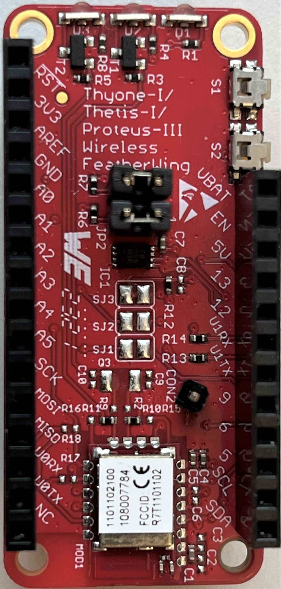
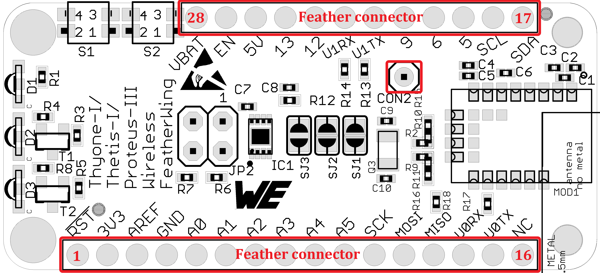
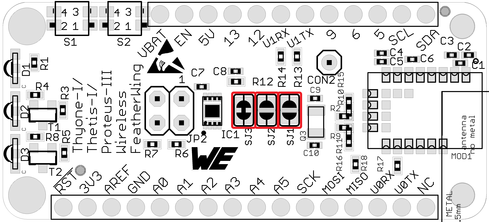
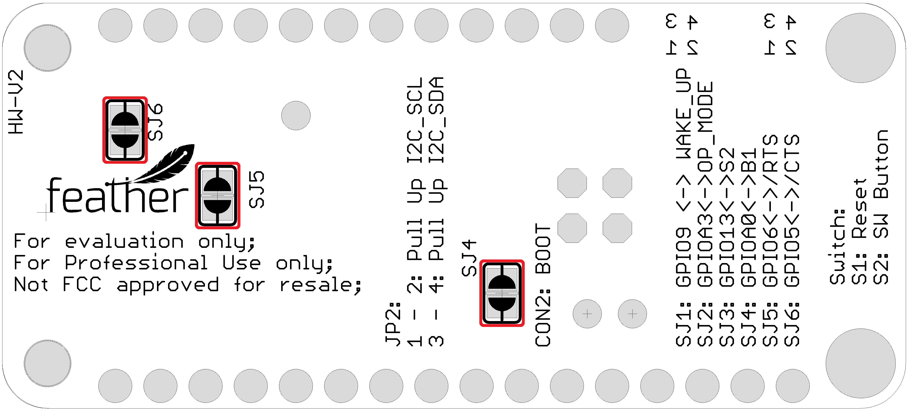
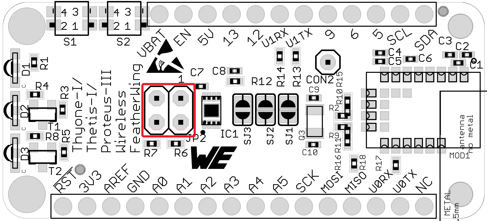
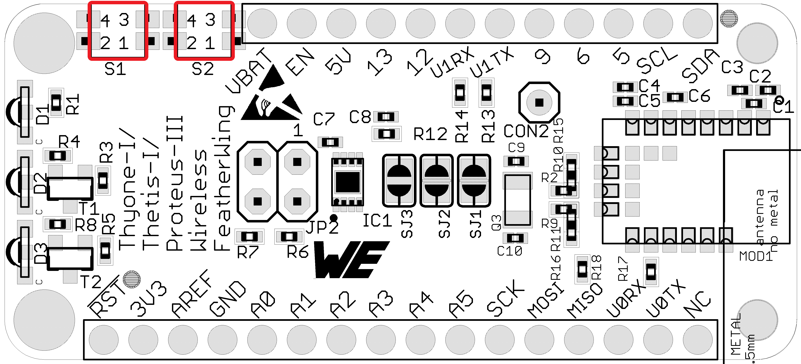

# Setebos-I Wireless FeatherWing

## Introduction

The Würth Elektronik eiSos [Setebos-I Wireless FeatherWing](https://www.we-online.de/katalog/en/SETEBOS-I_FeatherWing) is a development board that offers a combination of two different radio protocols in the 2.4 GHz ISM band. It is fully compatible to the popular [Adafruit](https://www.adafruit.com/) [Feather line](https://www.adafruit.com/feather) of development boards and consists if the following primary components:

* [**Setebos-I**](https://www.we-online.de/katalog/SETEBOS-I) [(2611011024020)](https://www.we-online.de/katalog/datasheet/2611011024020.pdf) - 2.4 GHz proprietary radio module
* [**ATECC608B-TNGTLS**](https://www.microchip.com/en-us/product/ATECC608B) - Secure element from Microchip Technologies

The Setebos-I Wireless FeatherWing can be configured to operate in one of the following modes:

* Bluetooth® LE 5.1 functionality based on the [**Proteus-III**](https://www.we-online.de/katalog/PROTEUS-III) radio module (default)
* Proprietary 2.4GHz radio based on [**Thyone-I**](https://www.we-online.de/katalog/THYONE-I) radio module. The secure element can
be used to secure the radio link with authentication and end-to-end encryption.

>[!NOTE] 
>The Setebos-I Wireless FeatherWing is the direct replacement for the Thyone-I
Wireless FeatherWing (2611059021001) and adds the Bluetooth® LE functionality.

>[!NOTE]
>The Setebos-I Wireless FeatherWing is configured to start with the Proteus-III
Bluetooth® LE 5.1 functionality by default.

>[!NOTE]
>For using the proprietary radio protocol based on Thyone-I, the solder bridge
jumper SJ4 shall be shorted and pin 5 of the Feather connector shall be pulled
to 3.3 V.

The Setebos-I module has an UART interface and the secure element an I2C interface and hence can be connected to any of the Feather microcontroller boards. The available [Arduino](https://www.arduino.cc/) (C/C++) drivers and examples (see [software folder](software)) make it easy to build a prototype to kick-start the application development.

The Setebos-I Wireless FeatherWing was designed with rapid application prototyping in mind.
Being fully compatible with the [Adafruit ecosystem](https://www.adafruit.com/), this[FeatherWing](https://www.adafruit.com/feather) allows the user the flexibility to choose the preferred host microcontroller. The inherent modularity of the ecosystem allows the FeatherWing to be easily integrated into any project.

This repository contains the [Eagle](https://www.autodesk.com/products/eagle/overview) design files for the Setebos-I Wireless FeatherWing [PCB](hardware) as well as examples software examples for each mode of operation.

For more information, please download the [Setebos-I wireless FeatherWing user manual](docs/SetebosWirelessFeatherWing.pdf). Feel free to check our [YouTube channel](https://www.youtube.com/user/WuerthElektronik/videos) for video tutorials, hands-ons and webinars relating to our products.

### Secure Element

The Setebos-I Wireless FeatherWing contains a [ATECC608B-TNGTLS](https://www.microchip.com/wwwproducts/en/ATECC608B) Microchip secure element. The ATECC608B-TNGTLS is a pre-provisioned variant of the ATECC608B secure element from Microchip Technologies. The device is configured to make the secure element suitable to some of the most common use cases for IoT applications. It offers a rich set of cryptographic features like key agreement using **ECDH**, **sign-verify mechanism**, and **encryption/decryption** over easily accessible I2C interface. Its tiny form factor and low power consumption makes it suitable for a wide variety of battery-driven applications.

## Software

This repository provides the following examples for the Setebos-I Wireless FeatherWing:

* The example for Bluetooth® LE 5.1 functionality can be found [here](../ProteusIIIFeatherWing/software/).
* The example for the Proprietary 2.4GHz radio can be found [here](../ThyoneWirelessFeatherWing/software/) 
* The example to transmit sensor data over Bluetooth® LE 5.1 can be found [here](../Sensor2BLE/)
* The example to transmit sensor data over Proprietary 2.4GHz radio can be found [here](../ThyoneWirelessSensors/software/)
 

## Hardware

### Description

The Setebos-I is a radio module for wireless communication between devices such as control systems, remote controls, sensor nodes etc. Operating in the globally available 2.4 GHz license free band, it combines two radio standards in a single hardware platform. The Setebos-I can be configured to work with either Bluetooth® LE, or with WE-ProWare radio stack.

* When selecting the Bluetooth® LE standard, the Setebos-I acts as a [Proteus-III](https://www.we-online.de/katalog/PROTEUS-III) radio module.
* When selecting the WE-ProWare radio stack, the Setebos-I acts as a [Thyone-I](https://www.we-online.de/katalog/THYONE-I) radio module.

Small dimensions (8 x 12 mm) comparable to a nano-sim card including an on-board PCB antenna make Setebos-I ideal for small form factor design. The Setebos-I interfaces the host system via serial UART.

### Key features

The Setebos-I offers a wide range of configurable features to suit even the most sophisticated application design. From low power long range to line-powered high throughput, the Setebos-I can be configured to cover a wide range of applications.

* **Extremely small dimensions**: Owing to its small size (8 x 12 mm) the module can be easily designed-in to compact end devices.
* **Energy efficient**: The Setebos-I has extremely low current consumption especially in sleep mode(< 0.4 μ A) making it suitable for battery driven applications.
* **Globally available 2.4 GHz band**: The Setebos-I operates in the 2.4 GHz license free band that allows global deployment of the end-device.
* **Smart antenna selection**: The Setebos-I offers a choice of using the on-board PCB antenna for compact designs or connecting an external antenna for application that require long range.
* **Configurable radio profiles**: The module can be configured to operate in 125, 500, 1000 and 2000 kbit/s radio profiles offering the versatility of long range or high throughput.
* **Fast serial interface**: The Setebos-I offers a UART-interface to communicate with a host using a user-defined baud rate of up to 1 Mbit/s.
* **Embedded security on-module**: The secure bootloader on the module verifies the image signature on boot-up offering tamper protection. The module also supports hardware accelerated end-to-end encryption.
* **Additional Local/Remote GPIOs**: The Setebos-I firmware allows configuration and control of free digital I/O pins on the module via serial or radio interface.
* **Transparent mode**: A transparent mode is available out-of-the-box enabling easy serial cable replacement.

Further details about the Setebos-I radio module can be found under [we-online.de/katalog/en/Setebos-I](https://www.we-online.de/katalog/en/Setebos-I).

### Pinouts

#### Feather Connector
This is the standard set of connectors that is used across the Feather ecosystem. The table below describes the functions of each of the 28 pins as applicable to this FeatherWing.

| Pin number | Pin name | Function |
| ------- | ------- |----------------|
|   1          | RST | Not connected|
|    2          | 3V3| 3.3 V power supply|
|    3          | AREF| Not connected|
|    4          | GND| Ground|
|    5          | A0| (Optional) Module’s pin RPS(B1) via solder bridge SJ4|
|    6          | A1| Not connected|
|    7          | A2| Not connected|
|    8          | A3| (Optional) Module’s pin MODE_1 via solder bridge SJ2|
|    9          | A4| Not connected|
|    10         | A5| Not connected|
|    11         | SCK| Not connected|
|    12         | MOSI| Not connected|
|    13         | MISO| Not connected|
|    14         | U0RX|  (Optional) Module’s UTXD pin via R18|
|    15         | U0TX| (Optional) Module’s URXD pin via R17|
|    16         | NC| Not connected|

| Pin number | Pin name | Function |
| ------- | ------- |----------------|
|    17         | SDA|I2C SDA to secure element|
|    18         | SCL|I2C SCL to secure element|
|    19         | 5| (Optional) Module’s pin /CTS via solder bridge SJ6|
|    20         | 6| (Optional) Module’s pin /RTS via solder bridge SJ5|
|    21         | 9|  (Optional) Module’s pin WAKE_UP via solder bridge SJ1|
|    22         | U1TX| Module’s pin URXD via R13 |
|    23         | U1RX| Module’s pin UTXD via R14|
|    24         | 12| Not connected|
|    25         | 13| (Optional) Push button S2 via solder bridge SJ3|
|    26         | 5V| Not connected|
|    27         | EN| Not connected|
|    28         | VBAT| Not connected| 

#### CON2

Connector CON2 is a single connector that enables connection to BOOT pin via a standard jumper cable.

|CON2 | Function |
| ------- | ------- |
|- | Direct connection to module's BOOT pin|

### Jumpers and solder briges

#### Solder bridges
These solder bridge jumpers enable optional connection between the pins of the radio module
and the switch S2 to the pins on the Feather connector. Table below shows the functionality and the default state of each solder bridge.

|SJ | Function  | PCB location |Jumper set (Default) |
| ------- | ------- |------------|----------------|
| 1	| WAKE_UP to GPIO9 |	Top |No |
| 2	| MODE_1 to GPIOA3 |	Top |No |
| 3	| Switch S2 to GPIO13 |	Top |Yes|
| 4	| RPS(B1) to GPIO0 |	Bottom |No|
| 5	| /RTS to GPIOA6 |	Bottom |No|
| 6	|/CTS to GPIO5|	Bottom |No|

>[!NOTE] 
> The RPS pin shall be set to switch between Bluetooth® and proprietary radio using the GPIOA3
protocol.

#### Jumper JP2
The standard I2C interface requires the SCL and SDA lines to be pulled up with resistors. These jumpers can be removed in cases where the pull-ups already exist on the I2C bus. 

| Pin connection | Function  | Jumper set (Default) |
| ------- | ------- |----------------|
|    1,2|	Connect  I2C SCL line to a 4.7 k&#8486; Pull up resistor|	Yes|
|    3,4|	Connect  I2C SDA line to a 4.7 k&#8486; Pull up resistor|	Yes|

#### Push button S1
This push button is connected to the /RESET pin of the Setebos-I module. Pressing this button resets the module.

#### Push button S2
S2 is a general purpose push button which is connected to GPIO 13 when a jumper is set between pins 5 and 6 of JP1.

### Schematics

### DISCLAIMER:
THE USE OF THE WÜRTH ELEKTRONIK EISOS DESIGN EXAMPLE / REFERENCE DESIGN IS ENTIRELY AT YOUR OWN RISK. IT IS YOUR SOLE RESPONSIBILITY TO IMPLEMENT THE DESIGN EXAMPLE / REFERENCE DESIGN WITH ALL TECHNICAL AND REGULATORY REQUIREMENTS IN YOUR APPLICATION. IT IS ALSO YOUR RESPONSIBILITY TO VERIFY THE FUNCTION AND PERFORMANCE OF YOUR DESIGN IN YOUR OWN PARTICULAR ENGINEERING AND PRODUCT ENVIRONMENT AND YOU ASSUME THE ENTIRE RISK OF DOING SO OR FAILING TO DO SO. THE WÜRTH ELEKTRONIK EISOS DESIGN EXAMPLE / REFERENCE DESIGN IS PROVIDED ON AN "AS IS" OR "AS AVAILABLE" BASIS, WITHOUT ANY WARRANTIES OF ANY KIND AND WÜRTH ELEKTRONIK EISOS DISCLAIMS ANY WARRANTIES EXPRESS OR IMPLIED, INCLUDING WITHOUT LIMITATION THE MERCHANTABILITY OR FITNESS FOR A PARTICULAR PURPOSE, USAGE OR THE NON-INFRINGEMENT OF THIRD PARTIES’ INTELLECTUAL PROPERTY RIGHTS. NO LICENSE IS GRANTED TO ANY INTELLECTUAL PROPERTY RIGHT BY WÜRTH ELEKTRONIK EISOS OR ANY THIRD PARY. UNDER NO CIRCUMSTANCES SHALL WÜRTH ELEKTRONIK EISOS BE LIABLE FOR DAMAGES INCURRED BY REASON OF OTHER SERVICES OR PRODUCTS RECEIVED THROUGH OR ADVERTISED IN CONNECTION WITH THE WÜRTH ELEKTRONIK EISOS SITE OR THE WÜRTH ELEKTRONIK EISOS DESIGN EXAMPLE / REFERENCE DESIGN. THE WÜRTH ELEKTRONIK EISOS DESIGN EXAMPLE / REFERENCE DESIGN IS SUBJECT TO CHANGE WITHOUT NOTICE.

## Software

Setebos-I Wireless FeatherWing **software examples** can be found in the [software folder](software).
