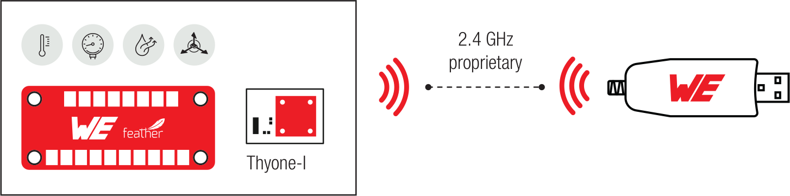

# Thyone FeatherWing

## Built up a proprietary Network

* Select a microprocessor of your choice from the Adafruit Feather ecosystem
* Use the Sensor FeatherWing for measuring condition parameters like temperature, air pressure, humidity and acceleration
* Send data with Thyone-I FeatherWing on 2.4 GHz proprietary radio out
* Thyone-I USB radio stick or another Thyone-I FeatherWing can receive the data and you get access to all information
* Even various Tags could be connected wirelessly.
* We support you with libraries for some microcontrollers on Github available

