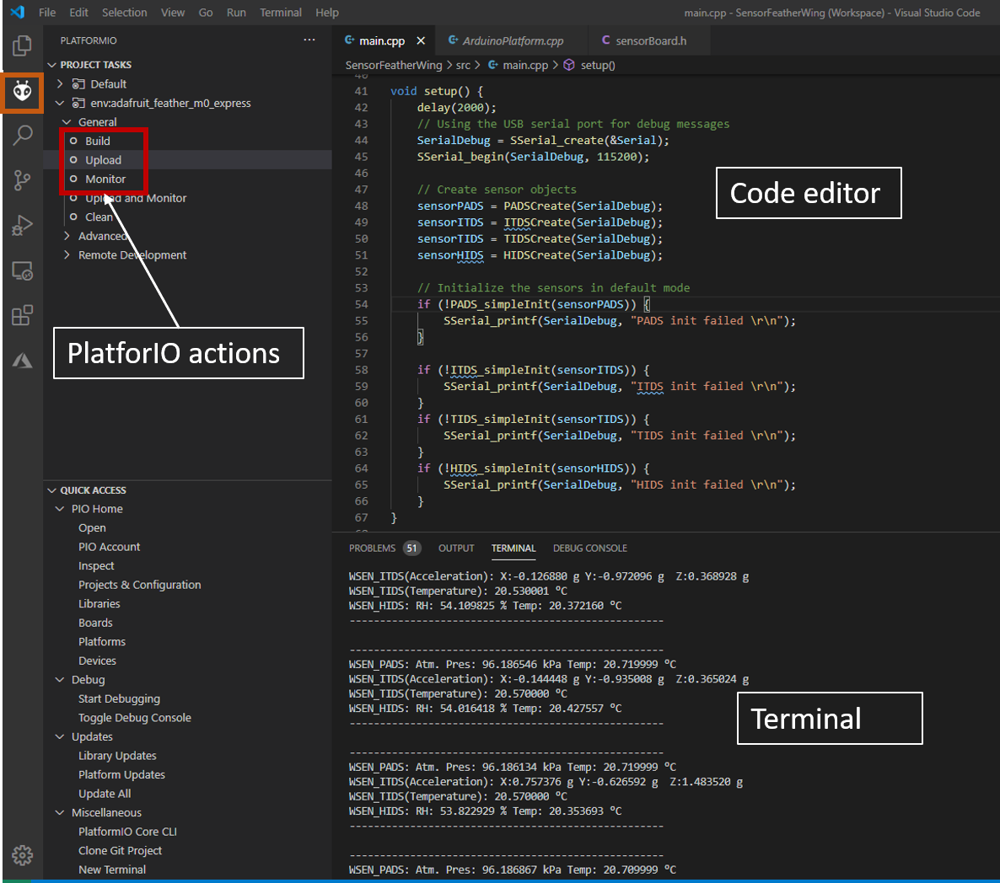

# Thyone FeatherWing

## Introduction

The Würth Elektronik eiSos Thyone FeatherWing is a development board that offers a secure 2.4 GHz proprietary wireless connectivity solution. It is fully compatible to the popular Adafruit’s Feather line of development boards. The Thone FeatherWing consists of two important components,

* **Thyone-I** (2611011021000) - A 2.4 GHz proprietary radio module
* **ATECC608A-TNGTLS** - Secure element from Microchip Technologies

The Thyone-I module has an UART interface and the secure element an I 2 C interface and hence can be connected to any of the Feather microcontroller boards. The Arduino(C/C++) drivers and examples made available makes it easy to build a prototype to kick-start the application development.


The Thyone FeatherWing was designed with rapid prototyping in mind. Being fully compatible with the Adafruit ecosystem, this FeatherWing allows the user the flexibility to choose the preferred host microcontroller. The inherent modularity of the ecosystem allows the FeatherWing to be easily integrated into any project.
For more information about the Hardware, please go to the Hardware repository or download [Thyone FeatherWing user manual](link.to.com\document).
Feel free to check our [youtube channel](www.youtube.com/user/WuerthElektronik/videos) for video tutorials, hands-ons and webinars relating to our products.

### Secure Element

Thyone FeatherWing contains [ATECC608A-TNGTLS](www.microchip.com/wwwproducts/en/ATECC608A) Microship secure element. The ATECC608A-TNGTLS is a pre-prvisioned variant of the ATECC608A secure element from Microchip Technologies. The device is configured to make the secure element suitable to some of the most common use cases for IoT applications. It offers a rich set of cryptographic features like key agreement using ECDH, sign-verify mechanism, and encryption/decryption over easily accessible I<sup>2</sup>C interface. Its tiny form factor and low power consumption make it suitable for a wide variety of battery-driven applications.


## Software 

Würth Elektronik eiSos provides a software development kit (SDK) with examples to support all the WE FeatherWings. Here are the salient features of the WE FeatherWing SDK.

* The SDK is open-source and well documented.
* It uses popular open-source tool chain including an IDE.
* The examples are written in Arduino-styled C/C++ for quick prototyping.
* The core components of the SDK are written in pure C to enable easy porting to any microcontroller platform.
* Development platform independent (Windows, Linux or MAC)
*  Modular structure of the software stack makes it easy to integrate into any project.

The SDK can be accessed on Github at [eismart FeatherWing GitHub](/../../).

### Necessary Steps

* **Install IDE**: your favourite development IDE (we recommend [Visual Studio Code](https://code.visualstudio.com/) with [Platform IO](https://platformio.org/) extension.
* **PlatformIO**: is a cross-platform, cross-architecture, multiple framework professional tool for embedded software development. It provides the tool chain necessary for the software development including building, debugging, code-upload and many more. PlatformIO works well on all the modern operating systems and supports a host of development boards including the Feathers from Adafruit. Further details about PlatformIO can be found under [platformio.org](https://platformio.org/)
* **WE SDK**: This is a layer of platform-independent pure C drivers for sensors and wireless connectivity modules from Würth Elektronik eiSos. These drivers implement all the necessary functions to utilize full feature set of the sensors and wireless connectivity modules. More details on the SDK and dowloads under [WCS Software](we-online.com/wcs-software)
* **Board files**: This layer provides abstraction at a board level and provides functions to configure and control individual FeatherWings from WE.
* **User application**: The SDK currently implements a quick start example for each of the FeatherWings.

### Installing the tools

* Install Visual Studio Code on the platform of your choice following the [instructions](code.visualstudio.com/docs)
* Follow the instructions under to install [PlatformIO IDE](platformio.org/install/ide?install=vscode) extension.


## Example

The quick start examples in the SDK are written to be run on Adafruit’s Feather M0 express. The hardware setup is as simple as stacking up the FeatherWing on top of the M0 Feather and powering up the board.

1. Clone or download the [WE FeatherWing SDK](/)
2. Open the workspace of interest with the filename `<FeatherWing>.code-workspace` in Visual Studio code.
3. Build and upload the code from the PlatformIO tab as shown in the Figure below
4. After successful upload, click on **Monitor** in PlatformIO extension tab to view the debug logs in the serial terminal.(See Figure)





### Source Code

```

/**
 * \file
 * \brief Main file for the WE-ThyoneFeatherWing.
 *
 * \copyright (c) 2020 Würth Elektronik eiSos GmbH & Co. KG
 *
 * \page License
 *
 * THE SOFTWARE INCLUDING THE SOURCE CODE IS PROVIDED “AS IS”. YOU ACKNOWLEDGE
 * THAT WÜRTH ELEKTRONIK EISOS MAKES NO REPRESENTATIONS AND WARRANTIES OF ANY
 * KIND RELATED TO, BUT NOT LIMITED TO THE NON-INFRINGEMENT OF THIRD PARTIES’
 * INTELLECTUAL PROPERTY RIGHTS OR THE MERCHANTABILITY OR FITNESS FOR YOUR
 * INTENDED PURPOSE OR USAGE. WÜRTH ELEKTRONIK EISOS DOES NOT WARRANT OR
 * REPRESENT THAT ANY LICENSE, EITHER EXPRESS OR IMPLIED, IS GRANTED UNDER ANY
 * PATENT RIGHT, COPYRIGHT, MASK WORK RIGHT, OR OTHER INTELLECTUAL PROPERTY
 * RIGHT RELATING TO ANY COMBINATION, MACHINE, OR PROCESS IN WHICH THE PRODUCT
 * IS USED. INFORMATION PUBLISHED BY WÜRTH ELEKTRONIK EISOS REGARDING
 * THIRD-PARTY PRODUCTS OR SERVICES DOES NOT CONSTITUTE A LICENSE FROM WÜRTH
 * ELEKTRONIK EISOS TO USE SUCH PRODUCTS OR SERVICES OR A WARRANTY OR
 * ENDORSEMENT THEREOF
 *
 * THIS SOURCE CODE IS PROTECTED BY A LICENSE.
 * FOR MORE INFORMATION PLEASE CAREFULLY READ THE LICENSE AGREEMENT FILE LOCATED
 * IN THE ROOT DIRECTORY OF THIS PACKAGE
 */
#include "thyoneIBoard.h"
#include "atecc608a.h"

// USB-Serial debug Interface
TypeSerial *SerialDebug;

void setup() {
    delay(2000);
    // Using the USB serial port for debug messages
    SerialDebug = SSerial_create(&Serial);
    SSerial_begin(SerialDebug, 115200);
}

void loop() {}


```
