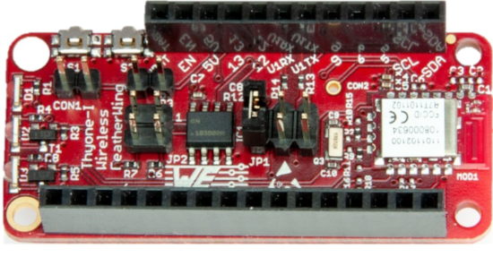
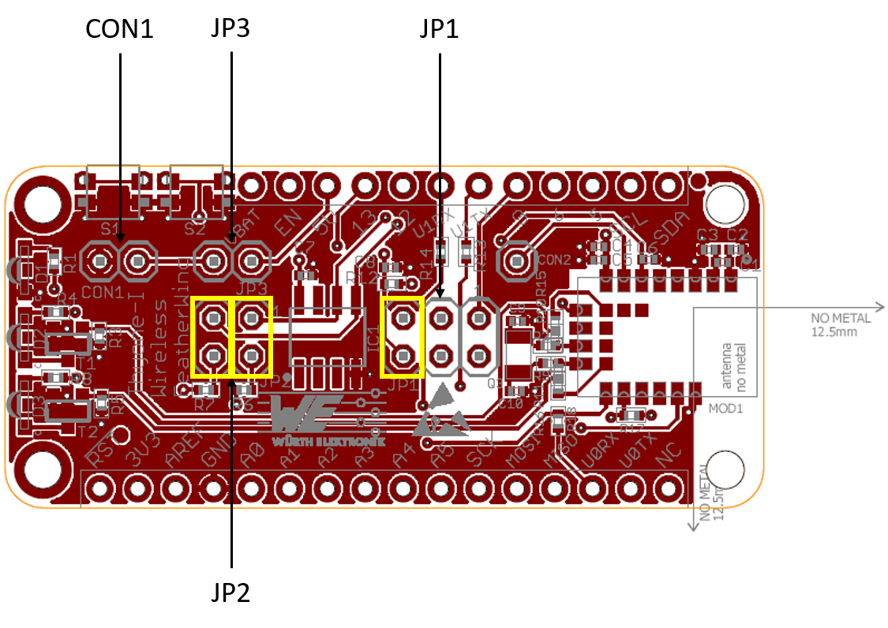
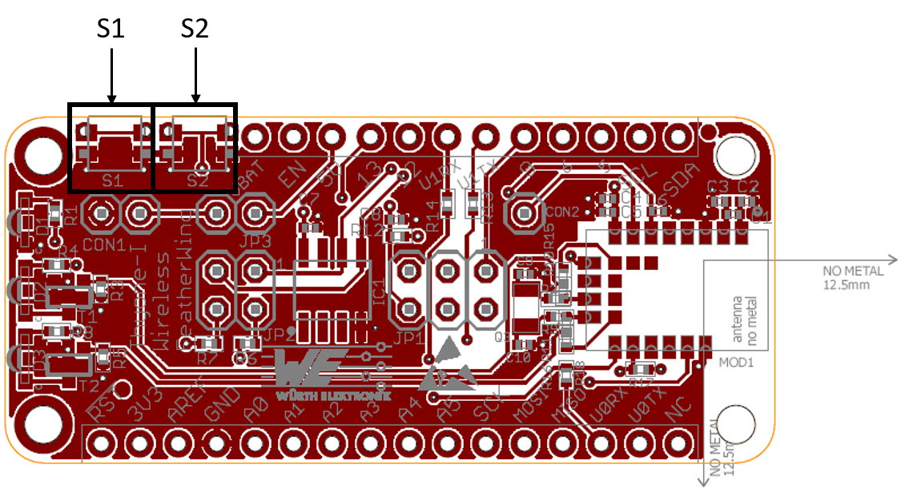
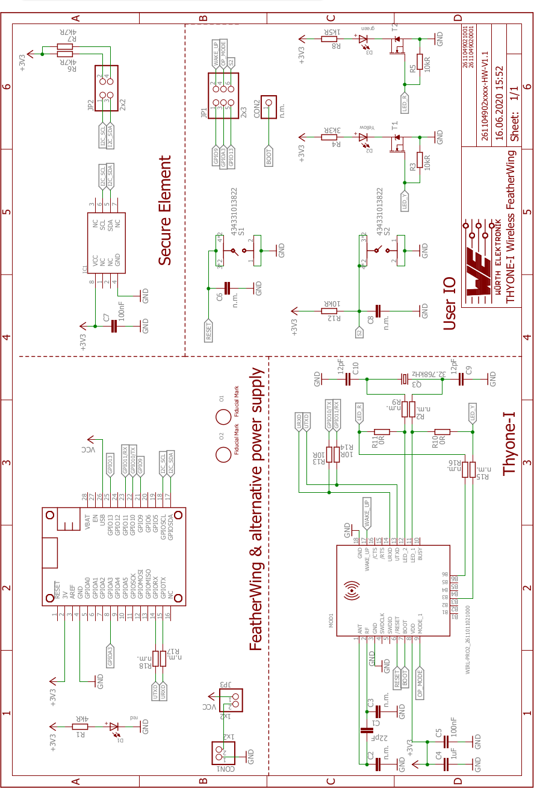

# Thyone Wireless FeatherWing

## Introduction

The Würth Elektronik eiSos [Thyone Wireless FeatherWing](https://www.we-online.de/katalog/en/THYONE-I_FeatherWing) is a development board that offers a secure **2.4 GHz proprietary** wireless connectivity solution. It is fully compatible to the popular [Adafruit](https://www.adafruit.com/) [Feather line](https://www.adafruit.com/feather) of development boards. The FeatherWing consists of two important components:

* [**Thyone-I**](https://www.we-online.de/katalog/de/THYONE-I) [(2611011021000)](https://www.we-online.de/katalog/datasheet/2611011021000.pdf) - 2.4 GHz proprietary radio module
* [**ATECC608A-TNGTLS**](http://ww1.microchip.com/downloads/en/DeviceDoc/ATECC608A-TNGTLS-CryptoAuthentication-Data-Sheet-DS40002112B.pdf) - Secure element from Microchip Technologies

The Thyone-I module has an UART interface and the secure element an I2C interface and hence can be connected to any of the Feather microcontroller boards. The available [Arduino](https://www.arduino.cc/) (C/C++) drivers and examples (see [software folder](software)) make it easy to build a prototype to kick-start the application development.

The Thyone Wireless FeatherWing was designed with rapid prototyping in mind. Being fully compatible with the [Adafruit ecosystem](https://www.adafruit.com/), this [FeatherWing](https://www.adafruit.com/feather) gives the user the flexibility to choose the preferred host microcontroller. The inherent modularity of the ecosystem allows the FeatherWing to be easily integrated into any project.

This repository contains the [Eagle](https://www.autodesk.com/products/eagle/overview) design files for the Thyone Wireless FeatherWing [PCB](hardware) as well as the [software](software) with quick start example. 

For more information, please download the [Thyone wireless FeatherWing user manual](docs/ThyoneWirelessFeatherWing.pdf). Feel free to check our [YouTube channel](https://www.youtube.com/user/WuerthElektronik/videos) for video tutorials, hands-ons and webinars relating to our products.

### Secure Element

The Thyone Wireless FeatherWing contains a [ATECC608A-TNGTLS](https://www.microchip.com/wwwproducts/en/ATECC608A) Microchip secure element. The ATECC608A-TNGTLS is a pre-provisioned variant of the ATECC608A secure element from Microchip Technologies. The device is configured to make the secure element suitable to some of the most common use cases for IoT applications. It offers a rich set of cryptographic features like key agreement using **ECDH**, **sign-verify mechanism**, and **encryption/decryption** over easily accessible I2C interface. Its tiny form factor and low power consumption makes it suitable for a wide variety of battery-driven applications.

## Hardware

### Description

The Thyone-I module is a radio sub-module for wireless communication between devices such as control systems, remote controls, sensor nodes etc. Operating in the globally available 2.4 GHz license free band, Thyone-I offers a robust and secure data transmission in point-to-point as well as mesh configurations.

The module is pre-loaded with the [WE-ProWare](https://www.we-online.de/web/de/electronic_components/produkte_pb/service_pbs/wco/service_eismart.php?formblock=section_id_weprowaretext_1#section_id_weprowaretext_1) radio stack which ensures high flexibility without compromising reliability. Interfacing with the host system via serial Universal Asynchronous Receiver/Transmitter (**UART**), the module allows easy configuration and control of the radio using a simple command interface. To ensure ease-of-use for cable replacement applications, the module also offers a transparent mode to function as a serial-to-radio adapter. Small dimensions comparable to a nano SIM card (8 x 12 mm) including an on-board PCB antenna make Thyone-I ideal for small form factor design.

### Key features

The Thyone-I offers a wide range of configurable features to suit even the most sophisticated application design. From low power long range to line-powered high throughput, the Thyone-I can be configured to cover a wide range of applications.

* **Extremely small dimensions**: Owing to its small size (8 x 12 mm) the module can be easily designed-in to compact end devices.
* **Energy efficient**: The Thyone-I has extremely low current consumption especially in sleep mode(< 0.4 μ A) making it suitable for battery driven applications.
* **Globally available 2.4 GHz band**: The Thyone-I operates in the 2.4 GHz license free band that allows global deployment of the end-device.
* **Smart antenna selection**: The Thyone-I offers a choice of using the on-board PCB antenna for compact designs or connecting an external antenna for application that require long range.
* **Long range mode**: A radio profile with channel coding allows a radio link of up to 500 m with a data rate of 125 kbit/s. As per two way ground reflection model with transmit power of 8 dBm, antenna height 2 m and a reserve of 6 dB
* **High throughput mode**: The Thyone-I offers a radio profile with 2 Mbit/s data transmission over the air leading to an effective end-to-end throughput of around 400 kbit/s.
* **Fast serial interface**: The Thyone-I offers a UART-interface to communicate with a host using a user-defined baud rate of up to 1 Mbit/s.
* **Embedded security on-module**: The secure bootloader on the module verifies the image signature on boot-up offering tamper protection. The module also supports hardware accelerated end-to-end encryption.
* **Additional Local/Remote GPIOs**: The Thyone-I firmware allows configuration and control of free digital I/O pins on the module via serial or radio interface.
* **Transparent mode**: A transparent mode is available out-of-the-box enabling easy serial cable replacement.
* **Network addressing**: The Thyone-I implements network addressing to enable unicast, multi-cast as well as broadcast data transmission. Additionally, packet ACK is available with automatic retry mechanism to ensure reliable data transmission.
* **Mesh network**: The Thyone-I offers repeater functionality to enable the creation of a simple flooding mesh network. The repeater mode can also be used for range extension.

Further details about the Thyone-I radio module can be found under [we-online.de/katalog/en/THYONE-I](https://www.we-online.de/katalog/en/THYONE-I).

### Pinouts

#### Feather Connector
This is the standard set of connectors that is used across the Feather ecosystem. The table below describes the functions of each of the 28 pins as applicable to this FeatherWing.

| Pin number | Pin name | Function |
| ------- | ------- |----------------|
|   1          | RST | Not connected|
|    2          | 3V3| 3.3 V power supply|
|    3          | AREF| Not connected|
|    4          | GND| Ground|
|    5          | A0| Not connected|
|    6          | A1| Not connected|
|    7          | A2| Not connected|
|    8          | A3| (Optional) Thyone-I MODE pin via Jumper JP1|
|    9          | A4| Not connected|
|    10         | A5| Not connected|
|    11         | SCK| Not connected|
|    12         | MOSI| Not connected|
|    13         | MISO| Not connected|
|    14         | U0RX|  (Optional) Thyone-I UTXD pin via R18|
|    15         | U0TX| (Optional) Thyone-I URXD pin via R17|
|    16         | NC| Not connected|

| Pin number | Pin name | Function |
| ------- | ------- |----------------|
|    17         | SDA|I2C SDA to secure element|
|    18         | SCL|I2C SCL to secure element|
|    19         | 5| Not connected|
|    20         | 6| Not connected|
|    21         | 9|  (Optional) Thyone-I WAKE_UP pin via Jumper JP1|
|    22         | U1TX| Thyone-I URXD pin via R13|
|    23         | U1RX| Thyone-I UTXD pin via R14|
|    24         | 12| Not connected|
|    25         | 13| (Optinal) Push button S2 via JP1|
|    26         | 5V| 5 V Power supply|
|    27         | EN| Not connected|
|    28         | VBAT| Not connected| 

#### Jumper JP1
This jumper enables the use of WAKE_UP and MODE pins of the Thyone-I module as well as the Switch S2 from the host microcontroller. 

| Pin connection | Function  | Jumper set (Default) |
| ------- | ------- |----------------|
|    1,2	| WAKE_UP to GPIO9 |	No |
|    3,4	| MODE to GPIOA3 |	No |
|    5,6	| Switch S2 to GPIO13 |	Yes |

#### Jumper JP2
The standard I2C interface requires the SCL and SDA lines to be pulled up with resistors. These jumpers can be removed in cases where the pull-ups already exist on the I2C bus. 

| Pin connection | Function  | Jumper set (Default) |
| ------- | ------- |----------------|
|    1,2|	Connect  I2C SCL line to a 4.7 k&#8486; Pull up resistor|	Yes|
|    3,4|	Connect  I2C SDA line to a 4.7 k&#8486; Pull up resistor|	Yes|

#### Jumper JP3
This jumper, when set, connects the external power supply coming from CON1 to V_USB.

| Pin connection | Function  | Jumper set (Default) |
| ------- | ------- |----------------|
|    1,2|	Connect  external supply connected to CON1 to V_USB|	No|

#### Push button S1
This push button is connected to the /RESET pin of the Thyone-I module. Pressing this button resets the module.

#### Push button S2
S2 is a general purpose push button which is connected to GPIO 13 when a jumper is set between pins 5 and 6 of JP1.

### Schematics

## Software

Thyone-I Wireless FeatherWing **software examples** can be found in the [software folder](software).
