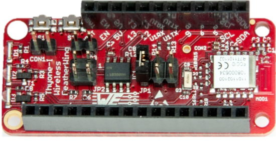

# Thyone FeatherWing

## Introduction

The Würth Elektronik eiSos Thyone FeatherWing is a development board that offers a secure **2.4 GHz proprietary** wireless connectivity solution. It is fully compatible to the popular [Adafruit](https://www.adafruit.com/) [Feather line](https://www.adafruit.com/feather) of development boards. The Thyone Wireless FeatherWing consists of two important components:

* [**Thyone-I** (2611011021000)](https://www.we-online.de/katalog/de/THYONE-I) - A 2.4 GHz proprietary radio module
* [**ATECC608A-TNGTLS**](http://ww1.microchip.com/downloads/en/DeviceDoc/ATECC608A-TNGTLS-CryptoAuthentication-Data-Sheet-DS40002112B.pdf) - Secure element from Microchip Technologies

The Thyone-I module has an UART interface and the secure element an I<sup>2</sup>C interface and hence can be connected to any of the Feather microcontroller boards. The [Arduino](https://www.arduino.cc/)(C/C++) drivers and examples made available makes it easy to build a prototype to kick-start the application development.



The Thyone FeatherWing was designed with rapid prototyping in mind. Being fully compatible with the [Adafruit ecosystem](https://www.adafruit.com/), this [FeatherWing](https://www.adafruit.com/feather) allows the user the flexibility to choose the preferred host microcontroller. The inherent modularity of the ecosystem allows the FeatherWing to be easily integrated into any project.

For more information about the hardware, please go to the [hardware repository](https://github.com/WE-eiSmart/FeatherWings-Hardware) or download [Thyone FeatherWing user manual](link.to.com\document).
Feel free to check our [YouTube channel](https://www.youtube.com/user/WuerthElektronik/videos) for video tutorials, hands-ons and webinars relating to our products.

### Thyone-I 

The Thyone-I module is a radio sub-module for wireless communication between devices such as control systems, remote controls, sensor nodes etc. Operating in the globally available 2.4 GHz license free band, Thyone-I offers a robust and secure data transmission in point-to-point as well as mesh configurations.

It is pre-loaded with the WE-ProWare radio stack which ensures high flexibility without compromising the reliability. Interfacing with the host system via serial UART, the module allows easy configuration and control of the radio using a simple command interface. To ensure ease-of-use for cable replacement applications, the module also offers a transparent mode to function as a serial-to-radio adapter. Small dimensions comparable a nano-SIM card (8 x 12 mm) including an on-board PCB antenna makes Thyone-I ideal for small form factor design.

### Secure Element

Thyone FeatherWing contains [ATECC608A-TNGTLS](www.microchip.com/wwwproducts/en/ATECC608A) Microship secure element. The ATECC608A-TNGTLS is a pre-provisioned variant of the ATECC608A secure element from Microchip Technologies. The device is configured to make the secure element suitable to some of the most common use cases for IoT applications. It offers a rich set of cryptographic features like key agreement using ECDH, sign-verify mechanism, and encryption/decryption over easily accessible I<sup>2</sup>C interface. Its tiny form factor and low power consumption make it suitable for a wide variety of battery-driven applications.


## Software 

Würth Elektronik eiSos provides a software development kit (SDK) with examples to support all the WE FeatherWings. Here are the salient features of the WE FeatherWing SDK.

* The SDK is open-source and well documented.
* It uses popular open-source tool chain including an IDE.
* The examples are written in Arduino-styled C/C++ for quick prototyping.
* The core components of the SDK are written in pure C to enable easy porting to any microcontroller platform.
* Development platform independent (Windows, Linux or MAC)
* Modular structure of the software stack makes it easy to integrate into any project.


### Necessary Steps

* **Install IDE**: your favourite development IDE (we recommend [Visual Studio Code](https://code.visualstudio.com/) with [Platform IO](https://platformio.org/) extension.
* **PlatformIO**: is a cross-platform, cross-architecture, multiple framework professional tool for embedded software development. It provides the tool chain necessary for the software development including building, debugging, code-upload and many more. PlatformIO works well on all the modern operating systems and supports a host of development boards including the Feathers from Adafruit. Further details about PlatformIO can be found under [platformio.org](https://platformio.org/)
* **WE SDK**: This is a layer of platform-independent pure C drivers for sensors and wireless connectivity modules from Würth Elektronik eiSos. These drivers implement all the necessary functions to utilize full feature set of the sensors and wireless connectivity modules. More details on the SDK and dowloads under [WCS Software](https://we-online.com/wcs-software)
* **Board files**: This layer provides abstraction at a board level and provides functions to configure and control individual FeatherWings from WE.
* **User application**: The SDK currently implements a quick start example for each of the FeatherWings.

### Installing the tools

* Install Visual Studio Code on the platform of your choice following the [instructions](https://code.visualstudio.com/docs)
* Follow the instructions under to install [PlatformIO IDE](https://platformio.org/install/ide?install=vscode) extension.


## Example

The quick start examples in the SDK are written to be run on Adafruit’s Feather M0 express. The hardware setup is as simple as stacking up the FeatherWing on top of the M0 Feather and powering up the board.

1. Clone or download the [WE FeatherWing SDK](https://github.com/WurthElektronik/WEFeatherWingSDK)
2. Open the workspace of interest with the filename `<FeatherWing>.code-workspace` in Visual Studio code.
3. Build and upload the code from the PlatformIO tab as shown in the Figure below
4. After successful upload, click on **Monitor** in PlatformIO extension tab to view the debug logs in the serial terminal.(See Figure)


### Quick start example

The quick start example for the Thyone FeatherWing demonstrates the very basic functionality of the Thyone-I radio module, that is to transmit and receive data.

1. In the quick start application, the Thyone-I can be configured either as a transmitter or a receiver.
```C
/*Configure the FeatherWing either as a transmitter or a receiver*/
#define Transmitter 1
```

2. Setup - The debug as well as the Thyone-I UART interfaces are initialized. Additionally, the basic configuration of the Thyone-I (Radio channel, radio profile and transmit power) is done.

```C

void setup() {
    delay(5000);
    uint8_t serialNrThy[4] = {0};

    // Using the USB serial port for debug messages
    SerialDebug = SSerial_create(&Serial);
    SSerial_begin(SerialDebug, 115200);

    SerialThyoneI = HSerial_create(&ThyoneIUART);

    // Create serial port for Thyone FeatherWing with baud 115200 and 8N1
    HSerial_beginP(SerialThyoneI, 115200, (uint8_t)SERIAL_8N1);
    pinPeripheral(10, PIO_SERCOM);
    pinPeripheral(11, PIO_SERCOM);

    thyoneI = THYONEI_Create(SerialDebug, SerialThyoneI, &thysettings);

    if (!THYONEI_simpleInit(thyoneI)) {
        SSerial_printf(SerialDebug, "Thyone init failed \r\n");
    }

    //Read and display the serial number - This is also the default source address
    if (ThyoneI_GetSerialNumber(thyoneI, serialNrThy)) {
        SSerial_printf(SerialDebug,
                       "Thyone-I default source address %02X%02X%02X%02X \r\n",
                       serialNrThy[3], serialNrThy[2], serialNrThy[1],
                       serialNrThy[0]);
    }

    /*The following code shows how to set the parameters of the Thyone radio
    module. In this case, the values are set to factory default. The settings
    are non-volatile. Each write operation performs a write to the flash memory
    and resets the module. Hence, this operation has to be limited to one time
    configuration only.*/
    ThyoneI_TXPower_t txPower;
    if (ThyoneI_GetTXPower(thyoneI, &txPower)) {
        if (txPower != ThyoneI_TXPower_8) {
            // Set the transmit power to 8 dBm
            if (!ThyoneI_SetTXPower(thyoneI, ThyoneI_TXPower_8)) {
                SSerial_printf(SerialDebug, "Thyone set power failed \r\n");
            }
        }
    } else {
        SSerial_printf(SerialDebug, "Thyone get power failed \r\n");
    }

    uint8_t rfChannel;
    if (ThyoneI_GetRFChannel(thyoneI, &rfChannel)) {
        if (rfChannel != THYONE_DEFAULT_RF_CHANNEL) {
            // Set the RF channel channel 21
            if (!ThyoneI_SetRFChannel(thyoneI, THYONE_DEFAULT_RF_CHANNEL)) {
                SSerial_printf(SerialDebug, "Thyone set channel failed \r\n");
            }
        }
    } else {
        SSerial_printf(SerialDebug, "Thyone get power failed \r\n");
    }
    uint8_t rfProfile;
    if (ThyoneI_GetRFProfile(thyoneI, &rfProfile)) {
        if (rfProfile != THYONE_DEFAULT_RF_PROFILE) {
            // Set the RF profile to long range 125 kbit/s mode
            if (!ThyoneI_SetRFProfile(thyoneI, THYONE_DEFAULT_RF_PROFILE)) {
                SSerial_printf(SerialDebug,
                               "Thyone set RF profile failed \r\n");
            }
        }
    } else {
        SSerial_printf(SerialDebug, "Thyone get power failed \r\n");
    }
}
```
3. In the main application, based on the mode chosen the module either transmits a hello message periodically or displays the received message over the debug interface.
```C
void loop() {
#if Transmitter
    unsigned char sendBuffer[32] = "Hello from Thyone-I FeatherWing";
    /*Broadcast Hello message to all the peers in the network*/
    if (ThyoneI_TransmitBroadcast(thyoneI, sendBuffer, 32)) {
        SSerial_printf(SerialDebug, "Broadcast sent! \r\n");
    } else {
        SSerial_printf(SerialDebug, "Broadcast send failed \r\n");
    }
    delay(1000);
#else
    PacketThyoneI dataReceived;
    dataReceived = THYONEI_receiveData(thyoneI);
    // Print the received packet
    if (dataReceived.length != 0) {
        SSerial_printf(SerialDebug,
                       "Received Data from %02X%02X%02X%02X RSSI : %i dBm\r\n",
                       dataReceived.sourceAddress >> 24 & 0xFF,
                       dataReceived.sourceAddress >> 16 & 0xFF,
                       dataReceived.sourceAddress >> 8 & 0xFF,
                       dataReceived.sourceAddress & 0xFF, dataReceived.RSSI);
        SSerial_printf(SerialDebug, "Payload[%u byte]: %s\r\n",
                       dataReceived.length, dataReceived.data);
    }
#endif
}
```